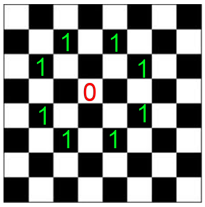
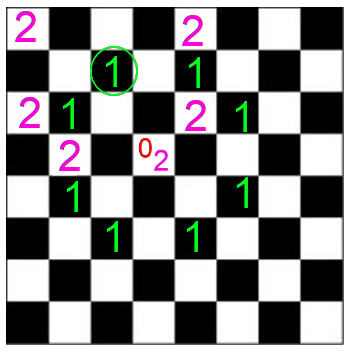
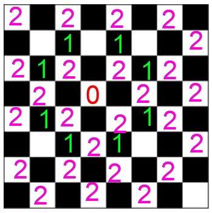
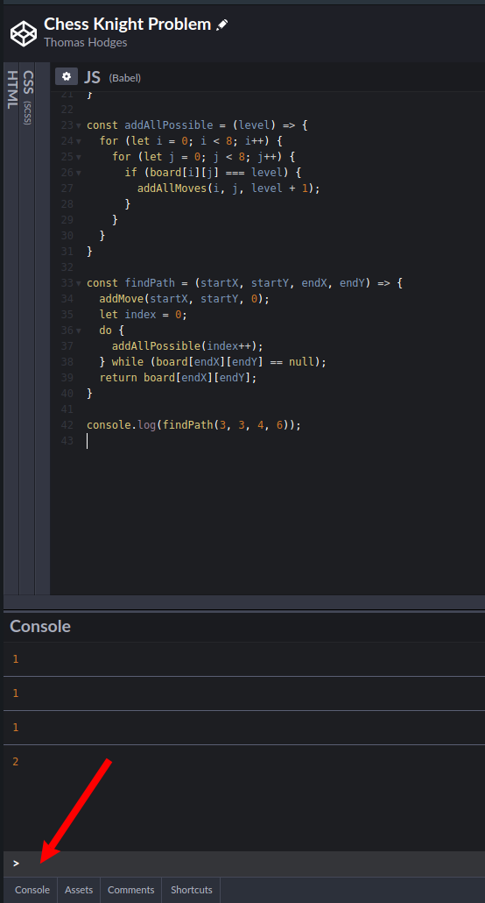

---
{
  title: "Chess Knight Problem: a quick and dirty solution in JavaScript",
  description: "Here I present a quick and dirty solution to a common interview question where the solution is not nearly as complex as it may first appear.",
  published: "2020-04-29T12:27:06.284Z",
  authors: ["thodges314"],
  tags: ["javascript", "computer science", "interviewing"],
  attached: [],
  license: "cc-by-4",
}
---

Here's a classic problem in Computer Science that is said to come up in various forms on programming interviews: given an 8 x 8 chessboard, a selected starting square, and a selected ending square, what is the minimum number of legal moves required to get a knight piece from the starting square to the ending square? Note that this is _not_ the same as Knight's Tour, which is a much more involved problem where we try to find a path around the board such that the knight touches every square once without repeat.

For some background - a chess knight moves in an L-shaped pattern - two up and one to the right, two to the left and one up, and so on. The knight jumps from it's starting location to it's ending location.

This is a diagram showing all possible knight moves:


The red mark above is an arbitrary starting point, and the green marks are all of the possible places that the knight can jump from that point.

# Solution Method {#solution-method}

At first glance, this may look like a bizarre maze navigation algorithm with complex rules, and inspires any number of thoughts of number of possible iterations, how to decide if a move is constructive or not, etc.

Happily, our solution is much simpler, such that I was able to tap one up in JavaScript in a single evening after I decided to look into this problem.

If, in the diagram above, we start in the red space, all of the green spaces are places we can go in one move. Let's label out starting spot '0', and the places that we can go in one move with '1.'


Let's choose one of those spots and see all of the places that we can go from there. Any spot that we can reach from this spot is a place that we can reach in two moves from our starting spot. Let's label them with '2's.


Notice that our starting square is double occupied. We can reach this spot in either zero moves or two moves. However, we want to know the _least_ number of possible moves to get to this spot. Zero is fewer than two, so we shall occupy this space with a '0.' I will remove the '2' and fill in the remaining spots that we can reach in two moves as being those that are one move away from the other '1' squares:


So, right now, we have all of the squares labelled that we can get to in zero, one or two moves. If you would like, you can fill in three moves and possibly four moves if that is required to fill every square. Remember to give precedent to the lower number in any already occupied squares.

If any of the labeled squares is the desired destination, then we know the minimum number of moves required to reach that square. So, all we have to do is start with our starting square and repeat this process until we happen to fill our ending destination with a number. The number in that square will be the minimal number of moves required to reach that spot.

# JavaScript Execution {#js-execution}

So, let's get started. I hacked this together in CodePen, and I didn't build an interface for it, but that would be an easy enough step. We could do all kinds of animations in D3js, etc, but that's not for this blog post.

To begin, let's define a two dimensional array to be our chess board:

```javascript
const board = [];
for (let i = 0; i < 8; i++) {
	board[i] = [];
}
```

That's it. All we need is a two-dimensional 8x8 array. I've not explicitly defined the number of entries in either dimension of the array because that's one of the idiosyncrasies of JavaScript. (It would be possible to say something like `let board = Array(8);` but it's not clear how much that will benefit performance here. JavaScript is famous for not having the same memory management optimizations of languages like FORTRAN - also note that I didn't need to prepopulate the array with null values, as I would have to with many other languages).

Let's make a function to add a move to the board. We need to see if the location is both in range and not occupied by another number before adding that move:

```javascript
const addMove = (x, y, level) => {
	if (x >= 0 && x <= 7 && y >= 0 && y <= 7 && board[x][y] == null) {
		board[x][y] = level;
	}
};
```

You may have noticed that I have checked if `board[x][y] == null`, rather than just `!board[x][y]`. This is because `0` is a potential entry for one of the squares (our staring square) and `0` is falsy.

Let's call this from another function that for any given location, tries to add all of the moves for that can be reached from that location:

```javascript
const addAllMoves = (x, y, level) => {
	addMove(x + 1, y + 2, level);
	addMove(x + 2, y + 1, level);
	addMove(x + 2, y - 1, level);
	addMove(x + 1, y - 2, level);
	addMove(x - 1, y - 2, level);
	addMove(x - 2, y - 1, level);
	addMove(x - 2, y + 1, level);
	addMove(x - 1, y + 2, level);
};
```

There might be a way to do this systematically, but for what I was doing, it was easier to tap it out by hand. Notice that we didn't have to check for valid moves because that is handled by `addMove()`.

Now, let's make a function to scan the board, look for all squares occupied by a given number, and to call `addAllMoves()` for each occupied space:

```javascript
const addAllPossible = (level) => {
	for (let i = 0; i < 8; i++) {
		for (let j = 0; j < 8; j++) {
			if (board[i][j] === level) {
				addAllMoves(i, j, level + 1);
			}
		}
	}
};
```

I hope that you can predict where this is going. Let's make a master function to tie all of this together:

```javascript
const findPath = (startX, startY, endX, endY) => {
	addMove(startX, startY, 0);
	let index = 0;
	do {
		addAllPossible(index++);
	} while (board[endX][endY] == null);
	return board[endX][endY];
};
```

Finally: I'll test this function with some of the spots we have labeled in the diagram above. Labeling the columns left to right and the rows start to finish, we start from `[3,3]`. One of the spots we can get in one move is `[2,1]`.

```javascript
console.log(findPath(3, 3, 2, 1));
```

I correctly got 1.

One of the spots that we can reach in 2 moves is \[4,6\].

```javascript
console.log(findPath(3, 3, 4, 6));
```

I correctly got 2.

If you want to try this yourself, [here is my CodePen project](https://codepen.io/thodges314/pen/ZEbJzPX). Enlarge the JavaScript panel and open the console along the bottom of the page to try this out.


