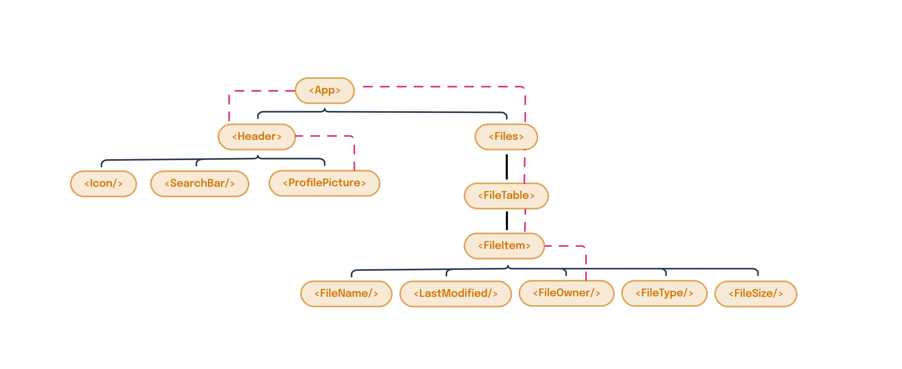
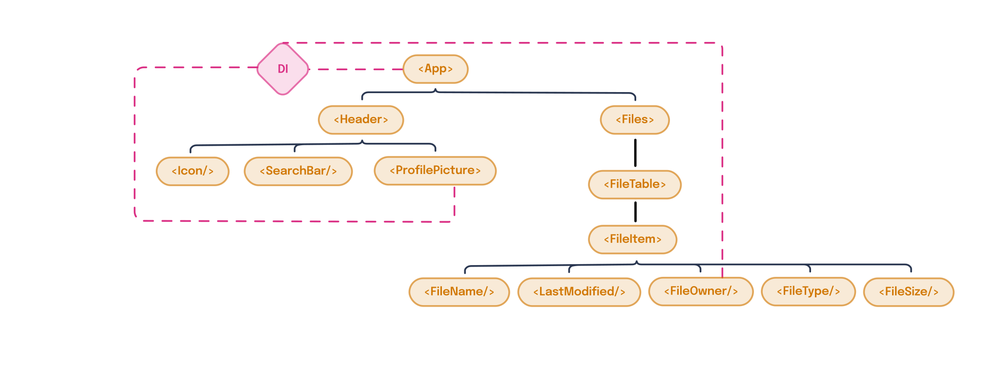
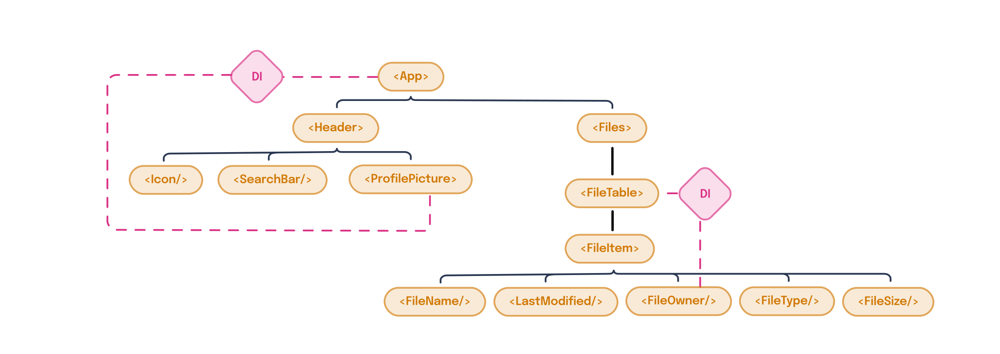
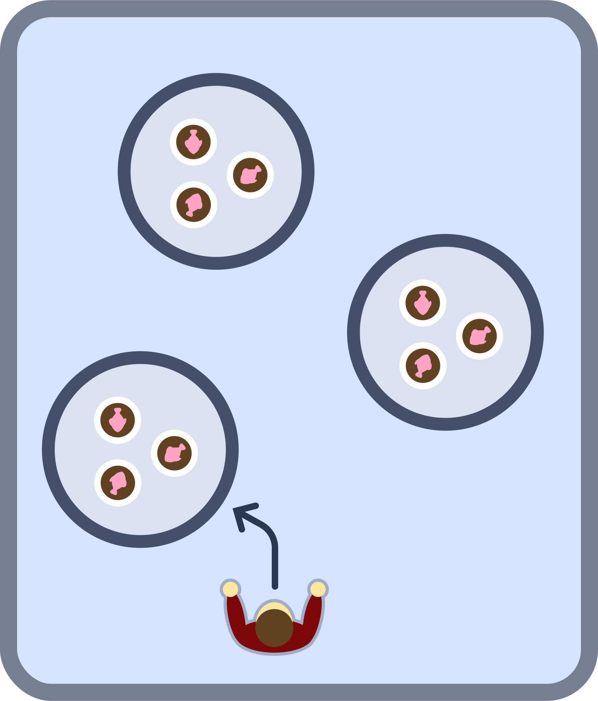
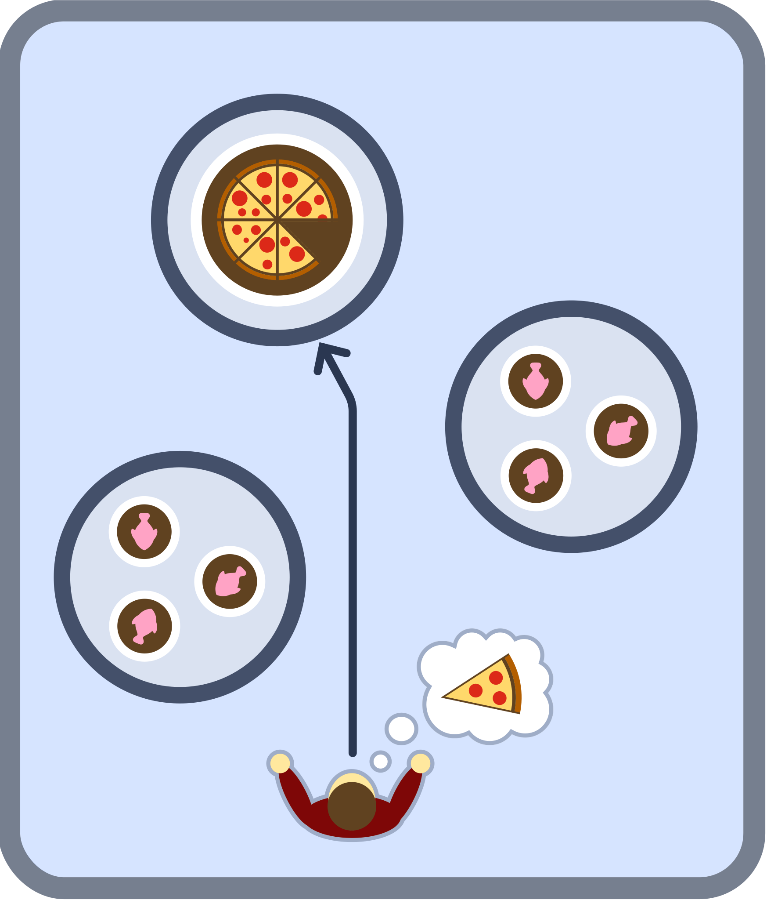

---
{
    title: "Dependency Injection",
    description: "Passing around props sucks. They're trivial get out of sync and easy to forget to pass. What if there was a better way to pass data between different parts of your app?",
    published: '2023-01-01T22:12:03.284Z',
    authors: ['crutchcorn'],
    tags: ['webdev'],
    attached: [],
    order: 12,
    series: "The Framework Field Guide"
}
---

One of the core tenants of components we've used repeatedly in the book is the idea of component inputs, or properties.

While component inputs work well for one-off behavior, it can be challenging to scale when you need the same set of data across multiple components.

For example, let's look back at our files app we've been developing throughout the book.

;

Here, we have a list of files, the user's profile picture in the corner of the screen. Here's an example of what our data for the page looks like:

```javascript
const APP_DATA = {
    currentUser: {
    	name: "Corbin Crutchley",
        profilePictureURL: "https://avatars.githubusercontent.com/u/9100169"
    },
	collection: [
		{
            name: "Movies",
            type: "folder",
			ownerName: null,
            size: 386547056640
		},
		{
            name: "Concepts",
            type: "folder",
			ownerName: "Kevin Aguillar",
            size: 0
		}
	]
}
```

> This data has been shortened to keep focus

Let's say that every time we see `null` where the `ownerName` is, we want to replace this information with the `currentUser`'s `name` field.

Let's use some pseudo-code and mock out what those components might look like with data passing from the parent to the child:

```jsx
// This is not real code, but demonstrates how we might structure our data passing
// Don't worry about syntax, but do focus on how data is being passed between components
const App = {
    data: APP_DATA,
    template: <div>
    	<Header currentUser="data.currentUser"/>
        <Files files="data.collection" currentUser="data.currentUser"/>
     </div>
}

const Header = {
    props: ['currentUser'],
    template: <div>
    	<Icon/>
        <SearchBar/>
        <ProfilePicture currentUser="props.currentUser"/>
    </div>
}


const ProfilePicture = {
    props: ['currentUser'],
    template: 
}

const Files = {
    props: ['currentUser', 'files'],
    template: <FileTable>
    	{props.files.map(file => <FileItem file="file" currentUser="props.currentUser"/>)}
    </FileTable>
}

const FileItem = {
    props: ['currentUser', 'file'],
    template: <tr>
    	<FileName file="props.file"/>
    	<LastModified file="props.file"/>
    	<FileOwner file="props.file" currentUser="props.currentUser"/>
    	<FileType file="props.file"/>
    	<FileSize file="props.file"/>
    </tr>
}

const FileOwner = {
    props: ['currentUser', 'file'],
    data: {
        userNameToShow: props.file.ownerName || props.currentUser.name
    },
    template: <td>{{userNameToShow}}</td>
}

render(App);
```

While this isn't real code, we can make a simple discovery by looking at our code laid out like this: We're passing `currentUser` to almost every single component!

If we chart out what the flow of data looks like, it might look something like this:



While it's obnoxious to pass `currentUser` in every component, we need that data in all of these components, so we can't simply remove the inputs, can we?

Well, we can! Sort of...

What we **can** do is pass these components _implicitly_ instead of _explicitly_. This means that instead of telling the child component what data it should accept, we simply hand off data regardless of if it's needed or not. From there, it's the child component's job to raise it's hand and ask for data.

Think of this like a food buffet. Instead of serving food directly to the customer's table, the customer comes to the table with all of the food, takes what it wants, and is satisfied with the results all-the-same.


We do this method of implicit data passing using a methodology called "dependency injection".

# Providing Basic Values with Dependency Injection

When we talk about dependency injection, we talk about a method of providing data from a parent component down to a child component through implicit means.

Using dependency injection, we can take our previous anxiety-inducing chart and redesign the app to reflect something like this instead:



Each of these three frameworks provides a simple way of injecting data implicitly into their components.

Let's start with the most basic method of dependency injection by providing some simple values, like a number or string, down to a child component.

<!-- tabs:start -->

## React

In the React world, all dependency injection is powered by a `createContext` method, which you then `Provide` to your child components, and within those child components you consume the data with a `useContext` hook.

```jsx
import {createContext, useContext} from 'react';

// We start by creating a context name
const HelloMessageContext = React.createContext();

function Parent() {
  return (
	// Then create a provider for this context
    <HelloMessageContext.Provider value={'Hello, world!'}>
      <Child />
    </HelloMessageContext.Provider>
  );
};

function Child() {
  // Later, we use `useContext` to consume the value from dependency injection
  const helloMessage = useContext(HelloMessageContext);
  return <p>{helloMessage}</p>;
};
```

## Angular

While other frameworks have a more singularly focused dependency injection API, Angular's dependency injection API is simultaneously more complex, but more powerful as a result.

Within Angular's DI system, it all starts with a `InjectionToken` of some kind. We'll start by importing Angular `InjectionToken` API, and creating a new token that we can use later. 

```typescript
import { InjectionToken, Component, Inject} from '@angular/core';

const WELCOME_MESSAGE_TOKEN = new InjectionToken('WELCOME_MESSAGE');
```

We'll then use this token to create a `provider` that we pass to a component's `providers` list:

```typescript
@Component({
  selector: 'app-root',
  template: `<child></child>`,
  providers: [
    {provide: WELCOME_MESSAGE_TOKEN, useValue: 'Hello, world!' },
  ]
})
export class AppComponent {
}
```

This API uses `useValue` to provide the value associated with the token we pass.

Finally, we use an `inject` function in our component class to tell Angular "We want this value in our component".  

```typescript
import { InjectionToken, Component, inject} from '@angular/core';

@Component({
  selector: 'child',
  template: `<p>{{welcomeMsg}}</p>`
})
export class ChildComponent {
  welcomeMsg: string = inject(WELCOME_MESSAGE_TOKEN);

  ngOnInit() {
    console.log(this.welcomeMsg);
  }
}
```

Something worth mentioning when using the `inject` function is that you're unable to provide a `constructor` method to the `ChildComponent` class. To get around this, we'll need to use an alternative API that Angular allows us to leverage.

### `constructor` injection 

Alongside Angular's `inject` function, there's a Decorator called `@Inject` that we can use in our `ChildComponent`'s `constructor` to inject the value from our `InjectionToken` instead:

```typescript
@Component({
  selector: 'child',
  template: `<p>{{welcomeMsg}}</p>`
})
export class ChildComponent {
  constructor(@Inject(WELCOME_MESSAGE_TOKEN) public welcomeMsg: string) {}

  ngOnInit() {
    console.log(this.welcomeMsg);
  }
}
```

## Vue

Vue's dependency injection API only has two parts to it:

1) A `provide` method, used to provide values from the parent component.
2) An `inject` method, used to get the provided values in the child component.

```vue
<!-- Parent.vue -->
<template>
  <child />
</template>

<script setup>
import { provide } from 'vue'
import Child from './Child.vue'

provide('WELCOME_MESSAGE', 'Hello, world!')
</script>
```

```vue
<!-- Child.vue -->
<template>
  <p>{{ welcomeMsg }}</p>
</template>

<script setup>
import { inject } from 'vue'

const welcomeMsg = inject('WELCOME_MESSAGE')
</script>
```

<!-- tabs:end -->

Here, we expect this component to show a `<p>` tag that renders out `"Hello, world!"`.

While this is convenient for passing simple values to multiple parts of the app, most usages of dependency injection tend to have more complex data provided. Let's extend this logic to provide an object to children instead.

<!-- tabs:start -->

## React

As we mentioned before, all of React's dependency injection logic uses `createContext`, `Provider`, and `useContext`. As such, to provide an object is a trivial change from before, simply by changing the `value` we pass to our provider:

````jsx
const HelloMessageContext = createContext();

const Child = () => {
  const helloMessage = useContext(HelloMessageContext);
  return <p>{helloMessage.message}</p>;
};

const Parent = () => {
  const helloMessageObject = { message: 'Hello, world!' };

  return (
    <HelloMessageContext.Provider value={helloMessageObject}>
      <Child />
    </HelloMessageContext.Provider>
  );
};
````

## Angular

 Because Angular's `useValue` accepts any arbitrary value, we can simply pass it an object to move away from a simple string injection:

```typescript
import { InjectionToken, Component, Inject } from '@angular/core';

const WELCOME_MESSAGE_TOKEN = new InjectionToken('WELCOME_MESSAGE');

@Component({
  selector: 'app-root',
  template: `<child></child>`,
  providers: [
    { provide: WELCOME_MESSAGE_TOKEN, useValue: { message: 'Hello, world!' } },
  ],
})
export class AppComponent {}

@Component({
  selector: 'child',
  template: `<p>{{welcomeMsg.message}}</p>`,
})
export class ChildComponent {
  welcomeMsg: { message: string } = inject(WELCOME_MESSAGE_TOKEN);
}
```

While this functions, it's not very clean. In particular, some of the headaches present with this method include:

- Duplicative TypeScript typings between `inject` usage and `useValue` providing
  - Mismatches can cause `undefined` bugs intentionally
- When using a `constructor`, needing to use `@Inject` decorator is overly verbose

Luckily for us, Angular provides a better solution for this problem than `useValue` and `InjectionToken`. 

Instead, let's create a class that we mark with an `@Injectable` decorator:

```typescript
import { Injectable, Component, OnInit } from '@angular/core';

@Injectable()
class InjectedValue {
  message = "Hello, world";
}
```

Here, we're telling Angular to treat our `InjectedValue` class as a `InjectionToken` that we can use by name in our `providers`.

```typescript
@Component({
  selector: "app-root",
  providers: [InjectedValue],
  template: `<child></child>`
})
class ParentComponent {
}
```

Now that our `InjectedValue` is a known type, we can remove our explicit type declaration to our consuming `inject` function in `ChildComponent`

```typescript
@Component({
  selector: "child",
  template: `<div>{{injectedValue.message}}</div>`
})
class ChildComponent implements OnInit {
  injectedValue = inject(InjectedValue);

  ngOnInit() {
    console.log(this.injectedValue);
  }
}
```

Alternatively, if we need to use a `constructor` to do dependency injection, it's now been made much less verbose because our `InjectedValue` class was marked with `@Injectable`. As a result, we can remove our previous usage of `@Inject` inside of our child constructor:

```typescript
@Component({
  selector: "child",
  template: `<div>{{injectedValue.message}}</div>`
})
class ChildComponent implements OnInit {
  constructor(public injectedValue: InjectedValue) {}

  ngOnInit() {
    console.log(this.injectedValue);
  }
}
```

Much cleaner!

## Vue

Just like React, Vue's simple dependency injection API means that we only need to change our `provide` value to an object, and we're off to the races!

```vue
<!-- Parent.vue -->
<template>
  <child />
</template>

<script setup>
import { provide } from 'vue'
import Child from './Child.vue'

const welcomeObj = { message: 'Hello, world!' }
provide('WELCOME_MESSAGE', welcomeObj)
</script>
```

```vue
<!-- Child.vue -->
<template>
  <p>{{ welcomeMsgObj.message }}</p>
</template>

<script setup>
import { inject } from 'vue'

const welcomeMsgObj = inject('WELCOME_MESSAGE')
</script>
```

<!-- tabs:end -->

# Changing Values After Injection

While providing values from a parent node down to a child component is useful on its own, it's made even more powerful by the inclusion of data manipulation.

For example, what happens when your user wants to change their name with some kind of rename functionality? You should be able to change how the data is stored in your dependency injection to propagate those changes throughout your whole application immediately.

<!-- tabs:start -->

## React

Because our `Provider` is able to pass down values of any kind, we can combine this with `useState` in order to allow React to update the values for children.

```jsx
const HelloMessageContext = createContext();

const Child = () => {
  const helloMessage = useContext(HelloMessageContext);
  return <p>{helloMessage}</p>;
};

const Parent = () => {
  const [message, setMessage] = useState('Initial value');
  return (
    <HelloMessageContext.Provider value={message}>
      <Child />
      <button onClick={() => setMessage('Updated value')}>
        Update the message
      </button>
    </HelloMessageContext.Provider>
  );
};
```

When we update the `message` value, it will trigger a re-render on the `Child` component and, in turn, update the displayed message.

## Angular

Because we've marked our `InjectedValue` class as an `Injectable`, we can simply have the parent component request access in the `constructor` in order to mutate the class instance.

````typescript
@Injectable()
class InjectedValue {
  message = 'Initial value';
}

@Component({
  selector: 'app-root',
  providers: [InjectedValue],
  template: `
    <child></child>
    <button (click)="updateMessage()">Update the message</button>
  `,
})
class ParentComponent {
  // We can access the `injectedValue` from the same component we provide it from
  injectedValue = inject(InjectedValue);

  updateMessage() {
    this.injectedValue.message = 'Updated value';
  }
}

@Component({
  selector: 'child',
  template: `<p>{{injectedValue.message}}</p>`,
})
class ChildComponent {
  injectedValue = inject(InjectedValue);
}
````

## Vue

Vue's minimal API surface allows us to easily compose `ref` and `provide` usage in order to provide values that we can change after injection. 

```vue
<!-- Parent.vue -->
<template>
  <child />
  <button @click="updateMessage()">Update the message</button>
</template>

<script setup>
import { provide, ref } from 'vue'
import Child from './Child.vue'

const welcomeMessage = ref('Initial value')
provide('WELCOME_MESSAGE', welcomeMessage)

function updateMessage() {
  welcomeMessage.value = 'Updated value'
}
</script>
```

```vue
<!-- Child.vue -->
<template>
  <p>{{ welcomeMessage }}</p>
</template>

<script setup>
import { inject } from 'vue'

// Worth mentioning, `welcomeMessage` is now _not_ a string, but rather a `ref`
// If you needed to use `welcomeMessage` inside of `<script setup>`, you'd
// need to use `.value`
const welcomeMessage = inject('WELCOME_MESSAGE')
</script>
```

<!-- tabs:end -->

## Changing Injected Values from Child

While mutating the injected value is intrinsically valuable, we often want to change the value from the child component instead of from the root. However, because dependency injection is usually unidirectional (from the parent to the child), we have to rely on specific functionality of the frameworks to enable this functionality. 

Let's see how that's done:

<!-- tabs:start -->

### React

Before, we utilized the ability to use `useState` in our `Provider` in order to handle data changes from the parent provider.

Luckily, React's `useContext` enables us to pass data of _any_ kind, functions included. This means that we can pass both the getter and setter function of `useState`, like so:

```jsx

const HelloMessageContext = createContext();

function Parent() {
  const [message, setMessage] = useState('Initial value');
  // We can pass both the setter and getter
  const providedValue = { message, setMessage };
  return (
    <HelloMessageContext.Provider value={providedValue}>
      <Child />
    </HelloMessageContext.Provider>
  );
}

function Child() {
  // And later, access them both as if they were local to the component
  const { message, setMessage } = useContext(HelloMessageContext);
  return (
    <>
      <p>{message}</p>
      <button onClick={() => setMessage('Updated value')}>
        Update the message
      </button>
    </>
  );
}
```

#### Using a reducer pattern

While `useState` and `useContext` make a powerful combination for simple data passing using dependency injection, it's far from a perfect solution when dealing with large data sets.

For example, what happens if we want to implement a counter, that includes an `increment` and `decrement` function?

This is where `useReducer` might come into play. Let's take a step back for a moment, and remove the `useContext` method.

A "reducer" pattern involves a list of actions that the user can take. These actions are provided the current `state` value, which will be updated based on the returned value from the reducer.

> It's worth mentioning that the reducer pattern is not unique to React. That said, React is unique in that it has a built-in method to build reducers, unlike many other frameworks. 

Let's take a look at the most basic version of a `reducer` that only can count up from `0`:

```jsx
const initialState = { count: 0 };

function reducer(state, action) {
  return {count: state.count + 1}
}

function App() {
  const [state, dispatch] = useReducer(reducer, initialState);
  return (
    <>
      <p>{state.count}</p>
      <button onClick={() => dispatch()}>Add one</button>
    </>
  );
}
```

Here, whenever `dispatch` is called, it will run the `reducer` with no arguments for `action`, and React will automatically pass `state` for us. Then, when we `return` inside of the reducer, React will automatically keep track of the returned value as the new `state` value.

However, this isn't particularly useful and seems like more boilerplate than needed for what's effectively a simple `useState`. To make `useReducer` more worthwhile, we need to add more actions.

 For example, we'll have an `increment` and `decrement` action that will respectively add one and remove one from the `state`.

```jsx
const initialState = { count: 0 };

function reducer(state, action) {
  switch (action.type) {
    case 'increment':
      return { count: state.count + 1 };
    case 'decrement':
      return { count: state.count - 1 };
    default:
      return state;
  }
}

function App() {
  const [state, dispatch] = useReducer(reducer, initialState);
  return (
    <>
      <p>{state.count}</p>
      <button onClick={() => dispatch({ type: 'increment' })}>Add one</button>
      <button onClick={() => dispatch({ type: 'decrement' })}>
        Remove one
      </button>
    </>
  );
}
```

Here, we can pass a `type` object as a parameter of `reducer`'s `action`, run a `switch`/`case` over it, and return relevant data changes as-needed.

But that's not all we can do with a reducer! We can also pass in what's often called a `payload` in order to set raw data to our `state` as well:

```jsx
const initialState = { count: 0 };

function reducer(state, action) {
  switch (action.type) {
    case 'increment':
      return { count: state.count + 1 };
    case 'decrement':
      return { count: state.count - 1 };
    case 'set':
      return { count: action.payload };
    default:
      return state;
  }
}

function App() {
  const [state, dispatch] = useReducer(reducer, initialState);
  return (
    <>
      <p>{state.count}</p>
      <button onClick={() => dispatch({ type: 'increment' })}>Add one</button>
      <button onClick={() => dispatch({ type: 'decrement' })}>
        Remove one
      </button>
      <button onClick={() => dispatch({ type: 'set', payload: 0 })}>
        Set to zero
      </button>
    </>
  );
}
```

#### Reducer patterns within Contexts

Just like we were able to pass the `setValue` function from `useState`, we can pass both `state` and `dispatch` using our `context`'s `Provide` and utilize `useContext` to inject those values into our child components. 

```jsx
const CounterContext = createContext();

const initialState = { count: 0 };

function reducer(state, action) {
  switch (action.type) {
    case 'increment':
      return { count: state.count + 1 };
    case 'decrement':
      return { count: state.count - 1 };
    case 'set':
      return { count: action.payload };
    default:
      return state;
  }
}

function Parent() {
  const [state, dispatch] = useReducer(reducer, initialState);
  const providedValue = { state, dispatch };
  return (
    <CounterContext.Provider value={providedValue}>
      <Child />
    </CounterContext.Provider>
  );
}

function Child() {
  const { state, dispatch } = useContext(CounterContext);
  return (
    <>
      <p>{state.count}</p>
      <button onClick={() => dispatch({ type: 'increment' })}>Add one</button>
      <button onClick={() => dispatch({ type: 'decrement' })}>
        Remove one
      </button>
      <button onClick={() => dispatch({ type: 'set', payload: 0 })}>
        Set to zero
      </button>
    </>
  );
}
```

> It's worth mentioning that while this works at a relatively small-scale, you [should not use this pattern for large data sets across huge swaths of your program. Instead, you should likely be using a library like Redux for performance reasons.](https://blog.isquaredsoftware.com/2021/01/context-redux-differences/)

### Angular

Because we're able to inject a full class instance into a child component, we can utilize methods in said class to mutate data of the injected class instance.

```typescript
@Injectable()
class InjectedValue {
  message = 'Hello, world';
  // `this` is referring to the `InjectedValue` instance
  changeMessage(val: string) {
    this.message = val;
  }
}

@Component({
  selector: 'app-root',
  providers: [InjectedValue],
  template: `<child></child>`,
})
class ParentComponent {}

@Component({
  selector: 'child',
  template: `
  <div>{{injectedValue.message}}</div>
  <button (click)="changeMessage()">Change message</button>
  `,
})
class ChildComponent {
  injectedValue = inject(InjectedValue);

  changeMessage() {
    // This will update the value of the class, and 
    // re-render the component to reflect the new value
    this.injectedValue.changeMessage('TESTING');
  }
}
```

### Vue

In our previous example, we used `provide` to inject a `ref` into the child component. Luckily for us, because of Vue's reactivity system, we can simply change the `.value` of the `ref` in the child itself.

```vue
<!-- Parent.vue -->
<template>
  <child />
</template>

<script setup>
import { provide, ref } from 'vue'
import Child from './Child.vue'

const welcomeMessage = ref('Initial value')
provide('WELCOME_MESSAGE', welcomeMessage)
</script>
```

```vue
<!-- Child.vue -->
<template>
  <p>{{ welcomeMessage }}</p>
  <button @click="updateMessage()">Update the message</button>
</template>

<script setup>
import { inject } from 'vue'

const welcomeMessage = inject('WELCOME_MESSAGE')

function updateMessage() {
  welcomeMessage.value = 'Updated value'
}
</script>
```

<!-- tabs:end -->

# Optional Injected Values

Let's think back to the start of this chapter. The original goal of introducing dependency injection was to enable sharing user login information throughout multiple components.

While you might expect the user's login information to always be present, what if it wasn't? What if, when the user first creates their account, they opt out of inputting their name and profile picture? Even if this seems unlikely, a robust application should handle edge-cases like this.

Lukcily, React, Angular, and Vue are all able to withstand no value provided to the child component via dependency injection. This is because all three frameworks have the ability to mark a dependency as "optional" in the dependency injection system.

<!-- tabs:start -->

## React

In React, handling optionally injected values is fairly straightforward. We can still use the `useContext` hook in the child component, even if there is no provider.

```jsx
import { createContext, useContext } from 'react';

const HelloMessageContext = createContext();

function Parent() {
  // Notice no provider was set
  return (
    <Child />
  );
}

function Child() {
  // `messageData` is `undefined` if nothing is injected 
  const messageData = useContext(HelloMessageContext);

  // If no value is passed, we can simply
  // not render anything in this component
  if (!messageData) return null;

  return (
    <p>{messageData}</p>
  );
}

export default Parent;
```

When this is done, `useContext` is `undefined` if no value is injected when it should be.

## Angular

In Angular, we provide values to be injected using the `providers` array on a component. 

```typescript
@Injectable()
class InjectedValue {
  message = 'Initial value';
}

@Component({
  selector: 'app-root',
  providers: [InjectedValue],
  template: `<child></child>`,
})
class ParentComponent {
}

@Component({
  selector: 'child',
  template: `<p>{{injectedValue.message}}</p>`,
})
class ChildComponent {
  injectedValue = inject(InjectedValue);
}
```

However, if we remove the `providers` from `ParentComponent`, in order to test our application without any user data, like so:

```typescript
@Component({
  selector: "app-root",
  template: `<child></child>`
})
class ParentComponent {
}
```

We get the following error:

> ```
> ERROR NullInjectorError: R3InjectorError(AppModule)[InjectedValue -> InjectedValue -> InjectedValue]: 
>   NullInjectorError: No provider for InjectedValue!
> ```

This is because our constructor inside of `ChildComponent` is marked as a required dependency by default, hence the error. 

Luckily for us, there's a way to tell Angular to mark that dependency as "optional" by passing a second argument to the `inject` function:

```typescript
@Injectable()
class InjectedValue {
  message = "Hello, world";
}

@Component({
  selector: "app-root",
  template: `<child></child>`
})
class ParentComponent {
}

@Component({
  selector: "child",
  template: `<div *ngIf="injectedValue">{{injectedValue.message}}</div>`
})
class ChildComponent implements OnInit {
  injectedValue = inject(InjectedValue, {optional: true});

  ngOnInit() {
    // undefined
    console.log(this.injectedValue);
  }
}
```


Likewise, if we need to mark a dependency as optional in our constructor, using the `@Optional` decorator in `ChildComponent`'s `constructor` will do the job:

```typescript
import { Injectable, Component, OnInit, Optional} from '@angular/core';

@Injectable()
class InjectedValue {
  message = "Hello, world";
}

@Component({
  selector: "app-root",
  template: `<child></child>`
})
class ParentComponent {
}

@Component({
  selector: "child",
  template: `<div *ngIf="injectedValue">{{injectedValue.message}}</div>`
})
class ChildComponent implements OnInit {
  constructor(@Optional() private injectedValue: InjectedValue) {}

  ngOnInit() {
    // undefined
    console.log(this.injectedValue);
  }
}
```

Now, we get no error when `injectedValue` is not provided. Instead, we get a value of `null`, which we can gaurd against using `ngIf` inside our template.

## Vue

Much like React's dependency injection system, when using Vue's `inject` without a parent `provide`, the `inject` simply defaults it's value to `undefined`.

``` vue
<!-- Parent.vue -->
<template>
  <child />
</template>

<script setup>
import Child from './Child.vue'
</script>
```

```vue
<!-- Child.vue -->
<template>
  <p v-if="welcomeMessage">{{ welcomeMessage }}</p>
</template>

<script setup>
import { inject } from 'vue'

const welcomeMessage = inject('WELCOME_MESSAGE')

// undefined
console.log(welcomeMessage)
</script>
```

> You may see a warning like this in your `console` if you do this:
>
> `[Vue warn]: injection "WELCOME_MESSAGE" not found. `
>
> This is normal and expected - keep calm and code on.

<!-- tabs:end -->


## Default Values for Optional Values

While it's good that we were able to create code that can handle nothing being dependency injected, it's not a great user experience to simply have parts of the app missing when data isn't present.

Instead, let's decide that when the user doesn't have a provided name, let's provide a default value of "Unknown Name" throughout our app. To do this, we'll need some method of providing that default value in our dependency injection system.

<!-- tabs:start -->

### React

Because of React's minimalistic dependency injection API, providing a default value to an optionally injected value can be done using [JavaScript's built-in "OR" operator (`||`)](https://developer.mozilla.org/en-US/docs/Web/JavaScript/Reference/Operators/Logical_OR).

```jsx
function Child() {
  const injectedMessageData = useContext(HelloMessageContext);

  const messageData = injectedMessageData || "Hello, world!";

  return (
    <p>{messageData}</p>
  );
}
```

### Angular

<!-- Editor's note: Angular, as-of v14, cannot do the default `private thing = Val` API becuase `Optional` is `null`, not `undefined` -->

As-of today, there's no built-in way to provide an optional value to Angular's optionally injected values, despite [an open GitHub issue requesting this feature](https://github.com/angular/angular/issues/25395). 

As a result, we have to handle this edge-case ourselves by creating a second variable in our `ChildComponent` class instance and assigning the value of it to match _either_ our injected value, or a default value.

```typescript
@Injectable()
class InjectedValue {
  message = 'Initial value';
}

@Component({
  selector: 'app-root',
  template: `
    <child></child>
  `,
})
class ParentComponent {}

@Component({
  selector: 'child',
  template: `<p>{{injectedValue.message}}</p>`,
})
class ChildComponent {
  injectedValue = inject(InjectedValue)  || { message: 'Default Value' };
}
```

Alternatively, if you're using the `constructor` method of dependency injection, you can do something similar within your `constructor`:

```typescript
@Injectable()
class InjectedValue {
  message = 'Initial value';
}

@Component({
  selector: 'app-root',
  template: `
    <child></child>
  `,
})
class ParentComponent {}

@Component({
  selector: 'child',
  template: `<p>{{injectedValue.message}}</p>`,
})
class ChildComponent {
  injectedValue: InjectedValue;

  constructor(@Optional() private _injectedValue: InjectedValue) {
    this.injectedValue = this._injectedValue || { message: 'Default Value' };
  }
}
```

> You may notice that we're using `||` here; [that symbol stands for "or" and can be used to say "this value OR that value if the first is undefined""](https://developer.mozilla.org/en-US/docs/Web/JavaScript/Reference/Operators/Logical_OR).

### Vue

Vue is the only framework of the three that supports a built-in way to provide a default value for dependency injected values. Simply pass a second argument to the `inject` method and it will be used as your default value.

```vue
<!-- Child.vue -->
<template>
  <p>{{ welcomeMessage }}</p>
</template>

<script setup>
import { inject } from 'vue'

const welcomeMessage = inject('WELCOME_MESSAGE', 'Default value')

// "Default value"
console.log(welcomeMessage)
</script>
```

<!-- tabs:end -->


# Application Wide Providers

Generally, it's suggested to keep your dependency injection providers as close to the injected children as possible. That said, it's not always feasible to do so, and you may want to have a dependency injector at the root of your application if _most_ components in your app will be using the same data.

How can we implement this in our code?

<!-- tabs:start --> 

## React

React doesn't have a specific method of providing values at the root of the application. Instead, you simply use a `Provider`  in your top-level `App` component.

```jsx
function App() {
  const [message, setMessage] = useState('Initial value');
  const providedValue = { message, setMessage };
  return (
    <HelloMessageContext.Provider value={providedValue}>
      <Child />
    </HelloMessageContext.Provider>
  );
}
```

### Consolidate Providers and Your Logic

When working with providers that needs state of some kind, you may want to keep your `useState` and `<Context.Provider>` code in the same place. To do this, simply move your provider and logic into the same place:

```jsx
const HelloMessageProvider = ({children}) => {
  const [message, setMessage] = useState('Initial value');
  const providedValue = { message, setMessage };
	return (
    <HelloMessageContext.Provider value={providedValue}>
			{children}
		</HelloMessageContext.Provider>
	)
}

function App() {
  return (
  	<HelloMessageProvider>
      <Child />
    </HelloMessageProvider>
  );
}
```

### Provider Christmas Trees are Okay!

When you have a large enough application, you may end up having an `App` component that looks like this:

```jsx
const App = () => {
  const {isDarkMode, paperTheme, updateLocalDarkMode, localDarkMode} =
    useLocalDarkMode();

  return (
    <NavigationContainer theme={isDarkMode ? darkNavTheme : lightNavTheme}>
      <PaperProvider theme={paperTheme}>
        <StatusBar
          barStyle={isDarkMode ? 'light-content' : 'dark-content'}
          backgroundColor={'transparent'}
        />
        <SetDarkModeContext.Provider
          value={{
            setDarkMode: updateLocalDarkMode,
            localDarkMode,
          }}>
          <ColorSchemeProvider mode={isDarkMode ? 'dark' : 'light'}>
            <ErrorBoundary FallbackComponent={CustomFallback}>
              <Provider store={store}>
                <AppContents />
              </Provider>
            </ErrorBoundary>
          </ColorSchemeProvider>
        </SetDarkModeContext.Provider>
      </PaperProvider>
    </NavigationContainer>
  );
};
```

> [This is actual source code pulled from my React Native app, GitShark](https://github.com/oceanbit/GitShark/blob/main/src/App.tsx#L156-L176).

This code is colloqually called the "Provider Christmas Tree" because of it's formatted structure.

Despite looking ugly, this code is okay! If you _really_ want to break things up, take one step further in componentizing your codebase and move similar providers into their own `StyleProvider` component to help flattern this code:

```jsx
const StyleProvider = ({ children }) => {
    return (
        <PaperProvider theme={paperTheme}>
            <StatusBar
                barStyle={isDarkMode ? 'light-content' : 'dark-content'}
                backgroundColor={'transparent'}
            />
            <SetDarkModeContext.Provider
                value={{
                    setDarkMode: updateLocalDarkMode,
                    localDarkMode,
                }}>
                <ColorSchemeProvider mode={isDarkMode ? 'dark' : 'light'}>
                    {children}
                </ColorSchemeProvider>
            </SetDarkModeContext.Provider>
        </PaperProvider>
    )
}

const App = () => {
    const { isDarkMode, paperTheme, updateLocalDarkMode, localDarkMode } =
        useLocalDarkMode();

    return (
        <NavigationContainer theme={isDarkMode ? darkNavTheme : lightNavTheme}>
            <ErrorBoundary FallbackComponent={CustomFallback}>
                <Provider store={store}>
                  <StyleProvider>
                    <AppContents />
                  </StyleProvider>
                </Provider>
            </ErrorBoundary>
        </NavigationContainer>
    );
};
```

Just remember, the order of these providers can matter and cause bugs if some of them are out-of-order!

## Angular

While other frameworks require you to explicitly provide your dependency injected values at the root of your application, Angular does not.

Remember earlier when we utilized `@Injectable`  to mark a class as an injectable class instance? Well, this decorator has a trick up its sleave: [the `providedIn` property](https://angular.io/guide/providers#providedin-and-ngmodules).

When you pass `{providedIn: 'root'}` to the `@Injectable` decorator, you no longer have to explicitly place the class inside of a `providers` array; instead, Angular will simply provide this class to the root of your application.


```typescript
@Injectable({providedIn: 'root'})
class InjectedValue {
  message = "Hello, world";
}

@Component({
  selector: "child",
  template: `<div></div>`
})
class ChildComponent implements OnInit {
  injectedValue = inject(InjectedValue);

  ngOnInit() {
    // This will include the `message` property, alongside 
    // any other methods and properties on the class instance
    console.log(this.injectedValue);
  }
}

@Component({
  selector: "app-root",
  template: `<child></child>`
})
class ParentComponent {
}
```

In Angular, these globally provided values are called "Services". They're often used to break up and move application logic out of components in order to be more widely re-used. 

## Vue

The simplicity in Vue's dependency injection API continues! Providing a value at your application's root is just as simple in Vue as providing a value anywhere else in your codebase. Simply add a `provide` method call inside your root `App` component, and you're off the races.

```vue
<!-- App.vue -->
<template>
  <child />
</template>

<script setup>
import { provide, ref } from 'vue'
import Child from './Child.vue'

const welcomeMessage = ref('Hello, world!')
provide('WELCOME_MESSAGE', welcomeMessage)
</script>
```

<!-- tabs:end -->

These globally provided values are also called "singletons". When using a singleton, it's important to remember that data is shared between every component. If we have three components that all use one provided value, and mutate said value, it will update all of the consuming components.

> It's worth mentioning that if you're extensively using global singletons in your application, you might be better served by tools purpose-built for this problem such as [Redux Toolkit](https://redux-toolkit.js.org/), [NgRx](https://ngrx.io/), and [Pinia](https://pinia.vuejs.org/) for React, Angular, and Vue respectively. 
>
> These tools offer much better performance and debugging than trying to hand-roll your own app-wide dependency injection tools. We'll touch more on the tools in our second book titled ["The Framework Field Guide: Ecosystem"](// TODO: Add link)

# Overwriting Dependency Injection Specificity

Large apps get complicated fast. Consider the following example:

You have an app that provides user data at the root of the application - the `App` component. However, you need to replace that user data at a lower level component for the rest of the component tree.

For these instances, these larger apps can replace dependency injection values mid-tree, like so:



While it's rare, this ability is an incredibly powerful feature you can leverage in your applications. 

> Why would you want to do this?

Admittedly, there are very few practical reasons to need to reach for this API. We'll touch on some of them as we go along, but for now, take this section as a bookmark of knowledge for potential future usage.

Back to the concepts!

A child component will have it's dependency injection resolved from the closest parent. This means that if you have two providers, but one is closer, it will read from the closer parent.

Earlier, we talked about how dependency injection is like a buffet of data; components act like customers grabbing food from an all-you-can-eat buffet of data. Let's continue that analogy: if you have multiple buffet tables and they all serve the same food, you're going to grab food from the closest table.



 Likewise, when you provide a value in dependency injection that's closer than another provider, the child will receive that value.

## Consistency Between Data Providers

Just because we can have multiple providers throughout an application doesn't mean that it's a free-for-all with what data we can provide.

If we have three different buffet tables, two with fish and one with pizza, and the user wants pizza, they'd likely walk past the other two tables to get the pizza they want; even if the pizza table is further away.



Likewise, if you have a data provider that is hosting entirely unrelated data from what your child component is looking for, it might not pick up the correct data.

 This concept of "related data" is considered your data's "shape".

For example, if you have the following object:

```javascript
const obj1 = {a: 1, b: 2};
```

It would be considered to have the same "shape" as this other object:

```javascript
const obj2 = {a: 2, b: 3};
```

Even if the two objects contain slightly different values. The "shape" of an object is defined by:

1) The names of properties
2) The types of data being stored in each properties
3) The number of properties

While the above have the same shapes, here's some examples that don't:

```javascript
const obj1 = {a: 1, b: 2};
const obj2 = {c: 1, d: 2};

isSameShape(obj1, obj2); // false
```

```javascript
const obj1 = {a: 1, b: 2};
const obj2 = {a: "1", b: 2};

isSameShape(obj1, obj2); // false
```

```javascript
const obj1 = {a: 1, b: 2};
const obj2 = {a: 1, b: 2, c: 3};

isSameShape(obj1, obj2, 'exact'); // false
isSameShape(obj1, obj2, 'similar'); // true
```

While #1 and #2 are strict requirements, the number of properties can shift a bit and still be considered of a similar "shape", even if it's not an exact match.

You can visualize an object's _shape_ as comparing two geometrical shapes to one another: A triangle is not the same as a diamond.


## Variance in Localized Injected Values

This doesn't mean, however, that the data provided at each provider must be exactly the same.

Just like each buffet table might have slightly different spices in each plate of food, so too can the individual data providers inject variance into their provided values.

For example, while methods of an injected object should have the same type, you can change the logic inside of injected objects.

Say you want to change the profile picture of a user, and have the following code in production that's provided to your children:

```javascript
const currentUser = {
  name: "Corbin Crutchley",
  profilePictureURL: "https://avatars.githubusercontent.com/u/9100169",
  changeName(newName) {
  	fetch("/api/changeUsername", {
  		body: JSON.stringify({name: newName})
  	})
      .then(() => {
        this.name = newName;
      })
  }
}
```

> While this is valid JavaScript that will work in all three frameworks, each framework might have minor preferences for how to do network calls. We'll touch on these preferences in [our second book, "The Framework Field Guide: Ecosystem"](// TODO: Add link).

While this functions as-indented in our app, this might cause some headaches when trying to do [integration tests](https://wikipedia.org/wiki/Integration_testing), where we likely want to avoid doing networking to make our tests more stable.

> If you're unfamiliar with integration tests, we'll touch on them more in [the second book of this trilogy](// TODO: Add link).

To do avoid this problem, we could modify what we inject within our integration tests by providing a closer dependency injection site:

```javascript
const currentUser = {
  name: "Corbin Crutchley",
  profilePictureURL: "https://avatars.githubusercontent.com/u/9100169",
  changeName(newName) {
  	this.name = newName;
  }
}
```

You can think of this like variance within a geometrical shape's color. If you have two triangles, but one is red and one is blue, you can still recognize the triangles as the same shape.


<!-- Editor's note: Okay, SHOULD we cover `@Self` and `@SkipSelf` here in Angular? I guess we could... I'm split on it -->


# Conclusion

// TODO: Write


It's worth mentioning that while Angular's dependency injection API may seem more complex than the other frameworks, it's also significantly more robust and flexible. We've only touched the surface of what Angular's dependency injection system is capable of.

While [we will dive deeper into how Angular's (and other frameworks') dependency injection system works in our future "Framework Field Guide: Internals" book](// TODO: Add link), for now it's suggested to [read through Angular's documentation for more](https://angular.io/guide/dependency-injection-providers).


<!-- Editor's note: We're explicitly not going to teach the following features of Angular's DI, unless I can be convinced otherwise: -->
<!-- `@Self` and `@SkipSelf` - too complex, not features in other frameworks -->

<!-- `@Host`  - for the same reasons as `@Self` -->

<!-- `factory(() => {})` - this is getting too in the weeds of OOP paradigms IMO -->

<!-- `'platform'` and `'any'` in `provideIn` - Too niche and nuanced for THIS book. Maybe in Internals -->

