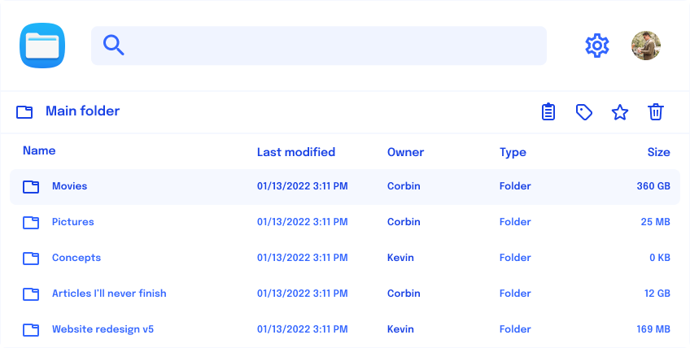
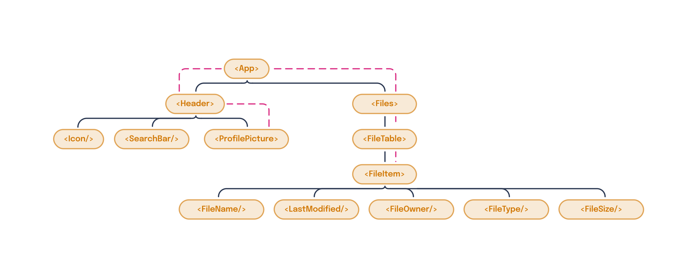
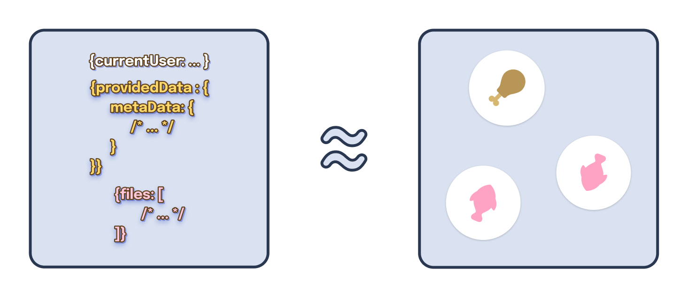
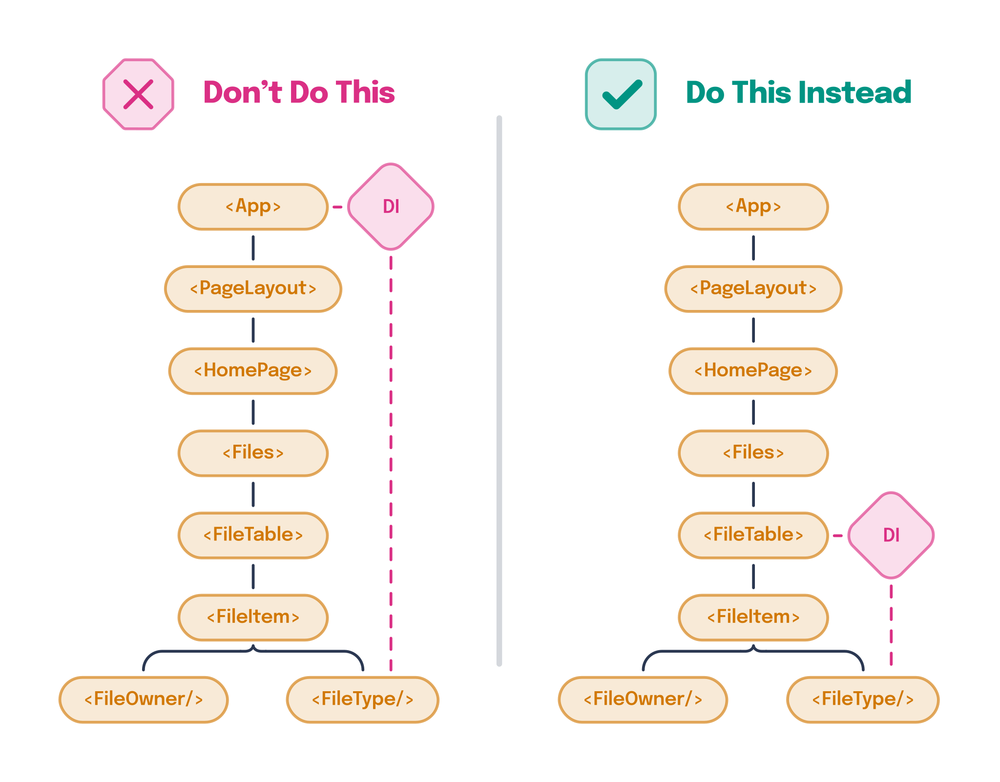
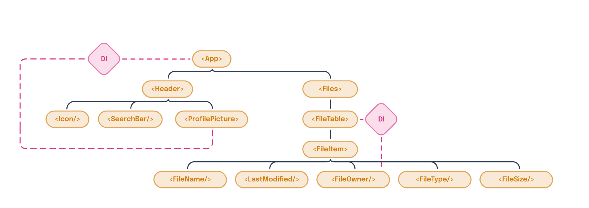
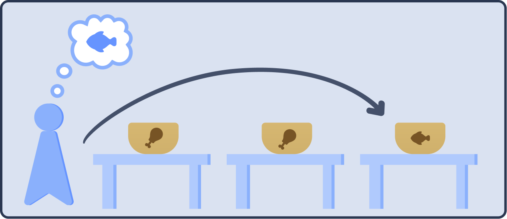
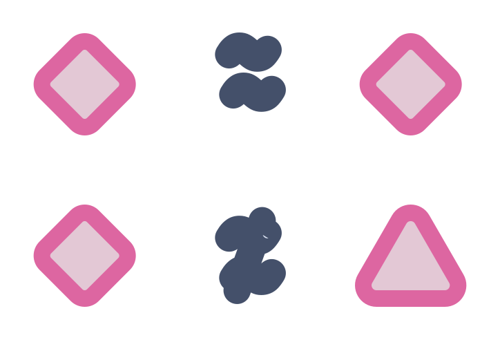
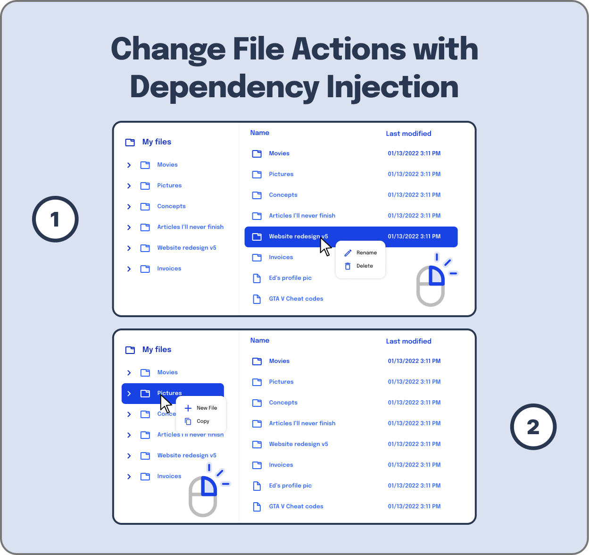
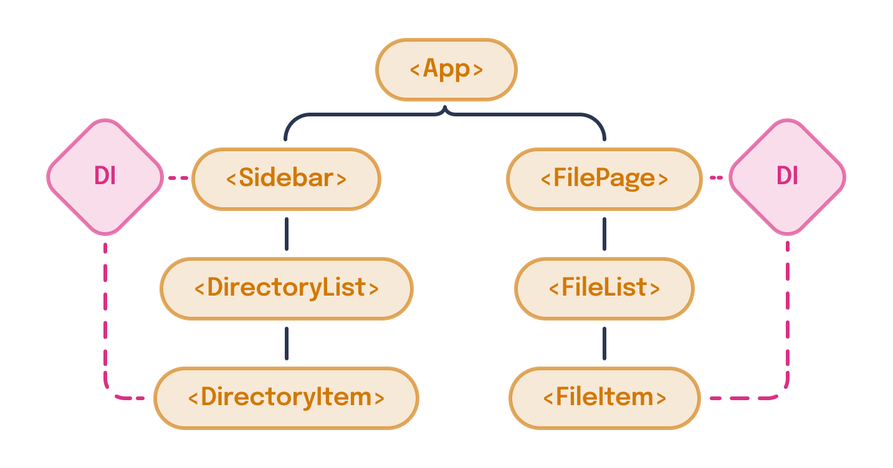

---
{
  title: "Dependency Injection",
  description: "Passing around props sucks. They're trivial get out of sync and easy to forget to pass. What if there was a better way to pass data between different parts of your app?",
  published: "2023-01-01T22:12:03.284Z",
  authors: ["crutchcorn"],
  tags: ["webdev"],
  attached: [],
  order: 11,
  collection: "The Framework Field Guide - Fundamentals",
}
---

One of the core tenants of components we've used repeatedly in the book is the idea of component inputs, or properties.

While component inputs are undoubtably useful, it can be challenging to utilize at scale when you need the same set of data across multiple layers of components.

For example, let's look back at our files app we've been developing throughout the book.



Here, we have a list of files, the user's profile picture in the corner of the screen. Here's an example of what our data for the page looks like:

```javascript
const APP_DATA = {
	currentUser: {
		name: "Corbin Crutchley",
		profilePictureURL: "https://avatars.githubusercontent.com/u/9100169",
	},
	collection: [
		{
			name: "Movies",
			type: "folder",
			ownerName: null,
			size: 386547056640,
		},
		{
			name: "Concepts",
			type: "folder",
			ownerName: "Kevin Aguillar",
			size: 0,
		},
	],
};
```

> This data has been shortened to keep focus on the topic at hand.

With this data, we can render out most of the UI within our mockup above.

Let's use this data to build out some of the foundation of our application. For example, say that every time we see an `ownerName` of `null`, we'll replace it with the `currentUser`'s `name` field.

To do this, we'll need to make sure to pass both our `collection` as well as `currentUser` down to every child component.

Let's use some pseudo-code and mock out what those components might look like with data passing from the parent to the child:

```jsx
// This is not real code, but demonstrates how we might structure our data passing
// Don't worry about syntax, but do focus on how data is being passed between components
const App = {
	data: APP_DATA,
	template: (
		<div>
			<Header currentUser="data.currentUser" />
			<Files files="data.collection" currentUser="data.currentUser" />
		</div>
	),
};

const Header = {
	props: ["currentUser"],
	template: (
		<div>
			<Icon />
			<SearchBar />
			<ProfilePicture currentUser="props.currentUser" />
		</div>
	),
};

const ProfilePicture = {
	props: ["currentUser"],
	template: ,
};

const Files = {
	props: ["currentUser", "files"],
	template: (
		<FileTable>
			{props.files.map((file) => (
				<FileItem file="file" currentUser="props.currentUser" />
			))}
		</FileTable>
	),
};

const FileItem = {
	props: ["currentUser", "file"],
	template: (
		<tr>
			<FileName file="props.file" />
			<LastModified file="props.file" />
			<FileOwner file="props.file" currentUser="props.currentUser" />
			<FileType file="props.file" />
			<FileSize file="props.file" />
		</tr>
	),
};

const FileOwner = {
	props: ["currentUser", "file"],
	data: {
		userNameToShow: props.file.ownerName || props.currentUser.name,
	},
	template: <td>{{ userNameToShow }}</td>,
};

render(App);
```

While this isn't real code, we can make a discovery by looking at our code laid out like this: We're passing `currentUser` to almost every single component!

If we chart out what the flow of data looks like, our `currentUser` property is being passed like so:



While it's obnoxious to pass `currentUser` in every component, we need that data in all of these components, so we can't simply remove the inputs, can we?

Well, we can! Sort of...

While we _can't_ outright remove the ability to pass the data from the parent to the children, what we **can** do is pass these components _implicitly_ instead of _explicitly_. This means that instead of telling the child component what data it should accept, we simply hand off data regardless of if it's needed or not. From there, it's the child component's job to raise it's hand and ask for data.

Think of this like a buffet of food. Instead of serving food directly to the customer's table, the customer comes to the table with all of the food, takes what it wants, and is satisfied with the results all-the-same.



We do this method of implicit data passing using a methodology called "**dependency injection**".

# Providing Basic Values with Dependency Injection

When we talk about dependency injection, we're referring to a method of providing data from a parent component down to a child component through implicit means.

Using dependency injection, we can change our method of providing data to implicitly pass data to the entire application. Doing so allows us to redesign the app and simplify how data is fetched to reflect something like this:


Here, `FileOwner` and `ProfilePicture` are grabbing data from the `App` provided value rather than having to go through every individual component.

React, Angular, and Vue all have methods for injecting data implicitly into child components using dependency injection. Let's start with the most basic method of dependency injection by providing some primitive values, like a number or string, down to a child component.

<!-- tabs:start -->

## React

In the React world, all dependency injection is powered by a `createContext` method, which you then `Provide` to your child components. Within those child components you then consume the provided data with a `useContext` hook.

```jsx
import { createContext, useContext } from "react";

// We start by creating a context name
const HelloMessageContext = createContext();

function Parent() {
	return (
		// Then create a provider for this context
		<HelloMessageContext.Provider value={"Hello, world!"}>
			<Child />
		</HelloMessageContext.Provider>
	);
}

function Child() {
	// Later, we use `useContext` to consume the value from dependency injection
	const helloMessage = useContext(HelloMessageContext);
	return <p>{helloMessage}</p>;
}
```

<iframe data-frame-title="React DI Basic Values String - StackBlitz" src="uu-remote-code:./ffg-fundamentals-react-di-basic-values-string-82?template=node&embed=1&file=src%2Fmain.jsx"></iframe>

## Angular

While React and Vue both have minimal APIs to handle dependency injection, Angular's dependency injection API is simultaneously more complex and powerful.

In Angular, it all starts with an `InjectionToken` of some kind. We'll start by importing Angular `InjectionToken` API, and creating a new token that we can use later.

```typescript
import { InjectionToken } from "@angular/core";

const WELCOME_MESSAGE_TOKEN = new InjectionToken<string>("WELCOME_MESSAGE");
```

We'll then use this token to create a `provider` that we pass to a component's `providers` list:

```typescript
@Component({
	selector: "app-root",
	standalone: true,
	imports: [ChildComponent],
	template: `<child-comp />`,
	providers: [{ provide: WELCOME_MESSAGE_TOKEN, useValue: "Hello, world!" }],
})
class AppComponent {}
```

This API uses `useValue` to provide the value associated with the token we pass.

Finally, we use an `inject` function in our component class to tell Angular "We want this value in our component".

```typescript
import { inject } from "@angular/core";

@Component({
	selector: "child-comp",
	standalone: true,
	template: `<p>{{ welcomeMsg }}</p>`,
})
class ChildComponent {
	welcomeMsg: string = inject(WELCOME_MESSAGE_TOKEN);

	ngOnInit() {
		console.log(this.welcomeMsg);
	}
}
```

<iframe data-frame-title="Angular DI Basic Values String - StackBlitz" src="uu-remote-code:./ffg-fundamentals-angular-di-basic-values-string-82?template=node&embed=1&file=src%2Fmain.ts"></iframe>

> Something worth mentioning when using the `inject` function is that you're unable to provide a `constructor` method to the `ChildComponent` class.
>
> While this might sound like a heavy limitation, the `inject` function provides various capabilities (and modularity) that the `constructor` method alone does not provide.

<!-- Editor's note: `inject` allows you to create sharable and exportable bits of code that can be reused elsewhere, whereas `@Inject` cannot be reused -->

## Vue

Vue's dependency injection API only has two parts to it:

1. A `provide` method, used to provide values from the parent component.
2. An `inject` method, used to get the provided values in the child component.

```vue
<!-- Parent.vue -->
<script setup>
import { provide } from "vue";
import Child from "./Child.vue";

provide("WELCOME_MESSAGE", "Hello, world!");
</script>

<template>
	<Child />
</template>
```

```vue
<!-- Child.vue -->
<script setup>
import { inject } from "vue";

const welcomeMsg = inject("WELCOME_MESSAGE");
</script>

<template>
	<p>{{ welcomeMsg }}</p>
</template>
```

<iframe data-frame-title="Vue DI Basic Values String - StackBlitz" src="uu-remote-code:./ffg-fundamentals-vue-di-basic-values-string-82?template=node&embed=1&file=src%2FParent.vue"></iframe>

<!-- tabs:end -->

Here, we expect this component to show a `<p>` tag that renders out `"Hello, world!"`.

While this is convenient for passing simple values to multiple parts of the app, most usages of dependency injection tend to have more complex data provided. Let's extend this logic to provide an object to children instead.

<!-- tabs:start -->

## React

As we mentioned before, all of React's dependency injection logic uses `createContext`, `Provider`, and `useContext`. As such, to provide an object is a minimal change from before, done by changing the `value` we pass to our provider:

```jsx
const HelloMessageContext = createContext();

const Child = () => {
	const helloMessage = useContext(HelloMessageContext);
	return <p>{helloMessage.message}</p>;
};

const Parent = () => {
	const helloMessageObject = { message: "Hello, world!" };

	return (
		<HelloMessageContext.Provider value={helloMessageObject}>
			<Child />
		</HelloMessageContext.Provider>
	);
};
```

<iframe data-frame-title="React DI Basic Values Object - StackBlitz" src="uu-remote-code:./ffg-fundamentals-react-di-basic-values-object-83?template=node&embed=1&file=src%2Fmain.jsx"></iframe>

## Angular

Because Angular's `useValue` accepts any arbitrary value, we can pass it an object to move away from a string injection:

```typescript {3,15}
@Component({
	selector: "child-comp",
	standalone: true,
	template: `<p>{{ welcomeMsg.message }}</p>`,
})
class ChildComponent {
	welcomeMsg = inject(WELCOME_MESSAGE_TOKEN);
}

@Component({
	selector: "app-root",
	standalone: true,
	imports: [ChildComponent],
	template: `<child-comp />`,
	providers: [
		{ provide: WELCOME_MESSAGE_TOKEN, useValue: { message: "Hello, world!" } },
	],
})
class AppComponent {}
```

<iframe data-frame-title="Angular DI Basic Values Object - StackBlitz" src="uu-remote-code:./ffg-fundamentals-angular-di-basic-values-object-83?template=node&embed=1&file=src%2Fmain.ts"></iframe>

While this functions, it's not very clean. In particular, some of the headaches present with this method include:

- Duplicative TypeScript typings between `inject` usage and `useValue` providing
  - Mismatches can cause `undefined` bugs intentionally

Luckily for us, Angular provides a better solution for this problem than `useValue` and `InjectionToken`.

Instead, let's create a class that we mark with an `@Injectable` decorator:

```typescript
import { Injectable } from "@angular/core";

@Injectable()
class InjectedValue {
	message = "Hello, world";
}
```

Here, we're telling Angular to treat our `InjectedValue` class as a `InjectionToken` that we can use by name in our `providers`.

```typescript
@Component({
	selector: "app-root",
	standalone: true,
	imports: [ChildComponent],
	providers: [InjectedValue],
	template: `<child-comp />`,
})
class AppComponent {}
```

Now that our `InjectedValue` is a known type, we can remove our explicit type declaration to our consuming `inject` function in `ChildComponent`

```typescript
@Component({
	selector: "child-comp",
	standalone: true,
	template: `<div>{{ injectedValue.message }}</div>`,
})
class ChildComponent implements OnInit {
	injectedValue = inject(InjectedValue);

	ngOnInit() {
		console.log(this.injectedValue);
	}
}
```

Much cleaner!

<iframe data-frame-title="Angular DI Injectable - StackBlitz" src="uu-remote-code:./ffg-fundamentals-angular-di-injectable-83?template=node&embed=1&file=src%2Fmain.ts"></iframe>

## Vue

Just like React, Vue's simple dependency injection API means that we only need to change our `provide` value to an object, and we're off to the races!

```vue
<!-- Parent.vue -->
<script setup>
import { provide } from "vue";
import Child from "./Child.vue";

const welcomeObj = { message: "Hello, world!" };
provide("WELCOME_MESSAGE", welcomeObj);
</script>

<template>
	<Child />
</template>
```

```vue
<!-- Child.vue -->
<script setup>
import { inject } from "vue";

const welcomeMsgObj = inject("WELCOME_MESSAGE");
</script>

<template>
	<p>{{ welcomeMsgObj.message }}</p>
</template>
```

<iframe data-frame-title="Vue DI Basic Values Object - StackBlitz" src="uu-remote-code:./ffg-fundamentals-vue-di-basic-values-object-83?template=node&embed=1&file=src%2FParent.vue"></iframe>

<!-- tabs:end -->

# Changing Values after Injection

While providing values from a parent node down to a child component is useful on its own, it's made even more powerful by the inclusion of data manipulation.

For example, what happens when your user wants to change their name with some kind of rename functionality? You should be able to change how the data is stored in your dependency injection to propagate those changes throughout your whole application immediately.

<!-- tabs:start -->

## React

Because our `Provider` is able to pass down values of any kind, we can combine this with `useState` in order to allow React to update the values for children.

```jsx
const HelloMessageContext = createContext();

const Child = () => {
	const helloMessage = useContext(HelloMessageContext);
	return <p>{helloMessage}</p>;
};

const Parent = () => {
	const [message, setMessage] = useState("Initial value");
	return (
		<HelloMessageContext.Provider value={message}>
			<Child />
			<button onClick={() => setMessage("Updated value")}>
				Update the message
			</button>
		</HelloMessageContext.Provider>
	);
};
```

<iframe data-frame-title="React Change After Val Inject - StackBlitz" src="uu-remote-code:./ffg-fundamentals-react-change-val-after-inject-84?template=node&embed=1&file=src%2Fmain.jsx"></iframe>

When we update the `message` value, it will trigger a re-render on the `Child` component and, in turn, update the displayed message.

## Angular

Because we've marked our `InjectedValue` class as an `Injectable`, we can have the parent component request access in the `constructor` in order to mutate the class instance.

```typescript
@Injectable()
class InjectedValue {
	message = "Initial value";
}

@Component({
	selector: "child-comp",
	standalone: true,
	template: `<p>{{ injectedValue.message }}</p>`,
})
class ChildComponent {
	injectedValue = inject(InjectedValue);
}

@Component({
	selector: "app-root",
	standalone: true,
	imports: [ChildComponent],
	providers: [InjectedValue],
	template: `
		<child-comp />
		<button (click)="updateMessage()">Update the message</button>
	`,
})
class AppComponent {
	// We can access the `injectedValue` from the same component we provide it from
	injectedValue = inject(InjectedValue);

	updateMessage() {
		this.injectedValue.message = "Updated value";
	}
}
```

<iframe data-frame-title="Angular Change Val After Inject - StackBlitz" src="uu-remote-code:./ffg-fundamentals-angular-change-val-after-inject-84?template=node&embed=1&file=src%2Fmain.ts"></iframe>

## Vue

Vue's minimal API surface allows us to compose `ref` and `provide` usage in order to provide values that we can change after injection.

```vue
<!-- Parent.vue -->
<script setup>
import { provide, ref } from "vue";
import Child from "./Child.vue";

const welcomeMessage = ref("Initial value");
provide("WELCOME_MESSAGE", welcomeMessage);

function updateMessage() {
	welcomeMessage.value = "Updated value";
}
</script>

<template>
	<Child />
	<button @click="updateMessage()">Update the message</button>
</template>
```

```vue
<!-- Child.vue -->
<script setup>
import { inject } from "vue";

// Worth mentioning, `welcomeMessage` is now _not_ a string, but rather a `ref`
// If you needed to use `welcomeMessage` inside of `<script setup>`, you'd
// need to use `.value`
const welcomeMessage = inject("WELCOME_MESSAGE");
</script>

<template>
	<p>{{ welcomeMessage }}</p>
</template>
```

<iframe data-frame-title="Vue Change Val After Inject - StackBlitz" src="uu-remote-code:./ffg-fundamentals-vue-change-val-after-inject-84?template=node&embed=1&file=src%2FParent.vue"></iframe>

<!-- tabs:end -->

## Changing Injected Values from Child

In the previous section, we showed how you're able to change the injected value from the root of the component. But what if we wanted to change the injected value from the child component instead of from the root?

Because dependency injection _usually_ only goes in one direction (from the parent to the child) it's not immediately clear how we can do this.

Despite this, each framework provides us the tools to update injected values from the children themselves; Let's see how that's done:

<!-- tabs:start -->

### React

Previously we utilized the ability to use `useState` in our `Provider` in order to handle data changes from the parent provider. Continuing on this pattern, we'll utilize `useState` once again to handle changes in a child component.

This works because React's `useContext` enables us to pass data of _any_ kind, functions included. This means that we can pass both the getter and setter function of `useState`, like so:

```jsx
const HelloMessageContext = createContext();

function Parent() {
	const [message, setMessage] = useState("Initial value");
	// We can pass both the setter and getter
	const providedValue = { message, setMessage };
	return (
		<HelloMessageContext.Provider value={providedValue}>
			<Child />
		</HelloMessageContext.Provider>
	);
}

function Child() {
	// And later, access them both as if they were local to the component
	const { message, setMessage } = useContext(HelloMessageContext);
	return (
		<>
			<p>{message}</p>
			<button onClick={() => setMessage("Updated value")}>
				Update the message
			</button>
		</>
	);
}
```

<iframe data-frame-title="React Change Val From Child - StackBlitz" src="uu-remote-code:./ffg-fundamentals-react-change-val-from-child-85?template=node&embed=1&file=src%2Fmain.jsx"></iframe>

#### Using a Reducer Pattern

Despite `useState` and `useContext` making a powerful combination for data passing and updating in dependency injection, it's far from a perfect solution when dealing with large data sets.

For example, what happens if we want to implement a counter, that includes an `increment` and `decrement` function?

We could pass each individual function through the `Provider`:

```jsx
function App() {
	const [count, setCount] = useState(0);

	const increment = () => {
		setCount(count + 1);
	};

	const decrement = () => {
		setCount(count - 1);
	};

	const set = (val) => {
		setCount(val);
	};

	const providedValue = { count, increment, decrement, set };
	return (
		<CounterContext.Provider value={providedValue}>
			<Child />
		</CounterContext.Provider>
	);
}
```

<iframe data-frame-title="React Homegrown Reducer - StackBlitz" src="uu-remote-code:./ffg-fundamentals-react-homegrown-reducer-85?template=node&embed=1&file=src%2Fmain.jsx"></iframe>

But doing so creates a substantial amount of noise: each function has a dedicated variable and needs to be passed independently for the `useContext` to work as intended.

---

This is where `useReducer` might come into play. Let's take a step back for a moment, and remove the `useContext` method.

A "reducer" pattern involves a list of actions that the user can take. These actions are provided the current `state` value, which will be updated based on the returned value from the reducer.

Let's take a look at the most basic version of a `reducer` that only can count up from `0`:

```jsx
import { useReducer } from "react";

const initialState = { count: 0 };

function reducer(state, action) {
	return { count: state.count + 1 };
}

function App() {
	const [state, dispatch] = useReducer(reducer, initialState);
	return (
		<>
			<p>{state.count}</p>
			<button onClick={() => dispatch()}>Add one</button>
		</>
	);
}
```

<iframe data-frame-title="React Basic useReducer - StackBlitz" src="uu-remote-code:./ffg-fundamentals-react-basic-use-reducer-85?template=node&embed=1&file=src%2Fmain.jsx"></iframe>

Here, whenever `dispatch` is called, it will run the `reducer` with no arguments for `action`, and React will automatically pass `state` for us. Then, when we `return` inside of the reducer, React will automatically keep track of the returned value as the new `state` value.

However, this isn't particularly useful and seems like more boilerplate than needed for what's effectively a simple `useState`. To make `useReducer` more worthwhile, we need to add more actions.

For example, we'll have an `increment` and `decrement` action that will respectively add one and remove one from the `state`.

```jsx
const initialState = { count: 0 };

function reducer(state, action) {
	switch (action.type) {
		case "increment":
			return { count: state.count + 1 };
		case "decrement":
			return { count: state.count - 1 };
		default:
			return state;
	}
}

function App() {
	const [state, dispatch] = useReducer(reducer, initialState);
	return (
		<>
			<p>{state.count}</p>
			<button onClick={() => dispatch({ type: "increment" })}>Add one</button>
			<button onClick={() => dispatch({ type: "decrement" })}>
				Remove one
			</button>
		</>
	);
}
```

<iframe data-frame-title="React useReducer Multi Action - StackBlitz" src="uu-remote-code:./ffg-fundamentals-react-use-reducer-multi-action-85?template=node&embed=1&file=src%2Fmain.jsx"></iframe>

Here, we can pass a `type` object as a parameter of `reducer`'s `action`, run a `switch`/`case` over it, and return relevant data changes as-needed.

But that's not all we can do with a reducer! We can also pass in what's often called a `payload` in order to set raw data to our `state` as well:

```jsx
const initialState = { count: 0 };

function reducer(state, action) {
	switch (action.type) {
		case "increment":
			return { count: state.count + 1 };
		case "decrement":
			return { count: state.count - 1 };
		case "set":
			return { count: action.payload };
		default:
			return state;
	}
}

function App() {
	const [state, dispatch] = useReducer(reducer, initialState);
	return (
		<>
			<p>{state.count}</p>
			<button onClick={() => dispatch({ type: "increment" })}>Add one</button>
			<button onClick={() => dispatch({ type: "decrement" })}>
				Remove one
			</button>
			<button onClick={() => dispatch({ type: "set", payload: 0 })}>
				Set to zero
			</button>
		</>
	);
}
```

<iframe data-frame-title="React useReducer Payload - StackBlitz" src="uu-remote-code:./ffg-fundamentals-react-use-reducer-payload-85?template=node&embed=1&file=src%2Fmain.jsx"></iframe>

> It's worth mentioning that [the reducer pattern is not unique to React](https://dev.to/reedbarger/what-is-a-reducer-in-javascript-a-complete-introduction-with-examples-ip1). That said, React is unique in that it has a built-in method to build reducers, unlike many other frameworks.

#### Reducer Patterns within Contexts

Just like we were able to pass the `setValue` function from `useState`, we can pass both `state` and `dispatch` using our `context`'s `Provide` and utilize `useContext` to inject those values into our child components.

```jsx
const CounterContext = createContext();

const initialState = { count: 0 };

function reducer(state, action) {
	switch (action.type) {
		case "increment":
			return { count: state.count + 1 };
		case "decrement":
			return { count: state.count - 1 };
		case "set":
			return { count: action.payload };
		default:
			return state;
	}
}

function Parent() {
	const [state, dispatch] = useReducer(reducer, initialState);
	const providedValue = { state, dispatch };
	return (
		<CounterContext.Provider value={providedValue}>
			<Child />
		</CounterContext.Provider>
	);
}

function Child() {
	const { state, dispatch } = useContext(CounterContext);
	return (
		<>
			<p>{state.count}</p>
			<button onClick={() => dispatch({ type: "increment" })}>Add one</button>
			<button onClick={() => dispatch({ type: "decrement" })}>
				Remove one
			</button>
			<button onClick={() => dispatch({ type: "set", payload: 0 })}>
				Set to zero
			</button>
		</>
	);
}
```

<iframe data-frame-title="React Reducer Within Contexts - StackBlitz" src="uu-remote-code:./ffg-fundamentals-react-reducer-within-contexts-85?template=node&embed=1&file=src%2Fmain.jsx"></iframe>

### Angular

Because we're able to inject a full class instance into a child component, we can utilize methods in said class to mutate data of the injected class instance.

```typescript
@Injectable()
class InjectedValue {
	message = "Hello, world";
	// `this` is referring to the `InjectedValue` instance
	changeMessage(val: string) {
		this.message = val;
	}
}

@Component({
	selector: "child-comp",
	standalone: true,
	template: `
		<div>{{ injectedValue.message }}</div>
		<button (click)="changeMessage()">Change message</button>
	`,
})
class ChildComponent {
	injectedValue = inject(InjectedValue);

	changeMessage() {
		// This will update the value of the class, and
		// re-render the component to reflect the new value
		this.injectedValue.changeMessage("Updated value");
	}
}

@Component({
	selector: "app-root",
	standalone: true,
	imports: [ChildComponent],
	providers: [InjectedValue],
	template: `<child-comp />`,
})
class ParentComponent {}
```

<iframe data-frame-title="Angular Change Val From Child - StackBlitz" src="uu-remote-code:./ffg-fundamentals-angular-change-val-from-child-85?template=node&embed=1&file=src%2Fmain.ts"></iframe>

### Vue

In our previous example, we used `provide` to inject a `ref` into the child component. Because of Vue's reactivity system, we can utilize this `ref` to change the `.value` of the `ref` in the child to modify the value that's injected across the app.

```vue
<!-- Parent.vue -->
<script setup>
import { provide, ref } from "vue";
import Child from "./Child.vue";

const welcomeMessage = ref("Initial value");
provide("WELCOME_MESSAGE", welcomeMessage);
</script>

<template>
	<Child />
</template>
```

```vue
<!-- Child.vue -->
<script setup>
import { inject } from "vue";

const welcomeMessage = inject("WELCOME_MESSAGE");

function updateMessage() {
	welcomeMessage.value = "Updated value";
}
</script>

<template>
	<p>{{ welcomeMessage }}</p>
	<button @click="updateMessage()">Update the message</button>
</template>
```

<iframe data-frame-title="Vue Change Val from Child - StackBlitz" src="uu-remote-code:./ffg-fundamentals-vue-change-val-from-child-85?template=node&embed=1&file=src%2FParent.vue"></iframe>

<!-- tabs:end -->

# Optional Injected Values

Let's think back to the start of this chapter. The original goal of introducing dependency injection was to enable sharing user login information throughout multiple components.

While you might expect the user's login information to always be present, what if it wasn't? What if, when the user first creates their account, they opt out of inputting their name and profile picture? Even if this seems unlikely, a robust application should handle edge-cases like this.

Luckily, React, Angular, and Vue are all able to withstand an empty value provided through dependency injection by marking the value as "optional".

<!-- tabs:start -->

## React

In React, handling optionally injected values doesn't require a new API. We can still use the `useContext` hook in the child component, even if there is no provider.

```jsx
const HelloMessageContext = createContext();

function Parent() {
	// Notice no provider was set
	return <Child />;
}

function Child() {
	// `messageData` is `undefined` if nothing is injected
	const messageData = useContext(HelloMessageContext);

	// If no value is passed, we can simply
	// not render anything in this component
	if (!messageData) return null;

	return <p>{messageData}</p>;
}
```

When this is done, `useContext` is `undefined` if no value is injected for a particular named context.

<iframe data-frame-title="React Optional Injected Vals - StackBlitz" src="uu-remote-code:./ffg-fundamentals-react-optional-injected-vals-86?template=node&embed=1&file=src%2Fmain.jsx"></iframe>

## Angular

In Angular, we provide values to be injected using the `providers` array on a component.

```typescript
@Injectable()
class InjectedValue {
	message = "Initial value";
}

@Component({
	selector: "child-comp",
	standalone: true,
	template: `<p>{{ injectedValue.message }}</p>`,
})
class ChildComponent {
	injectedValue = inject(InjectedValue);
}

@Component({
	selector: "app-root",
	standalone: true,
	imports: [ChildComponent],
	providers: [InjectedValue],
	template: `<child-comp />`,
})
class ParentComponent {}
```

However, if we remove the `providers` from `ParentComponent`, in order to test our application without any user data, like so:

```typescript
@Component({
	selector: "app-root",
	standalone: true,
	imports: [ChildComponent],
	template: `<child-comp />`,
})
class ParentComponent {}
```

We get the following error:

> ```
> ERROR NullInjectorError: R3InjectorError(AppModule)[InjectedValue -> InjectedValue -> InjectedValue]:
>   NullInjectorError: No provider for InjectedValue!
> ```

<iframe data-frame-title="Angular Optional Injected Vals Err - StackBlitz" src="uu-remote-code:./ffg-fundamentals-angular-optional-injected-vals-err-86?template=node&embed=1&file=src%2Fmain.ts"></iframe>

This is because our `inject` function inside of `ChildComponent` is marked as a required dependency by default, hence the error.

Fortunately there's a way to tell Angular to mark that dependency as "optional" by passing a second argument to the `inject` function:

```typescript
@Injectable()
class InjectedValue {
	message = "Hello, world";
}

@Component({
	selector: "child-comp",
	standalone: true,
	imports: [NgIf],
	template: `
		<div *ngIf="injectedValue">{{ injectedValue.message }}</div>
		<div *ngIf="!injectedValue">There is no injected value</div>
	`,
})
class ChildComponent implements OnInit {
	injectedValue = inject(InjectedValue, { optional: true });

	ngOnInit() {
		// undefined
		console.log(this.injectedValue);
	}
}

@Component({
	selector: "app-root",
	standalone: true,
	imports: [ChildComponent],
	template: `<child-comp />`,
})
class ParentComponent {}
```

Now, we get no error when `injectedValue` is not provided. Instead, we get a value of `null`, which we can gaurd against using `ngIf` inside our template.

<iframe data-frame-title="Angular Optional Injected Vals - StackBlitz" src="uu-remote-code:./ffg-fundamentals-angular-optional-injected-vals-86?template=node&embed=1&file=src%2Fmain.ts"></iframe>

## Vue

Much like React's dependency injection system, when using Vue's `inject` without a parent `provide`, the `inject` defaults its value to `undefined`.

```vue
<!-- Parent.vue -->
<script setup>
import Child from "./Child.vue";
</script>

<template>
	<Child />
</template>
```

```vue
<!-- Child.vue -->
<script setup>
import { inject } from "vue";

const welcomeMessage = inject("WELCOME_MESSAGE");

// undefined
console.log(welcomeMessage);
</script>

<template>
	<p v-if="welcomeMessage">{{ welcomeMessage }}</p>
	<p v-if="!welcomeMessage">There is no welcome message</p>
</template>
```

<iframe data-frame-title="Vue Optional Injected Vals - StackBlitz" src="uu-remote-code:./ffg-fundamentals-vue-optional-injected-vals-86?template=node&embed=1&file=src%2FParent.vue"></iframe>

> You may see a warning like this in your `console` if you do this:
>
> `[Vue warn]: injection "WELCOME_MESSAGE" not found. `
>
> This is normal and expected - keep calm and code on.

<!-- tabs:end -->

## Default Values for Optional Values

While it's good that our code is now more resilient against missing data, it's not a great user experience to simply have parts of the app missing when said data isn't present.

Instead, let's decide that when the user doesn't have a provided name, let's provide a default value of "Unknown Name" throughout our app. To do this, we'll need to provide that default value in our dependency injection system.

<!-- tabs:start -->

### React

Because of React's minimalistic dependency injection API, providing a default value to an optionally injected value can be done using [JavaScript's built-in "OR" operator (`||`)](https://developer.mozilla.org/en-US/docs/Web/JavaScript/Reference/Operators/Logical_OR).

```jsx
function Child() {
	const injectedMessageData = useContext(HelloMessageContext);

	const messageData = injectedMessageData || "Hello, world!";

	return <p>{messageData}</p>;
}
```

<iframe data-frame-title="React Default Vals for Optional - StackBlitz" src="uu-remote-code:./ffg-fundamentals-react-default-vals-for-optional-87?template=node&embed=1&file=src%2Fmain.jsx"></iframe>

### Angular

<!-- Editor's note: Marking an item as `optional` has a default value of `null`, not `undefined`: https://github.com/angular/angular/issues/25395 -->

When an `inject` function is marked as `{optional: true}`, the default value (when nothing is provided) is `null`.

As such, we can use [JavaScript's built-in "OR" operator (`||`)](https://developer.mozilla.org/en-US/docs/Web/JavaScript/Reference/Operators/Logical_OR) to default to a different value as our default:

```typescript
@Injectable()
class InjectedValue {
	message = "Initial value";
}

@Component({
	selector: "child-comp",
	standalone: true,
	template: `<p>{{ injectedValue.message }}</p>`,
})
class ChildComponent {
	injectedValue = inject(InjectedValue) || { message: "Default Value" };
}

@Component({
	selector: "app-root",
	standalone: true,
	imports: [ChildComponent],
	providers: [InjectedValue],
	template: ` <child-comp /> `,
})
class ParentComponent {}
```

<iframe data-frame-title="Angular Default Vals for Optional - StackBlitz" src="uu-remote-code:./ffg-fundamentals-angular-default-vals-for-optional-87?template=node&embed=1&file=src%2Fmain.ts"></iframe>

### Vue

Vue is the only framework of the three that supports a built-in way to provide a default value for dependency injected values. To do this, pass a second argument to the `inject` method and it will be used as your default value.

```vue
<!-- Child.vue -->
<script setup>
import { inject } from "vue";

const welcomeMessage = inject("WELCOME_MESSAGE", "Default value");

// "Default value"
console.log(welcomeMessage);
</script>

<template>
	<p>{{ welcomeMessage }}</p>
</template>
```

<iframe data-frame-title="Vue Default Vals for Optional - StackBlitz" src="uu-remote-code:./ffg-fundamentals-vue-default-vals-for-optional-87?template=node&embed=1&file=src%2FParent.vue"></iframe>

<!-- tabs:end -->

# Application Wide Providers

In our example codebase, we structured an application where `userData` is utilized all over the app. Instead of having an injected value for this data, it would be ideal to have access to this information anywhere in the component tree.

<!-- tabs:start -->

## React

To provide values at the root of a React application, we can reuse our `Provider` knowledge and use a `Provider` at the top-level `App` component.

```jsx
function App() {
	const [message, setMessage] = useState("Initial value");
	const providedValue = { message, setMessage };
	return (
		<HelloMessageContext.Provider value={providedValue}>
			<Child />
		</HelloMessageContext.Provider>
	);
}
```

### Consolidate Providers and Your Logic

When working with providers that needs state of some kind, you may want to keep your `useState` and `<Context.Provider>` code in the same place.

To centralize these APIs, we can utilize the concept of componentization. Start by moving your provider and logic into a new component, then allow the user to pass child components to the new `HelloMessageProvider` component:

```jsx
// This can be named anything! It's a component like any other
const HelloMessageProvider = ({ children }) => {
	const [message, setMessage] = useState("Initial value");
	const providedValue = { message, setMessage };
	return (
		<HelloMessageContext.Provider value={providedValue}>
			{children}
		</HelloMessageContext.Provider>
	);
};

function App() {
	return (
		<HelloMessageProvider>
			<Child />
		</HelloMessageProvider>
	);
}
```

These children of `HelloMessageProvider` are then passed the `HelloMessageContext` through React's dependency injection system.

### Provider Christmas Trees Are Okay!

When you have a large enough application, you may end up having an `App` component that looks like this:

```jsx
const App = () => {
	const { isDarkMode, paperTheme, updateLocalDarkMode, localDarkMode } =
		useLocalDarkMode();

	return (
		<NavigationContainer theme={isDarkMode ? darkNavTheme : lightNavTheme}>
			<PaperProvider theme={paperTheme}>
				<StatusBar
					barStyle={isDarkMode ? "light-content" : "dark-content"}
					backgroundColor={"transparent"}
				/>
				<SetDarkModeContext.Provider
					value={{
						setDarkMode: updateLocalDarkMode,
						localDarkMode,
					}}
				>
					<ColorSchemeProvider mode={isDarkMode ? "dark" : "light"}>
						<ErrorBoundary FallbackComponent={CustomFallback}>
							<Provider store={store}>
								<AppContents />
							</Provider>
						</ErrorBoundary>
					</ColorSchemeProvider>
				</SetDarkModeContext.Provider>
			</PaperProvider>
		</NavigationContainer>
	);
};
```

> [This is actual source code pulled from my React Native app, GitShark](https://github.com/oceanbit/GitShark/blob/main/src/App.tsx#L156-L176).

This code is colloquially called the "Provider Christmas Tree" because of it's formatted structure.

Despite looking ugly, this code is okay! If you _really_ want to break things up, take one step further in componentizing your codebase and move similar providers into their own `StyleProvider` component to help flatten this code:

```jsx
const StyleProvider = ({ children }) => {
	return (
		<PaperProvider theme={paperTheme}>
			<StatusBar
				barStyle={isDarkMode ? "light-content" : "dark-content"}
				backgroundColor={"transparent"}
			/>
			<SetDarkModeContext.Provider
				value={{
					setDarkMode: updateLocalDarkMode,
					localDarkMode,
				}}
			>
				<ColorSchemeProvider mode={isDarkMode ? "dark" : "light"}>
					{children}
				</ColorSchemeProvider>
			</SetDarkModeContext.Provider>
		</PaperProvider>
	);
};

const App = () => {
	const { isDarkMode, paperTheme, updateLocalDarkMode, localDarkMode } =
		useLocalDarkMode();

	return (
		<NavigationContainer theme={isDarkMode ? darkNavTheme : lightNavTheme}>
			<ErrorBoundary FallbackComponent={CustomFallback}>
				<Provider store={store}>
					<StyleProvider>
						<AppContents />
					</StyleProvider>
				</Provider>
			</ErrorBoundary>
		</NavigationContainer>
	);
};
```

> Remember, the order of these providers can matter and can cause bugs if out-of-order!

## Angular

While other frameworks require you to explicitly provide your dependency injected values at the root of your application, Angular does not.

Remember earlier when we utilized `@Injectable` to mark a class as an injectable class instance? Well, this decorator has a trick up its sleave: [the `providedIn` property](https://angular.io/guide/providers#providedin-and-ngmodules).

When you pass `{providedIn: 'root'}` to the `@Injectable` decorator, you no longer have to explicitly place the class inside of a `providers` array; instead, Angular will simply provide this class to the root of your application.

```typescript
@Injectable({ providedIn: "root" })
class InjectedValue {
	message = "Hello, world";
}

@Component({
	selector: "child-comp",
	standalone: true,
	template: `<div></div>`,
})
class ChildComponent implements OnInit {
	injectedValue = inject(InjectedValue);

	ngOnInit() {
		// This will include the `message` property, alongside
		// any other methods and properties on the class instance
		console.log(this.injectedValue);
	}
}

@Component({
	selector: "app-root",
	standalone: true,
	imports: [ChildComponent],
	template: `<child-comp />`,
})
class ParentComponent {}
```

In Angular, these globally provided values are called "Services". They're often used to break up and move application logic out of components in order to be more widely re-used.

## Vue

Providing a value at your application's root in Vue is similar to providing a value anywhere else in your codebase. Add a `provide` method call inside your root `App` component, and your data is now provided globally.

```vue
<!-- App.vue -->
<script setup>
import { provide, ref } from "vue";
import Child from "./Child.vue";

const welcomeMessage = ref("Hello, world!");
provide("WELCOME_MESSAGE", welcomeMessage);
</script>

<template>
	<Child />
</template>
```

<!-- tabs:end -->

These globally provided values are also called "singletons". When using a singleton, it's important to remember that data is shared between every component. If we have three components that all use one provided value, and mutate said value, it will update all of the consuming components.

## Application Wide Providers _Can_ Cause Performance Problems

Generally, it's suggested to keep your data providers as close to the intended component as possible. For example, if you have the following component structure:

```html
<App>
	<PageLayout>
		<HomePage>
			<Files>
				<FileTable>
					<FileItem>
						<FileOwner />
						<FileType />
					</FileItem>
				</FileTable>
			</Files>
		</HomePage>
	</PageLayout>
</App>
```

You have two choices to `provide` the data:

1. At the root of your component structure (`App`)
2. At the closest source of location (`FileTable`)

Between these two options, you should _generally_ opt to utilize #2, which would place your data injection closer to the components that need said data.



While this isn't always possible, the justification for doing so is that any changes made to the injected values must propagate downwards and find the component that needs to be re-rendered.

While some frameworks like Vue handle this gracefully and only re-render the components that actually use the injected values, React and Angular differ.

Let's assume that we go with an application-wide provider. In React and Angular, **when we change the value of the provider, the framework must search through the entire component tree to find the components that need to re-render**.

**React even re-renders all of the child components of `App` when using `useContext`** to provide changing data.

[This problem can be solved by external tooling, such as Redux in React](https://blog.isquaredsoftware.com/2021/01/context-redux-differences/) or [NgRx in Angular](https://ngrx.io/), as they introduce a more optimized mechanism of detecting component data changes.

Luckily, your knowledge of these framework's built-in dependency injection APIs will help you greatly along the way of utilizing these external tools.

# Overwriting Dependency Injection Specificity

Large apps get complicated fast. Consider the following example:

You have an app that provides user data at the root of the application - the `App` component. However, you need to replace that user data at a lower level component for the rest of the component tree.

For these instances, these larger apps can replace dependency injection values mid-tree, like so:



While it's rare, this ability is an incredibly powerful feature you can leverage in your applications.

A child component will have it's dependency injection resolved from the closest parent. This means that if you have two providers, but one is closer, it will read from the closer parent.

This means that if we have the following structure:

```jsx
<App>
	<Child>
		<GrandChild>
			<GreatGrandChild />
		</GrandChild>
	</Child>
</App>
```

And both `App` and `GrandChild` inject values into the same named context, then `GreatGrandChild` will display information from `GrandChild` rather than `App`:

<!-- tabs:start -->

## React

```jsx
const NameContext = createContext("");

function App() {
	return (
		<NameContext.Provider value="Corbin">
			<Child />
		</NameContext.Provider>
	);
}

function Child() {
	return <GrandChild />;
}

// Notice the new provider here, it will suppliment the `App` injected value
// for all child components of `GrandChild`
function GrandChild() {
	return (
		<NameContext.Provider value="Kevin">
			<GreatGrandChild />
		</NameContext.Provider>
	);
}

function GreatGrandChild() {
	const name = useContext(NameContext);
	return <p>Name: {name}</p>;
}
```

## Angular

```typescript
@Injectable()
class NameValue {
	name = "";
}

@Component({
	selector: "great-grand-child",
	standalone: true,
	imports: [],
	template: `<p>{{ nameValue.name }}</p>`,
})
class GreatGrandChildComponent {
	nameValue = inject(NameValue);
}

@Component({
	selector: "grand-child",
	standalone: true,
	// Notice the new provider here, it will suppliment the `App` injected value
	// for all child components of `grand-child`
	providers: [{ provide: NameValue, useValue: { name: "Kevin" } }],
	imports: [GreatGrandChildComponent],
	template: `<great-grand-child />`,
})
class GrandChildComponent {}

@Component({
	selector: "child-comp",
	standalone: true,
	imports: [GrandChildComponent],
	template: `<grand-child />`,
})
class ChildComponent {}

@Component({
	selector: "app-root",
	standalone: true,
	providers: [{ provide: NameValue, useValue: { name: "Corbin" } }],
	imports: [ChildComponent],
	template: `<child-comp />`,
})
class AppComponent {}
```

## Vue

```vue
<!-- App.vue -->
<script setup>
import { provide } from "vue";
import Child from "./Child.vue";

provide("NAME", "Corbin");
</script>

<template>
	<Child />
</template>
```

```vue
<!-- Child.vue -->
<script setup>
import GrandChild from "./GrandChild.vue";
</script>

<template>
	<GrandChild />
</template>
```

```vue
<!-- GrandChild.vue -->
<script setup>
import { provide } from "vue";
import GreatGrandChild from "./GreatGrandChild.vue";

// Notice the new provider here, it will suppliment the `App` injected value
// for all child components of `GrandChild`
provide("NAME", "Kevin");
</script>

<template>
	<GreatGrandChild />
</template>
```

```vue
<!-- GreatGrandChild.vue -->
<script setup>
import { inject } from "vue";

const name = inject("NAME");
</script>

<template>
	<p>Name: {{ name }}</p>
</template>
```

<!-- tabs:end -->

Earlier, we talked about how dependency injection is like a buffet of data; components act like customers grabbing food from an all-you-can-eat buffet of data.

Let's continue that analogy:

Assume you're at a buffet with three tables of food. These tables, in order of proximity to yourself, are:

- Chicken, closest to you
- Chicken, second closest to you
- Fish, farthest away


If you're hungry for chicken, you're not likely to walk farther to get the same food and will instead pick the closest table with chicken on it to get your food from.

This is similar to how a component will try to find the closest source of data for a requested data type in the component tree.

# Finding Specific Injected Values

Just because we can have multiple providers throughout an application doesn't mean that there's not an order to how your component grabs specifically requested data.

Let's take that same analogy from before with the three buffet tables. Now, assume that the person looking to get food is a pescatarian; they don't eat meat unless it's from a fish.

Despite chicken being closer to them, they'll go out of their way to find the table with fish on it.



Likewise, if you have a data provider that is hosting entirely unrelated data from what your child component is looking for, it might not pick up the correct data.

<!-- tabs:start -->

### React

```jsx
const NameContext = createContext("");
const AgeContext = createContext(0);

function App() {
	return (
		<NameContext.Provider value="Corbin">
			<Child />
		</NameContext.Provider>
	);
}

function Child() {
	return <GrandChild />;
}

function GrandChild() {
	return (
		<AgeContext.Provider value={24}>
			<GreatGrandChild />
		</AgeContext.Provider>
	);
}

function GreatGrandChild() {
	// Despite the `AgeContext` being closer, this is
	// specifically looking for the `NameContext` and will
	// go further up in the tree to find that data from `App`
	const name = useContext(NameContext);
	return <p>Name: {name}</p>;
}
```

### Angular

```typescript
@Injectable()
class NameValue {
	name = "";
}

@Injectable()
class AgeValue {
	age = 0;
}

@Component({
	selector: "great-grand-child",
	standalone: true,
	imports: [],
	template: `<p>{{ nameValue.name }}</p>`,
})
class GreatGrandChildComponent {
	// Despite the `AgeValue` being closer, this is
	// specifically looking for the `NameValue` and will
	// go further up in the tree to find that data from `app-root`
	nameValue = inject(NameValue);
}

@Component({
	selector: "grand-child",
	standalone: true,
	providers: [{ provide: AgeValue, useValue: { age: 24 } }],
	imports: [GreatGrandChildComponent],
	template: `<great-grand-child />`,
})
class GrandChildComponent {}

@Component({
	selector: "child-comp",
	standalone: true,
	imports: [GrandChildComponent],
	template: `<grand-child />`,
})
class ChildComponent {}

@Component({
	selector: "app-root",
	standalone: true,
	providers: [{ provide: NameValue, useValue: { name: "Corbin" } }],
	imports: [ChildComponent],
	template: `<child-comp />`,
})
class AppComponent {}
```

### Vue

```vue
<!-- App.vue -->
<script setup>
import { provide } from "vue";
import Child from "./Child.vue";

provide("NAME", "Corbin");
</script>

<template>
	<Child />
</template>
```

```vue
<!-- Child.vue -->
<script setup>
import GrandChild from "./GrandChild.vue";
</script>

<template>
	<GrandChild />
</template>
```

```vue
<!-- GrandChild.vue -->
<script setup>
import { provide } from "vue";
import GreatGrandChild from "./GreatGrandChild.vue";

provide("AGE", 24);
</script>

<template>
	<GreatGrandChild />
</template>
```

```vue
<!-- GreatGrandChild.vue -->
<script setup>
import { inject } from "vue";

// Despite the `AGE` being closer, this is
// specifically looking for the `NAME` and will
// go further up in the tree to find that data from `App`
const name = inject("NAME");
</script>

<template>
	<p>Name: {{ name }}</p>
</template>
```

<!-- tabs:end -->

This specificity-seeking behavior of your dependency injection consumer is helpful to ensure your data retains its "shape" between injector sites.

> What's my data's "shape"?

# The Importance of Consistency in Provided Data

The idea of a data's "shape" is that two pieces of data share enough related data to be considered "similar" in "shape".

For example, if you have the following object:

```javascript
const obj1 = { a: 1, b: 2 };
```

It would be considered to have the same "shape" as this other object:

```javascript
const obj2 = { a: 2, b: 3 };
```

Even if the two objects contain slightly different values. The "shape" of an object is defined by:

1. The names of properties
2. The types of data being stored in each properties
3. The number of properties

While the above have the same shapes, here's some examples that don't:

```javascript
const obj1 = { a: 1, b: 2 };
const obj2 = { c: 1, d: 2 };

isSameShape(obj1, obj2); // false
```

```javascript
const obj1 = { a: 1, b: 2 };
const obj2 = { a: "1", b: 2 };

isSameShape(obj1, obj2); // false
```

```javascript
const obj1 = { a: 1, b: 2 };
const obj2 = { a: 1, b: 2, c: 3 };

isSameShape(obj1, obj2, "exact"); // false
isSameShape(obj1, obj2, "similar"); // true
```

While #1 and #2 are strict requirements, the number of properties can shift a bit and still be considered of a similar "shape", even if it's not an exact match.

You can visualize an object's _shape_ as comparing two geometrical shapes to one another: A triangle is not the same as a diamond.



> Why does this matter? How does this pertain to frontend frameworks?

This concept of "retaining shape" between dependency injection providers is critical. Assume you have the following code:

<!-- tabs:start -->

## React

```jsx
const UserContext = createContext({});

function App() {
	const user = { name: "Corbin Crutchley" };
	return (
		<UserContext.Provider value={user}>
			<Child />
		</UserContext.Provider>
	);
}

function Child() {
	return <GrandChild />;
}

function GrandChild() {
	const otherUser = { firstName: "Corbin", lastName: "Crutchley" };
	return (
		<UserContext.Provider value={otherUser}>
			<GreatGrandChild />
		</UserContext.Provider>
	);
}

function GreatGrandChild() {
	const user = useContext(UserContext);
	// Nothing will display, because we switched the user
	// type halfway through the component tree
	return <p>Name: {user.name}</p>;
}
```

## Angular

// TODO:

## Vue

// TODO:

<!-- tabs:end -->

If we were to read through the `App` component and the `GreatGrandChild` component, we wouldn't expect to see any problems. But if we look at the final render, we'll see the following markup:

```html
<p>Name:</p>
```

This bug was introduced because we switched the _shape_ of the object midway through the component tree.

> This consistency in shape doesn't just help prevent errors, either. Keeping a similar shape throughout multiple function calls is how you're able to implicitly improve your app's performance through an internal browser optimization called ["Monomorphic inline caching"](https://marcradziwill.com/blog/mastering-javascript-high-performance/#ic).
>
> The above link is intended to help

## Variance in Injected Data

This required consistency in injected data doesn't mean that the data provided at each provider must be exactly the same.

Just like each buffet table might have different spices on each plate of the same kind of food, so too can the individual data providers inject variance into their provided values.

For example, while methods of an injected object should accept the same props and should generally return the same values, you can change the logic inside of injected objects:

<!-- tabs:start -->

### React

```jsx
const GreeterContext = createContext({
	greeting: "",
	changeGreeting: (newGreeting) => {},
});

function App() {
	const [greeting, setGreeting] = useState("");
	const value = { greeting, changeGreeting: setGreeting };
	return (
		<GreeterContext.Provider value={value}>
			<Child />
		</GreeterContext.Provider>
	);
}

function Child() {
	return <GrandChild />;
}

function GrandChild() {
	const [greeting, setGreeting] = useState("✨ Welcome 💯");

	// New ✨ sparkly ✨ functionality adds some fun! 💯
	const changeGreeting = (newVal) => {
		if (!newVal.includes("✨")) {
			newVal += "✨";
		}
		if (!newVal.includes("💯")) {
			newVal += "💯";
		}

		setGreeting(newVal);
	};

	const value = { greeting, changeGreeting };
	return (
		<GreeterContext.Provider value={value}>
			<GreatGrandChild />
		</GreeterContext.Provider>
	);
}

function GreatGrandChild() {
	const { greeting, changeGreeting } = useContext(GreeterContext);
	return (
		<div>
			<p>{greeting}, user!</p>
			<label>
				<div>Set a new greeting</div>
				<input
					value={greeting}
					onChange={(e) => changeGreeting(e.target.value)}
				/>
			</label>
		</div>
	);
}
```

### Angular

// TODO:

### Vue

// TODO:

<!-- tabs:end -->

Here, we see two variants of the same `Greeter` injected value. One is a more serious "Set the value without changing it" while the other injected value adds some emoji to spice up your greetings!

You can think of this like variance within a geometrical shape's color. If you have two triangles, but one is red and one is blue, you can still recognize the triangles as the same shape.


While the first set of shapes and the second set of the shapes are not the _same_, they are still the same _shape_.

# Challenge

Earlier, in our [element reference](/posts/ffg-fundamentals-element-reference) and [component reference](/posts/ffg-fundamentals-component-reference) chapters, we built out a context menu component to show additional actions a user could take with right-clicking on a file.


This component has all the key features we need to act as a custom context menu:

- Opens on right-click

- Closes when user clicks outside of it

- Focusing when open

While we've done good work on the component thus far, it's missing something critical: Functionality.

Let's fix that by adding in a list of actions the user can take when the context menu is open. Here's the catch: The actions the user can take depends on what part of the app they're right-clicking on.



There's a few ways we could solve this, but they all boil down to persisting a list of actions the user can take depending on which part of the component tree they're in.

Sound familiar?

Let's use dependency injection to provide a different list of actions based on which part of the component tree they're a part of, like so:



This will consist of multiple steps:

1. Creating an app layout that includes an empty sidebar and file page to fill in later

2. Creating a file list in the file page and directory list in the sidebar

3. Add a context menu to the list items with a static list of actions

4. Update the context menu to grab data from a dependency injection node

5. Make the list of actions function as-expected

Strap in - this is going to be a long challenge. By the end of it we'll have a functioning application shell with a real-world example of dependency injection.

## 1. Creating an Initial App Layout

// TODO: ...

<!-- tabs:start -->

### React

```jsx
// App.jsx
function App() {
	return (
		<Layout sidebar={<Sidebar />}>
			<FileList />
		</Layout>
	);
}
```

```jsx
// Layout.jsx
const Layout = ({ sidebar, children }) => {
	return (
		<div style={{ display: "flex", flexWrap: "nowrap", minHeight: "100vh" }}>
			<div
				style={{
					width: 150,
					backgroundColor: "lightgray",
					borderRight: "1px solid grey",
				}}
			>
				{sidebar}
			</div>
			<div style={{ width: 1, flexGrow: 1 }}>{children}</div>
		</div>
	);
};
```

```jsx
// Sidebar.jsx
const Sidebar = () => {
	return (
		<div style={{ padding: "1rem" }}>
			<h1 style={{ fontSize: "1.25rem" }}>Directories</h1>
		</div>
	);
};
```

```jsx
// FileList.jsx
const FileList = () => {
	return (
		<div style={{ padding: "1rem" }}>
			<h1>Files</h1>
		</div>
	);
};
```

### Angular

```typescript
// app.component.ts
@Component({
	selector: "app-root",
	standalone: true,
	imports: [LayoutComponent, SidebarComponent, FileListComponent],
	template: `
		<app-layout>
			<app-sidebar sidebar />
			<file-list />
		</app-layout>
	`,
})
class AppComponent {}
```

```typescript
// layout.component.ts
@Component({
	selector: "app-layout",
	standalone: true,
	template: `
		<div style="display: flex; flex-wrap: nowrap; min-height: 100vh ">
			<div
				style="
              width: 150px;
              background-color: lightgray;
              border-right: 1px solid grey;
            "
			>
				<ng-content select="sidebar" />
			</div>
			<div style="width: 1px; flex-grow: 1">
				<ng-content />
			</div>
		</div>
	`,
})
class LayoutComponent {}
```

```typescript
// file-list.component.ts
@Component({
	selector: "file-list",
	standalone: true,
	template: `
		<div style="padding: 1rem">
			<h1>Files</h1>
		</div>
	`,
})
class FileListComponent {}
```

```typescript
// sidebar.component.ts
@Component({
	selector: "app-sidebar",
	standalone: true,
	template: `
		<div style="padding: 1rem">
			<h1 style="font-size: 1.25rem">Directories</h1>
		</div>
	`,
})
class SidebarComponent {}
```

### Vue

```vue
<!-- App.vue -->
<script setup>
import Layout from "./Layout.vue";
import Sidebar from "./Sidebar.vue";
import FileList from "./FileList.vue";
</script>

<template>
	<Layout>
		<template #sidebar>
			<Sidebar />
		</template>
		<FileList />
	</Layout>
</template>
```

```vue
<!-- Layout.vue -->
<script setup></script>

<template>
	<div style="display: flex; flex-wrap: nowrap; min-height: 100vh">
		<div
			style="
        width: 150px;
        background-color: lightgray;
        border-right: 1px solid grey;
      "
		>
			<slot name="sidebar" />
		</div>
		<div style="width: 1px; flex-grow: 1">
			<slot />
		</div>
	</div>
</template>
```

```vue
<!-- Sidebar.vue -->
<script setup></script>

<template>
	<div style="padding: 1rem">
		<h1 style="font-size: 1.25rem">Directories</h1>
	</div>
</template>
```

```vue
<!-- FileList.vue -->
<script setup></script>

<template>
	<div style="padding: 1rem">
		<h1>Files</h1>
	</div>
</template>
```

<!-- tabs:end -->

## 2. Add File and Directory List

// TODO: ...

<!-- tabs:start -->

### React

```jsx
// File.jsx
const File = ({ name }) => {
	return (
		<button style={{ display: "block", width: "100%", marginBottom: "1rem" }}>
			{name}
		</button>
	);
};
```

Then, we can this component into our `Sidebar` and `FileList` components to display a static list of directories and files:

```jsx
// Sidebar.jsx
import { File } from "./File";

const directories = [
	{
		name: "Movies",
		id: 1,
	},
	{
		name: "Documents",
		id: 2,
	},
	{
		name: "Etc",
		id: 3,
	},
];

const Sidebar = () => {
	return (
		<div style={{ padding: "1rem" }}>
			<h1 style={{ fontSize: "1.25rem" }}>Directories</h1>
			{directories.map((directory) => {
				return <File key={directory.id} name={directory.name} />;
			})}
		</div>
	);
};
```

```jsx
// FileList.jsx
import { File } from "./File";

const files = [
	{
		name: "Testing.wav",
		id: 1,
	},
	{
		name: "Secrets.txt",
		id: 2,
	},
	{
		name: "Other.md",
		id: 3,
	},
];

const FileList = () => {
	return (
		<div style={{ padding: "1rem" }}>
			<h1>Files</h1>
			{files.map((file) => {
				return <File key={file.id} name={file.name} />;
			})}
		</div>
	);
};
```

### Angular

```typescript
@Component({
	selector: "file-item",
	standalone: true,
	template: `
		<button style="display: block; width: 100%; margin-bottom: 1rem">
			{{ name }}
		</button>
	`,
})
class FileComponent {
	@Input() name!: string;
}
```

```typescript
@Component({
	selector: "file-list",
	standalone: true,
	imports: [FileComponent, NgFor],
	template: `
		<div style="padding: 1rem">
			<h1>Files</h1>
			<file-item *ngFor="let file of files" [name]="file.name" />
		</div>
	`,
})
class FileListComponent {
	files = [
		{
			name: "Testing.wav",
			id: 1,
		},
		{
			name: "Secrets.txt",
			id: 2,
		},
		{
			name: "Other.md",
			id: 3,
		},
	];
}
```

```typescript
@Component({
	selector: "sidebar",
	standalone: true,
	imports: [FileComponent, NgFor],
	template: `
		<div style="padding: 1rem">
			<h1 style="font-size: 1.25rem">Directories</h1>
			<file-item
				*ngFor="let directory of directories"
				[name]="directory.name"
			/>
		</div>
	`,
})
class SidebarComponent {
	directories = [
		{
			name: "Movies",
			id: 1,
		},
		{
			name: "Documents",
			id: 2,
		},
		{
			name: "Etc",
			id: 3,
		},
	];
}
```

### Vue

// TODO: ...

<!-- tabs:end -->

## 3. Add Context Menu with Static Actions

// TODO: ...

Next, we'll add in a context menu. We'll start by [taking our context menu from our "Component Reference" chapter](/posts/ffg-fundamentals-component-reference#Using-component-reference-to-focus-our-context-menu) and adapting it to our needs here. Namely, let's change the following to our context menu over the previous version:

- Only allow one context menu to be opened at a time <!-- TODO: Check if this is true for previous code sample or not -->
- Add a list of actions that the user can take in the context menu

<!-- tabs:start -->

### React

// TODO: ...

```jsx
// File.jsx
import { useState, useRef, useEffect } from "react";
import { ContextMenu } from "./ContextMenu";

const File = ({ name, id }) => {
	const [mouseBounds, setMouseBounds] = useState({
		x: 0,
		y: 0,
	});
	const [isOpen, setIsOpen] = useState(false);
	function onContextMenu(e) {
		e.preventDefault();
		setIsOpen(true);
		setMouseBounds({
			x: e.clientX,
			y: e.clientY,
		});
	}

	const contextMenuRef = useRef();

	useEffect(() => {
		if (isOpen) {
			setTimeout(() => {
				if (contextMenuRef.current) {
					contextMenuRef.current.focus();
				}
			}, 0);
		}
	}, [isOpen, mouseBounds]);

	return (
		<React.Fragment>
			<button
				onContextMenu={onContextMenu}
				style={{ display: "block", width: "100%", marginBottom: "1rem" }}
			>
				{name}
			</button>
			<ContextMenu
				data={id}
				ref={contextMenuRef}
				isOpen={isOpen}
				onClose={() => setIsOpen(false)}
				x={mouseBounds.x}
				y={mouseBounds.y}
			/>
		</React.Fragment>
	);
};
```

```jsx
// ContextMenu.jsx
import {
	forwardRef,
	useContext,
	useEffect,
	useImperativeHandle,
	useState,
	useMemo,
} from "react";
import { ContextMenuContext } from "./ContextMenuContext";

const ContextMenu = forwardRef(({ isOpen, x, y, onClose, data }, ref) => {
	const context = useContext(ContextMenuContext);

	const [contextMenu, setContextMenu] = useState();

	useImperativeHandle(ref, () => ({
		focus: () => contextMenu && contextMenu.focus(),
	}));

	useEffect(() => {
		if (!contextMenu) return;
		const closeIfOutsideOfContext = (e) => {
			const isClickInside = contextMenu.contains(e.target);
			if (isClickInside) return;
			onClose(false);
		};
		document.addEventListener("click", closeIfOutsideOfContext);
		return () => document.removeEventListener("click", closeIfOutsideOfContext);
	}, [contextMenu, onClose]);

	useEffect(() => {
		const closeIfContextMenu = () => {
			if (!isOpen) return;
			onClose(false);
		};
		// Inside a timeout to make sure the initial context menu does not close the menu
		setTimeout(() => {
			document.addEventListener("contextmenu", closeIfContextMenu);
		}, 0);
		return () => {
			document.removeEventListener("contextmenu", closeIfContextMenu);
		};
	}, [isOpen, onClose]);

	const actions = useMemo(() => {
		return [
			{
				label: "Copy",
				fn: (data) => alert(`Copied ${data}`),
			},
			{
				label: "Delete",
				fn: (data) => alert(`Deleted ${data}`),
			},
		];
	});

	if (!isOpen || !context) {
		return null;
	}

	return (
		<div
			ref={(el) => setContextMenu(el)}
			tabIndex={0}
			style={{
				position: "fixed",
				top: y,
				left: x,
				background: "white",
				border: "1px solid black",
				borderRadius: 16,
				padding: "1rem",
			}}
		>
			<button onClick={() => onClose()}>X</button>
			<ul>
				{actions.map((action) => (
					<li>
						<button
							onClick={() => {
								action.fn(data);
								onClose(false);
							}}
						>
							{action.label}
						</button>
					</li>
				))}
			</ul>
		</div>
	);
});
```

Finally, we need to make sure to pass the `file.id` to `<File id={file.id}/>` component:

```jsx
const FileList = () => {
	return (
		<div style={{ padding: "1rem" }}>
			<h1>Files</h1>
			{files.map((file) => {
				return <File key={file.id} name={file.name} id={file.id} />;
			})}
		</div>
	);
};
```

```jsx
const Sidebar = () => {
	return (
		<div style={{ padding: "1rem" }}>
			<h1 style={{ fontSize: "1.25rem" }}>Directories</h1>
			{directories.map((directory) => {
				return (
					<File key={directory.id} name={directory.name} id={directory.id} />
				);
			})}
		</div>
	);
};
```

### Angular

// TODO: ...

```typescript
@Component({
	selector: "file-item",
	standalone: true,
	imports: [ContextMenuComponent],
	template: `
		<button
			(contextmenu)="onContextMenu($event)"
			style="display: block; width: 100%; margin-bottom: 1rem"
		>
			{{ name }}
		</button>
		<context-menu
			#contextMenu
			[data]="id"
			[isOpen]="isOpen"
			(close)="setIsOpen(false)"
			[x]="mouseBounds.x"
			[y]="mouseBounds.y"
		/>
	`,
})
class FileComponent {
	@ViewChild("contextMenu", { static: true })
	contextMenu!: ContextMenuComponent;
	@Input() name!: string;
	@Input() id!: number;

	mouseBounds = {
		x: 0,
		y: 0,
	};

	isOpen = false;

	setIsOpen = (v: boolean) => (this.isOpen = v);

	onContextMenu(e: MouseEvent) {
		e.preventDefault();
		this.isOpen = true;
		this.mouseBounds = {
			x: e.clientX,
			y: e.clientY,
		};
		setTimeout(() => {
			this.contextMenu.focusMenu();
		}, 0);
	}
}
```

```typescript
@Component({
	selector: "context-menu",
	standalone: true,
	imports: [NgIf, NgFor],
	template: `
		<div
			*ngIf="isOpen && actions"
			#contextMenu
			tabIndex="0"
			[style]="
				'
        position: fixed;
        top: ' +
				y +
				'px;
        left: ' +
				x +
				'px;
        background: white;
        border: 1px solid black;
        border-radius: 16px;
        padding: 1rem;
      '
			"
		>
			<button (click)="close.emit(false)">X</button>
			<ul>
				<li *ngFor="let action of actions">
					<button (click)="action.fn(data); close.emit(false)">
						{{ action.label }}
					</button>
				</li>
			</ul>
		</div>
	`,
})
class ContextMenuComponent implements OnInit, OnDestroy, OnChanges {
	@ViewChild("contextMenu", { static: false }) contextMenuRef!: ElementRef;
	@Input() isOpen!: boolean;
	@Input() x!: number;
	@Input() y!: number;
	@Input() data!: any;

	@Output() close = new EventEmitter<boolean>();

	actions = [
		{
			label: "Copy",
			fn: (data: string) => alert(`Copied ${data}`),
		},
		{
			label: "Delete",
			fn: (data: string) => alert(`Deleted ${data}`),
		},
	];

	closeIfOutside = (e: MouseEvent) => {
		const contextMenuEl = this.contextMenuRef?.nativeElement;
		if (!contextMenuEl) return;
		const isClickInside = contextMenuEl.contains(e.target);
		if (isClickInside) return;
		this.close.emit(false);
	};

	closeIfContextMenu = () => {
		if (!this.isOpen) return;
		this.close.emit(false);
	};

	previousListener: null | (() => void) = null;

	ngOnChanges(changes: SimpleChanges) {
		if (changes["isOpen"].previousValue !== changes["isOpen"].currentValue) {
			if (this.previousListener) {
				this.previousListener();
			}
			// Inside a timeout to make sure the initial context menu does not close the menu
			setTimeout(() => {
				document.addEventListener("contextmenu", this.closeIfContextMenu);
			}, 0);

			this.previousListener = () =>
				document.removeEventListener("contextmenu", this.closeIfContextMenu);
		}
	}

	ngOnInit() {
		document.addEventListener("click", this.closeIfOutside);
	}

	ngOnDestroy() {
		document.removeEventListener("click", this.closeIfOutside);
	}

	focusMenu() {
		this.contextMenuRef.nativeElement.focus();
	}
}
```

Finally, we need to make sure to pass the `file.id` to `<file-item id={file.id}/>` component:

```typescript
@Component({
	selector: "file-list",
	standalone: true,
	imports: [FileComponent, NgFor],
	template: `
		<div style="padding: 1rem">
			<h1>Files</h1>
			<file-item *ngFor="let file of files" [name]="file.name" [id]="file.id" />
		</div>
	`,
})
class FileListComponent {
	// ...
}
```

```typescript
@Component({
	selector: "sidebar",
	standalone: true,
	imports: [FileComponent, NgFor],
	template: `
		<div style="padding: 1rem">
			<h1 style="font-size: 1.25rem">Directories</h1>
			<file-item
				*ngFor="let directory of directories"
				[name]="directory.name"
				[id]="directory.id"
			/>
		</div>
	`,
})
class SidebarComponent {
	// ...
}
```

### Vue

// TODO: ...

<!-- tabs:end -->

## 4. Adding Dependency Injection to Context Menu

// TODO: ...

<!-- tabs:start -->

### React

```jsx
// ContextMenuContext.js
import { createContext } from "react";

const ContextMenuContext = createContext({
	actions: [],
});
```

Then we can use this context in our `ContextMenu` component:

```jsx
const ContextMenu = forwardRef(({ isOpen, x, y, onClose, data }, ref) => {
	const context = useContext(ContextMenuContext);

	// ...

	const actions = useMemo(() => {
		if (!context) return [];
		return context.actions;
	}, [context]);

	// ....
});
```

Finally, we need to make sure to setup our `ContextMenuContext` provider in each of our landmarks:

```jsx
import { File } from "./File";
import { ContextMenuContext } from "./ContextMenuContext";

// ...

const Sidebar = () => {
	return (
		<ContextMenuContext.Provider
			value={{
				actions: [
					{
						label: "Copy directory name",
						fn: (data) => alert(`You copied ${data}`),
					},
				],
			}}
		>
			<div style={{ padding: "1rem" }}>
				<h1 style={{ fontSize: "1.25rem" }}>Directories</h1>
				{directories.map((directory) => {
					return (
						<File key={directory.id} name={directory.name} id={directory.id} />
					);
				})}
			</div>
		</ContextMenuContext.Provider>
	);
};
```

```jsx
import { ContextMenuContext } from "./ContextMenuContext";
import { File } from "./File";

// ...

const FileList = () => {
	return (
		<ContextMenuContext.Provider
			value={{
				actions: [
					{
						label: "Rename",
						fn: (data) => alert(`You renamed ${data}`),
					},
					{
						label: "Delete",
						fn: (data) => alert(`You deleted ${data}`),
					},
				],
			}}
		>
			<div style={{ padding: "1rem" }}>
				<h1>Files</h1>
				{files.map((file) => {
					return <File key={file.id} name={file.name} id={file.id} />;
				})}
			</div>
		</ContextMenuContext.Provider>
	);
};
```

### Angular

// TODO: ...

### Vue

// TODO: ...

<!-- tabs:end -->

## 5. Adding Functionality to Context Menu

// TODO: ...

<!-- tabs:start -->

### React

```jsx
// Sidebar.tsx
const directories = [
	{
		name: "Movies",
		id: 1,
	},
	{
		name: "Documents",
		id: 2,
	},
	{
		name: "Etc",
		id: 3,
	},
];

const getDirectoryById = (id) => {
	return directories.find((dir) => dir.id === id);
};

const onCopy = (id) => {
	const dir = getDirectoryById(id);
	// Some browsers still do not support this
	if (navigator?.clipboard?.writeText) {
		navigator.clipboard.writeText(dir.name);
		alert("Name is copied");
	} else {
		alert("Unable to copy directory name due to browser incompatibility");
	}
};

const Sidebar = () => {
	return (
		<ContextMenuContext.Provider
			value={{
				actions: [
					{
						label: "Copy directory name",
						fn: onCopy,
					},
				],
			}}
		>
			<div style={{ padding: "1rem" }}>
				<h1 style={{ fontSize: "1.25rem" }}>Directories</h1>
				{directories.map((directory) => {
					return (
						<File key={directory.id} name={directory.name} id={directory.id} />
					);
				})}
			</div>
		</ContextMenuContext.Provider>
	);
};
```

No changes needed to the other components!

With this, we can even change our FileList to be interactive:

```jsx
const FileList = () => {
	const [files, setFiles] = useState([
		{
			name: "Testing.wav",
			id: 1,
		},
		{
			name: "Secrets.txt",
			id: 2,
		},
		{
			name: "Other.md",
			id: 3,
		},
	]);

	const getFileIndexById = (id) => {
		return files.findIndex((file) => file.id === id);
	};

	const onRename = (id) => {
		const fileIndex = getFileIndexById(id);
		const file = files[fileIndex];
		const newName = prompt(
			`What do you want to rename the file ${file.name} to?`,
		);
		if (!newName) return;
		setFiles((v) => {
			const newV = [...v];
			newV[fileIndex] = {
				...file,
				name: newName,
			};
			return newV;
		});
	};

	const onDelete = (id) => {
		const fileIndex = getFileIndexById(id);
		setFiles((v) => {
			const newV = [...v];
			newV.splice(fileIndex, 1);
			return newV;
		});
	};

	return (
		<ContextMenuContext.Provider
			value={{
				actions: [
					{
						label: "Rename",
						fn: onRename,
					},
					{
						label: "Delete",
						fn: onDelete,
					},
				],
			}}
		>
			<div style={{ padding: "1rem" }}>
				<h1>Files</h1>
				{files.map((file) => {
					return <File key={file.id} name={file.name} id={file.id} />;
				})}
			</div>
		</ContextMenuContext.Provider>
	);
};
```

<details>

<summary>Final code output</summary>

<iframe data-frame-title="React DI Challenge - StackBlitz" src="uu-remote-code:./ffg-fundamentals-react-di-challenge?template=node&embed=1&file=src%2Fmain.jsx"></iframe>

</details>

### Angular

// TODO: ...

<details>

<summary>Final code output</summary>

<iframe data-frame-title="Angular DI Challenge - StackBlitz" src="uu-remote-code:./ffg-fundamentals-angular-di-challenge?template=node&embed=1&file=src%2Fmain.ts"></iframe>

</details>

### Vue

// TODO: ...

<details>

<summary>Final code output</summary>

<iframe data-frame-title="Vue DI Challenge - StackBlitz" src="uu-remote-code:./ffg-fundamentals-vue-di-challenge?template=node&embed=1&file=src%2FApp.vue"></iframe>

</details>

<!-- tabs:end -->

<!-- Editor's note: We're explicitly not going to teach the following features of Angular's DI, unless I can be convinced otherwise: -->

<!-- `@Inject` decorator, as a future version of Angular will break them due to ECMA compatible -->

<!-- `@Self` and `@SkipSelf` - too complex, not features in other frameworks -->

<!-- `@Host`  - for the same reasons as `@Self` -->

<!-- `factory(() => {})` - this is getting too in the weeds of OOP paradigms IMO -->

<!-- `'platform'` and `'any'` in `provideIn` - Too niche and nuanced for THIS book. Maybe in Internals -->
