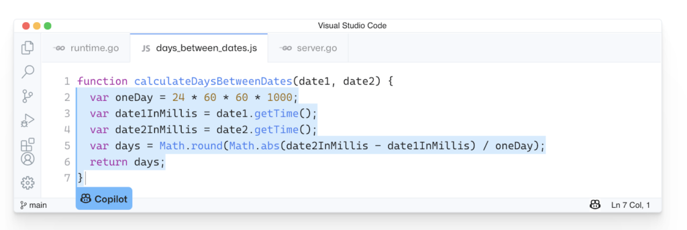
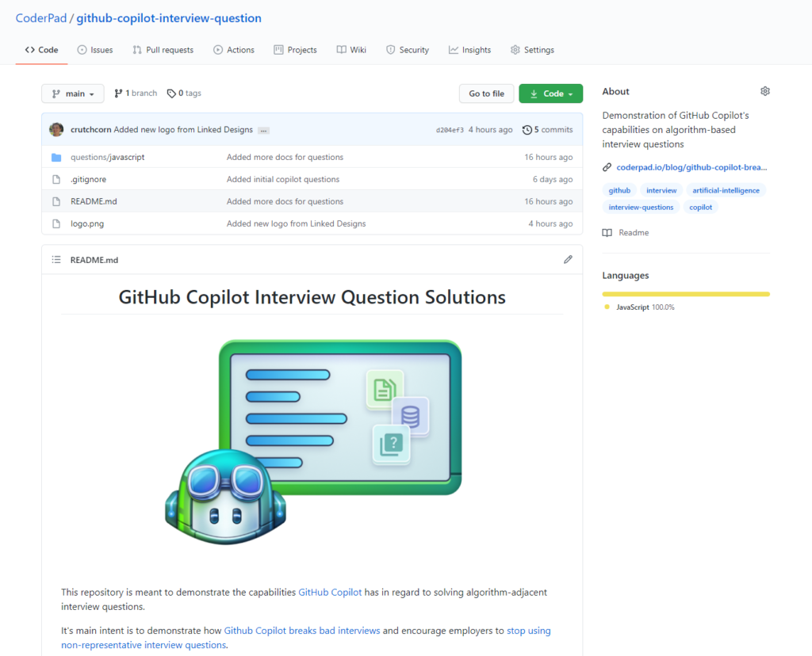

---
{
    title: "GitHub Copilot Breaks Bad Interviews",
    description: "",
    published: '2021-07-22T22:12:03.284Z',
    authors: ['crutchcorn'],
    tags: ['interviewing', 'opinion', 'copilot'],
    attached: [],
    license: 'coderpad',
    originalLink: 'https://coderpad.io/blog/github-copilot-breaks-bad-interviews/'
}
---

[GitHub Copilot](https://copilot.github.com/) was recently announced! In the past few years, we’ve seen artificial intelligence (AI) revolutionize aspects of technology such as image recognition, recommendation algorithms, and more. With Copilot, GitHub is hoping to add “code generation” to that list of items. In this article, we’ll explain what GitHub Copilot is, why some people are concerned with allowing its usage in technical interviews, and how to build your interviews to be better in general and therefore more resilient to auto-generated code.

## What is GitHub Copilot?

GitHub Copilot is a VSCode extension that’s able to autocomplete code snippets. While we've had some form of code completion for some time now, they've been relatively limited in one way or another. Usually, they tend to rely on existing code in your files or can only suggest a tiny amount of code per suggestion. Other times, code completion can be no more than a predefined snippet of code without considering any additional context.

Copilot offers the ability to suggest multi-line and contextually aware code suggestions - powered by AI. GitHub says this tool is available for most programming languages and can implement entire functions off of their names alone.

They’re not alone in this endeavor, however. GitHub is working in collaboration with OpenAI, the company behind the extremely powerful GPT-3 AI tool. Between the training dataset consisting of GitHub’s public source code and OpenAI’s expertise in AI generation, it has the potential to provide impressive results.

Taking an example from their website, it’s able to generate an implementation of a date utility from nothing more than the function name.



It’s incredible that given the simple input of:

```javascript
function calculateDaysBetweenDates(date1, date2) {
```

It’s able to generate the following code which functions how you might expect:

```javascript
function calculateDaysBetweenDates(date1, date2) {
  var oneDay = 24 * 60 * 60 * 1000;
  var date1InMillis = date1.getTime();
  var date2InMillis = date2.getTime();
  var days = Math.round(Math.abs(date2InMillis - date1InMillis) / oneDay);
  return days;
}
```

While every new tech has its naysayers, and even some on our team are skeptical of its true utility, it’s undoubtedly a powerful tool that will, for some, change the way they write code. 

GitHub’s not alone in this venture of AI-powered code generation, either! Other companies, such as [Kite](https://www.kite.com/) or [TabNine](https://www.tabnine.com/) are working hard at this problem space as well! Whether we want it to or not, AI-generated code helpers are here to stay.

## How does Copilot Threaten Tech Interviews?

In the current tech interview landscape, algorithms reign as the leading method of technical assessment. While we’ve touched on [why this shouldn’t be the case](https://coderpad.io/blog/5-tips-for-tech-recruiting/) before, Copilot in particular breaks algorithm questions in significant ways by being able to rapidly generate solutions to algorithmic problems.

Let’s see how Copilot interacts with some common interview questions.

One common question that’s a favorite of interviewers hoping to quickly glean mathematical competency is a function to check if a given number is prime or not.

Well, it’s been a few years since I’ve refreshed my math skills, so they might be a little shakey. I should be able to figure it out all the same. 

Let’s open VSCode and start implementing the function.

<video src="./gh_copilot_is_prime.mp4" title="GitHub Copilot generating a complete implementation of 'isPrime' from nothing more than the function name"></video>

Wow! I hadn’t even had a chance to add the parameters to the “isPrime” function before Copilot had already made a suggestion!

Looking through the suggested code, it seems clean and functions as expected!

```javascript
function isPrime(n) {
    if (n < 2) return false;
    for (var i = 2; i < n; i++) {
        if (n % i == 0) return false;
    }
    return true;
}
```

Sure, we could change the `var` to a `const`, but this is code that I wouldn’t blink twice at in a code review!

While this may seem like an outlier, Copilot seems to excel in these algorithm-based questions. 

But surely `isPrime` would be too trivial for a *real* interview question, right? Perhaps, but watch what happens when a popular coding YouTuber attempts to utilize Copilot to solve Leetcode interview questions

https://www.youtube.com/watch?v=FHwnrYm0mNc

Without fail, Copilot is able to generate usable code for each difficulty level of algorithms given to it. Further, the solutions are all more performant than the average of submissions. For the permutation question, it’s able to be faster than 88% of other submissions!

“Given how predominant these types of interview questions are, we could be in big trouble if some candidates are less-than-forthcoming with their usage of Copilot in coding exercises.”

While this may be true for some interviews, if your interviews are susceptible to collapse with Copilot in the picture, you’re already facing this problem whether you’re aware of it or not.

## Algorithms Are Breaking Your Interviews

On paper, algorithm based interview questions sound like a great way to assess a candidate's skills. They can help give guidance on a candidate's understanding of logic complexity, how efficient (or inefficient) a specific solution is, and is usually an insight into a candidate’s ability to think in abstract manners. 

However, in practice algorithm questions tend to go against the grain of real-world engineering. Ideally, an interview process should act as a way to evaluate a candidate’s ability to do the same kind of engineering they’d be using in their projects at your company. While a developer may, with resources, implement an algorithm once in a while, they’re more than likely doing things like refactoring significantly more often.

We’ve written more about how [algorithms aren’t often effective as interview questions in the past.](https://coderpad.io/blog/5-tips-for-tech-recruiting/#less-algorithms-more-demos)

But more than being unrepresentative of the job, algorithm questions are often easy to cheat - without the use of GitHub Copilot. Because most algorithm questions are significantly similar to each other, there’s often a small selection of tips and tricks a candidate can memorize in order to drastically improve their output in these styles of interviews.


There’s even the potential for a candidate to be able to output an algorithm verbatim. There are hundreds of sites that will give a candidate one algorithm question after another in the hopes of improving their understanding of these algorithms.

But with GitHub Copilot, the propensity for cheating on an algorithm question rises significantly. As we’ve demonstrated previously in the article, it’s capable of generating significant portions of code at a time. In fact, Copilot is so proficient at algorithm questions that a [non-trivial number of algorithm questions we asked it to solve were done](https://github.com/CoderPad/github-copilot-interview-question) before we could even finish the function signature. All it takes is a candidate to give Copilot the name of the function and paste the results into their assessment editor.

Further, folks wanting to cheat have had the ability to do something similar for some time now in the form of forum questions. Simply lookup any algorithm on a code forum or site like [StackOverflow](http://stackoverflow.com/) and you can find hundreds of answers at your disposal. 

In fact, many have pointed out that Copilot’s process of looking up code based on its expected constraints is similar to one that a developer might experience by searching StackOverflow for code snippets. Funnily, some thought the idea so similar they decided to build an alternative VSCode plugin to Copilot that simply [looks up StackOverflow answers as suggestions](https://github.com/hieunc229/copilot-clone).

Regardless of how the question is answered, a candidate’s skill at these types of questions might not reflect their capabilities in other aspects of the codebase. That’s why, in order to access candidates properly, it might be the right move to move away from these questions.

## How to Fix Your Interviews

While you *could* simply require candidates to use a non-VSCode IDE for your technical assessments, there are no guarantees that your take-homes will be spared the same fate. Further, while VSCode is the launch platform for Copilot, it’s more than likely to gain plugins for other IDEs in the future as well.

But what of it? Let’s say your company doesn’t do take-homes ([even though you totally should](https://coderpad.io/blog/hire-better-faster-and-in-a-more-human-way-with-take-homes/)), what of it? Well, even if restricting VSCode would work to avoid Copilot for a while, you ideally want to be able to standardize your IDE platform for all candidates. 

Plus, as we touched on in the previous section, algorithm-based interview questions are still able to be manipulated - with or without Copilot.

The solution to fixing your interviews should be two-fold:

1. More representative questions of the job
   - Require more thought process than memorization
2. Better communication with candidates

For the first, make sure your questions are examples of real-world challenges you’ve seen in your project’s codebase. Some great examples of this might be “setting up a backend endpoint [connected to your database](https://coderpad.io/resources/docs/full-stack-databases/)” or “[refactor this React component to be unidirectional](https://coderpad.io/blog/master-react-unidirectional-data-flow/#challenge)”.

> If you’re using CoderPad, we have a [great selection of questions available in our Question Bank that you can personalize to fix the unique needs of your team](https://coderpad.io/resources/docs/question-bank/example-questions/)

The second point might sound obvious, but look at it this way: Engineering often utilizes more “soft” skills than we usually credit. In any engineering team you’ll need to do code review, create technical documentation, and communicate with others on your team. Being able to program is well and good, but without soft skills your ability to leverage those skills goes flat.

Even if a candidate does end up using Copilot to generate a non-trivial portion of a candidates’ submitted code, you should be able to ask them what their review process of the generated code looked like. Does it follow their code standards? What alternatives did it suggest and why did they choose that one? How maintainable is said code? Are there edge-cases not yet covered?

## Conclusion

GitHub Copilot is a remarkable piece of technology. It will be interesting to watch as it continues to develop and see how developers will utilize it in their day-to-day. As it becomes more and more relevant, we need to make sure our interviews are structured to handle(and prevent) its capabilities.

In fact, we’ve created [a GitHub repo to showcase a wide range of interview questions that Copilot has been able to successfully generate](https://github.com/CoderPad/github-copilot-interview-question), given little input.

[](https://github.com/CoderPad/github-copilot-interview-question)

Feel free to open a PR if you find a question that you think should be present. If you’re worried about your interview question being susceptible to Copilot, maybe drop by the repo and see if it’s in the list.
