---
{
    title: 'Hard grids & baselines: How I achieved 1:1 fidelity on Android',
    description: 'Testing the limits of `firstBaselineToTopHeight` and `lastBaselineToBottomHeight` to deliver a perfect result.',
    published: '2019-10-07T22:07:09.945Z',
    edited: '2020-02-02T22:07:09.945Z',
    authors: ['edpratti'],
    tags: ['android', 'design', 'figma'],
    attached: [],
    license: 'cc-by-nc-nd-4'
}
---

## Testing the limits of `firstBaselineToTopHeight` and `lastBaselineToBottomHeight` to deliver a perfect result.

_**I really care about implementation.**_ I obsess over it. I’m constantly thinking about it.

Whenever I’m designing an app, I always try to focus on how a UI can be created optimally and how well the composition inside a design tool can translate to platform components and paradigms.

You’ve probably been through the same thing at one point: you make mockups, detailed descriptions, and spreadsheets; and in the end, the result is not what you wanted it to be. In that case, you’d ask yourself whether those details matter to someone other than yourself. And your answer would be “No.”

But that doesn’t help it. Deep down, you still care. It’s still wrong. It almost makes it worse; you’re the only one that knows it’s wrong, but you can’t push yourself to bug your developers about it and waste time that could be spent on “better things” or “more features.” That’s certainly the case for me.

So today I’m going to talk about Android’s `TextViews`; how they behave in comparison to design tools, and how to take full control of them, **as a designer.**

<blockquote class="bigBlock">The goal is to ensure the implementation is perfect without taking time off feature development.</blockquote>

In this post, I’ll walk you through how to make text components for Figma that can be easily implemented on Android, with code snippets and explanations. This post is also helpful for developers to understand [**why they should move that button `3px` to the left.**](https://library.gv.com/why-you-should-move-that-button-3px-to-the-left-c012e5ad32f7)

If all you need is to quickly ensure that text sits within a baseline grid without knowing the exact values or whether they match the mockups, there are alternatives to this method!

_[Plaid’s `BaselineGridTextView` library](https://github.com/android/plaid/blob/master/core/src/main/java/io/plaidapp/core/ui/widget/BaselineGridTextView.java)_

<ul role="list" style="list-style: none; padding: 0; margin: 0;">
<li role="listitem">✔ Applies proper baseline alignment automatically</li>
<li role="listitem">✔ Ensures a precise line height</li>
</ul>

**If this isn’t good enough for you and you’d rather have control over every aspect of the UI, then come along.**

## Introduction

Android has two main `TextView`s; one of them is `AppCompatTextView`, which has been available for quite a while, and `MaterialTextView` (which extends `AppCompatTextView`). They are identical, with the latter allowing a line-height attribute to be set in a `textAppearance` (if you don’t know what that means, no worries). _**Go with `MaterialTextView`**._

With Android 9.0 Pie, Google introduced 3 new attributes for `TextView`s: `firstBaselineToTopHeight`, `lastBaselineToBottomHeight` and `lineHeight`. These control everything you’d need to build a UI with.

Shortly after, Google removed those API restrictions by backporting those features to [`AppCompatTextView`](https://developer.android.com/reference/androidx/appcompat/widget/AppCompatTextView) and subsequently, [`MaterialTextView`](https://developer.android.com/reference/com/google/android/material/textview/MaterialTextView?hl=en). This means these attributes can now be used across all supported versions of Android!

However, if you seek fidelity, you’ll find that `lineHeight` on Android differs from other platforms and most design tools.

## How is it any different?

Let us take a look at some examples; one with a single line, then two lines, then three lines with line height set to `24pt/sp`.


As you can probably tell, Android `TextViews` are always smaller than the ones given to a developer from a design tool and those implemented on the web. In reality, Android’s `lineHeight` is not line-height at all! **It’s just a smart version of line-spacing.**


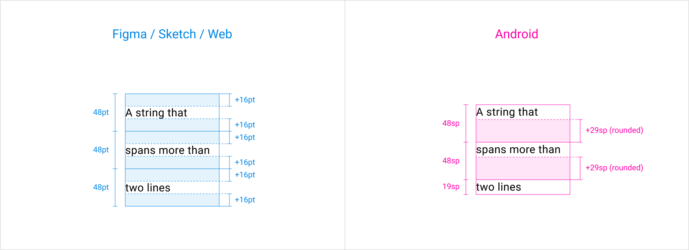

Now you might ask yourself, “*How can I calculate the height of each `TextView`, then?*”

When you use a `TextView`, it has one parameter turned on by default: **`includeFontPadding`**. `includeFontPadding` increases the height of a `TextView` to give room to ascenders and descenders that might not fit within the regular bounds.

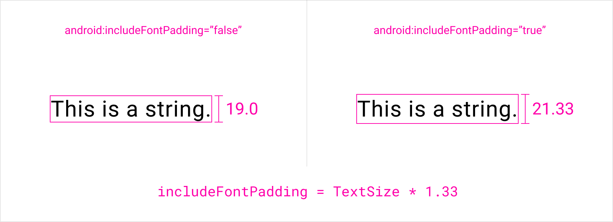

Now that we know how Android’s typography works, let’s look at an example.

Here’s a simple mockup, detailing the spacing between a title and a subtitle. It is built at `1x`, with Figma, meaning line height defines the final height of a text box — not the text size. (This is how most design tools work)


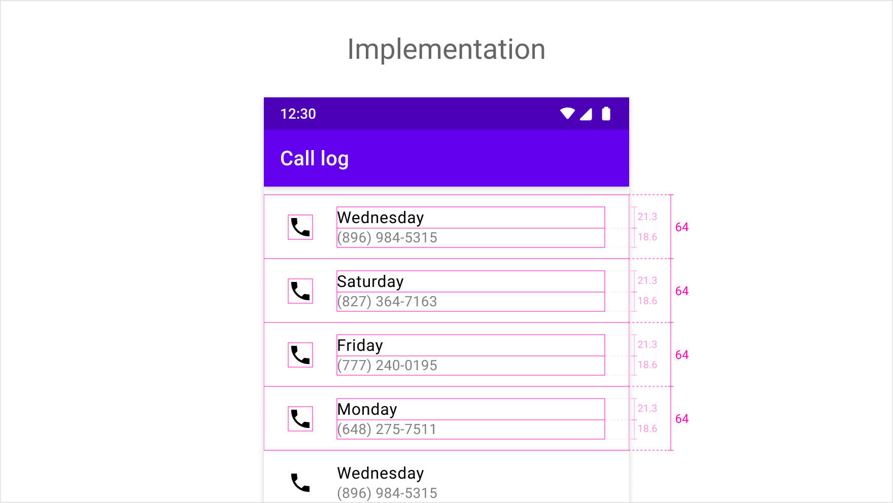

*Of course, because it’s Android, the line height has no effect on the height of the `TextView`, and the layout is therefore `8dp` too short of the mockups.*

But even if it did have an effect, the problems wouldn’t stop there; the issue is more complex than that.

## What designers want, and what developers can do

Designers, like myself, like to see perfect alignment. We like consistent values and visual rhythm.


Unfortunately, translating values from a design tool wasn’t possible. You had the option to either pixel nudge (pictured above, right), or forget about alignment altogether, thus leading to an incorrect implementation that would, yet again, be shorter than the mockups.

### …Until now!

_`firstBaselineToTopHeight`_ and _`lastBaselineToBottomHeight`_ are powerful tools for Android design. They do as the name suggests: If _`firstBaselineToTopHeight`_ is set to `56sp`, then that’ll become the distance between the first baseline and the top of a `TextView`.


This means that designers, alongside developers, can force the bounds of a `TextView` to match the design specs and open the door to perfect implementations of their mockups.

This is something I’ve personally tested in an app I designed. [**Memoire**, a note-taking app](http://tiny.cc/getmemoire) for Android, is a 1:1 recreation of its mockups — for every single screen. This was made possible due to these APIs — *and because [**@sasikanth**](https://twitter.com/its\_sasikanth) is not confrontational* — since text is what almost always makes baseline alignment and hard grids impossible to implement in production.

`video: title: "Near-perfect duplication of guidelines against Memoire's mockups and actual app": ./images/Memoire_Bounds_and_Baselines.mp4`

*Memoire’s TextViews are all customized using these APIs.*

## What is the purpose of firstBaselineToTopHeight and lastBaselineToBottomHeight?

In reality, the new attributes were actually made to be used when creating layouts: you want to make sure the baseline is a certain distance from another element, and it also helps to align the first and lastBaseline to a `4dp` grid. This mirrors the way iOS layouts are built.

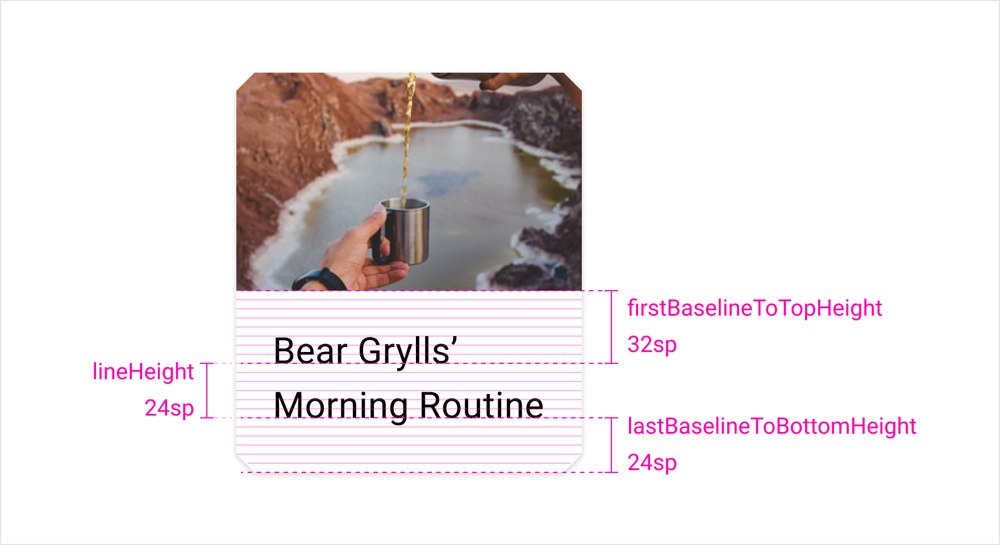

**However, there’s one giant flaw: You can’t align a `TextView`’s `firstBaseline` to another `TextView`’s `lastBaseline`.** So a problem immediately arises due to this limitation:

<blockquote class="bigBlock"><i>What if there’s more than one <code class="language-text">TextView</code>?</i></blockquote>

As you might imagine, **if we want to keep our text aligned to a baseline grid, we need to ensure that the height of each `TextView` is a multiple of 4 while doing so.** This means we must apply first and lastBaseline attributes to both / all of the stacked TextViews — and that becomes hard to maintain.

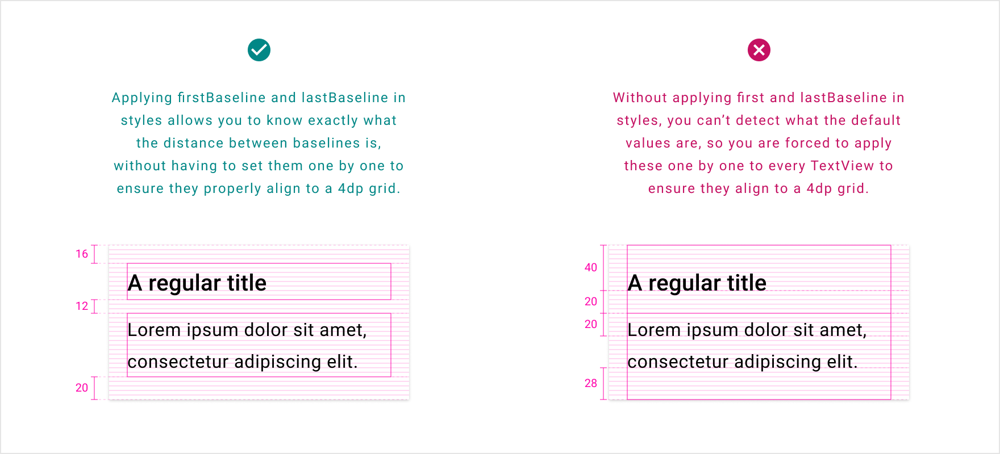

|✅ Good|🛑 Bad|
|--|--|
|Applying `firstBaseline` and `lastBaseline` in styles allows you to know exactly what the distance between baselines is, without having to set them one by one to ensure they properly align to a `4dp` grid. | Without applying `firstBaseline` and `lastBaseline` in styles, you can’t detect what the default values are, so you are forced to apply these one by one to every `TextView` to ensure they align to a `4dp` grid. |

`video: title: "A comparison of how text spacing is applied on iOS and Android": ./images/iOS_vs_Android.mp4`

The solution is to apply them in your `styles.xml` so that, when themed, the `TextView` is given the right text size, height, font, and baseline properties.

**It is important to note that these values should not be overridden within layouts.**

<blockquote class="bigBlock">Ultimately, <strong>overriding first and lastBaseline in layouts also causes major issues</strong> if you want to change a font style or text size in the future.</blockquote>

The overrides will take precedence to whatever value you set in your **`styles.xml`**, requiring you to hunt down occurrences until you can find a layout that was broken due to the change. Let’s look at an example:

`video: title: "Allowing margin changes instead will let the text grow to it's expected sie without having issues with the baseline not being centered": ./images/Dont_Override.mp4`

Implementing margins instead of overriding values also matches the way layouts work within Android Studio and design tools like Sketch and Figma. It also ensures that your layouts can scale well to different font sizes.

## So, how can you adapt your TextViews? Design goes first.

It’s actually pretty simple. Let’s walk through how to adapt one of Material Design’s standard type sizes: Headline 6 — used inside AppBars and dialog titles.

**Step 1: Place a text box of the text style you’d like to adapt — in this case, Headline 6.**


*Text box within Figma.*

Here we can see that the text box has a height of `32`. This is inherited from the line height set in Figma, but we need to know the minimum height on Android. We can easily calculate the minimum height in production using *includeFontPadding*.

> Headline 6 = `20` (text size) `* 1.33` (`includeFontPadding`) = `26.667sp`


*`TextView` on Android.*

Now resize your Figma text box to `26.6` — *it will round it to `27`, but that’s fine.*

**Step 2: With the resized text box, align its baseline with the nearest `4dp` breakpoint in your grid.**


*Baseline now sits on the `4dp` grid.*

**Step 3: Measure the distance between the baseline and the top and bottom of the text box.**


*`firstBaselineToTopHeight`: `20.66` | `lastBaselineToBottomHeight`: `6.0`*

**Step 4: Now right click the text box and select Frame Selection.**


*When created from an object, a frame’s dimensions are dependent on the content inside it.*

**Step 5: While holding Ctrl / Command, drag the frame handles and resize it so that the top and bottom align with the nearest baselines beyond the minimum values.**


**NOTE: Keep in mind we must not resize the text box with it. Holding Ctrl / Command is very, very important.**

In the example above, we stretched the frame so that the distance between the top of the frame and the baseline of the text box would be bigger than `20.66` (the minimum), therefore, **`24sp`**.

The same thing was done to the last baseline and the bottom; we changed it from `6sp` to **`8sp`**, which was the closest multiple of 4 larger than 6.

**Step 6: Select the text box inside the frame, and set the text to Grow Vertically.**

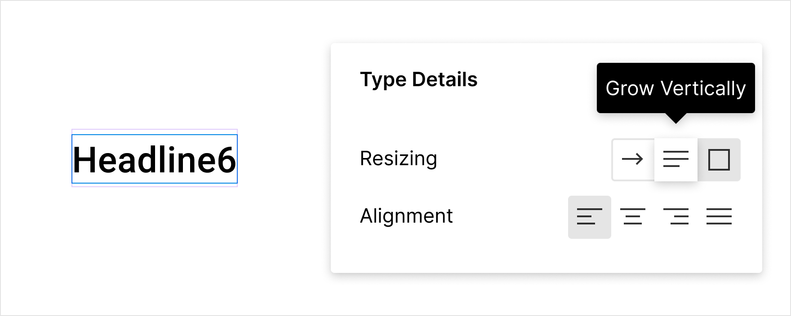

This will cause the text box to return to its original height of `32sp` — inherited from the line height.


*The text box is 1sp down from the frame, but that’s normal. We no longer care about the text box height.*

**Step 7: With the text box selected, set its constraints to *Left & Right* and *Top & Bottom*.**

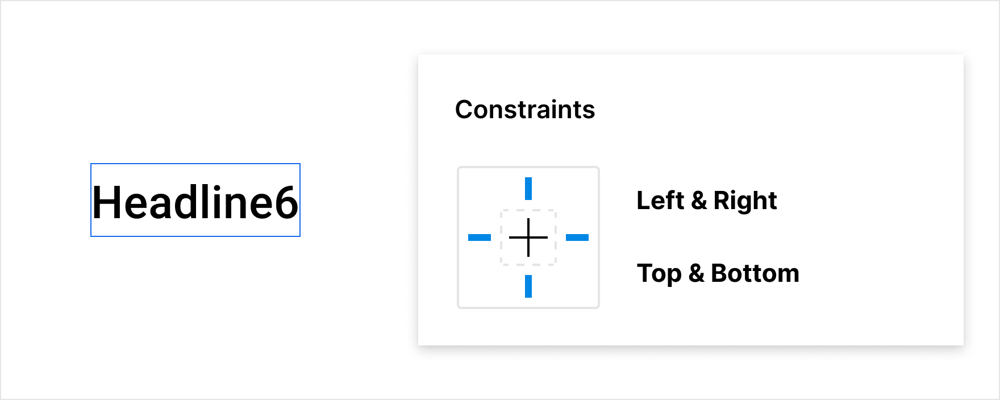

*Now your text box will resize with your frame. This is essential when using the text components.*

You would need to find these values for every text style in your app, but if you’re taking the Material Design Type Spec as a base for your own, I have already measured and picked the right values for each! _**Resources at the end.**_

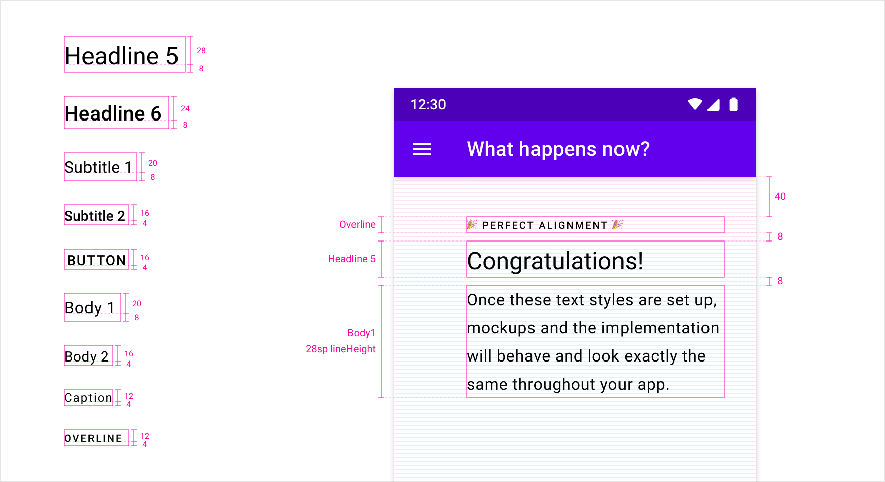

## How to implement these values (as a developer)

All of them follow the same template.

We first set up a `TextAppearance` — which your app probably already has —  and then create another style that encapsulates the `TextAppearance` alongside the `firstBaseline` and `lastBaseline` attributes.

```xml
<!-- **TEXT_STYLE** -->
    <style name="TextAppearance.**APP_NAME**.**TEXT_STYLE**" parent="TextAppearance.MaterialComponents.**TEXT_STYLE**">
        <item name="lineHeight">**LINE_HEIGHT**</item>
        <item name="android:textSize">**TEXT_SIZE**</item>
        <item name="android:letterSpacing">**LETTER_SPACING**</item>
    </style>

    <style name="TextStyle.**APP_NAME**.**TEXT_STYLE**">
        <item name="android:textAppearance">@style/TextAppearance.**APP_NAME**.**TEXT_STYLE**</item>
        <item name="firstBaselineToTopHeight">**FIRST_BASELINE_VALUE**</item>
        <item name="lastBaselineToBottomHeight">**LAST_BASELINE_VALUE**</item>
    </style>
<!-- **TEXT_STYLE** -->
```


Let’s use Memoire once again as an example.

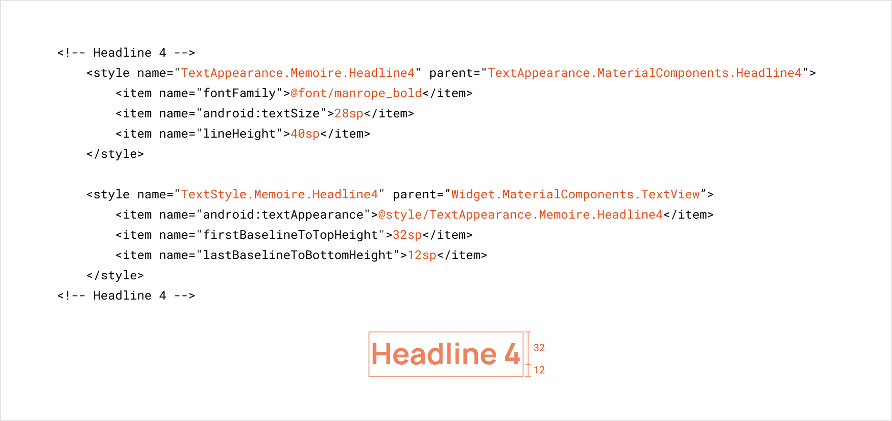

### Each has a different function:

**`TextAppearance`:** Applied in styles to theme Material Components globally.

Material Components are themed with `textAppearanceTEXT\_STYLE` attributes that are then applied to all components that inherit it.
For example, _**`textAppearanceCaption`**_, _**`textAppearanceBody1`**_, etc.

**`TextStyle`:** Applied to `TextView`s in layouts, to ensure `4dp` alignment.

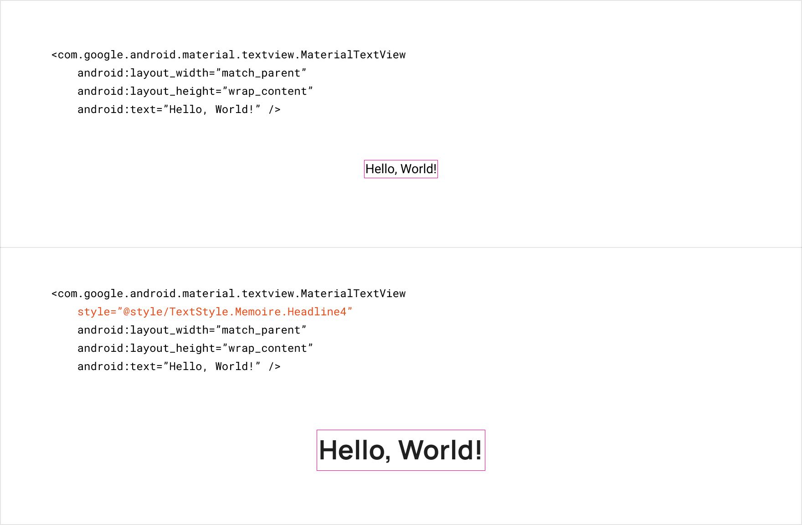

*What happens to a `TextView` when a `TextStyle` is properly applied.*

## And now, a couple of warnings

### Loss of vertical padding

When setting a style to a `TextView`, keep in mind that `firstBaseline` and `lastBaseline` are designed to replace vertical padding. This means that, whenever set, a `TextStyle` will nullify all vertical padding values.

### Do not apply `TextStyle` to Material Components. Use `TextAppearance` for those instances instead.

Applying a `TextStyle` to a component — instead of a `TextAppearance` — causes serious issues.


*Uh-oh…*

This happens because Material Components already have padding that _**IS NOT**_ overridden by `firstBaseline` and `lastBaseline` values. Buttons, in particular, have a **maximum height *and* padding**, meaning we’re effectively trying to fit a large text box into a very narrow container, causing the text to shrink as a result.

As far as other issues, I haven’t been able to find any.

## Resources, resources, resources!

Now that you’ve scrolled all the way down without reading a single word, here’s all the stuff you’ll need:

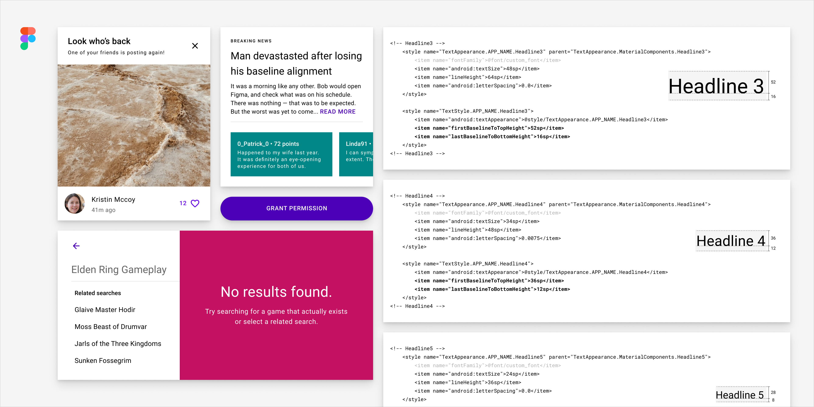

*Figma document with code and layout samples.*

### For designers: [Figma Document](https://www.figma.com/file/F1RVpdJh73KmvOi06IJE8o/Hard-Grid-—-Text-Components/duplicate)

Document containing:

* A slight introduction

* All the text components

* A small tutorial on how to use them effectively

* Prebuilt layout examples to get you started

* Customizable code blocks for each style in a text box, so you can change each depending on your theme and hand it to developers

### For developers: [styles.xml](./styles.xml)

A styles.xml file containing:

* All the `TextAppearance`s that can be used with Material Components

* All the `TextStyle`s to theme `TextView`s accordingly

