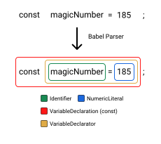

> I want to start this article by saying "It's okay if you don't know programming". I'm writing this article as a starting point to a developer's journey or even just to learn more about how computers work under-the-hood. I'll make sure to cover as many of the basics as I can before diving into the more complex territory. That said, we all learn in different ways and I am not a perfect author. If you have questions or find yourself stuck reading through this, drop a comment down below or [join our Discord](https://discord.gg/FMcvc6T) and ask questions there. We have a very friendly and understanding community that would love to explain more in depth.
>
> 
>
> Further, while I'll be using JavaScript for the examples in this article, the foundational concepts apply regardless of what programming language you use. While some languages may have more or less complex translations to and from your machine, they ultimately boil down to the same formula.
>
> Now that that's out-of-the-way, let's get started!

If you've spent any time with developers, you'll likely have heard of the term "source code". Source code simply refers to the text that programmers type in order to make their programs. Take the following text:

```javascript
const magicNumber = 185;

console.log(magicNumber);
```

If you're not familiar with what that code does, that's okay. We'll explain this code in a bit. Right now it's just important to focus on what's being typed. If you opened Word, you'd be able to type this in using a typical QWERTY keyboard.

Now, while you _could_ write your code in Word, it would add additional (invisible) encoding characters in the file. However, if you were to use Notepad (or similar), and save this to a `.txt` file, it would be considered a "source code" file.

> Typically, code is not stored in a `.txt` file, but it rather stored in a different file extension. However, if you saved the code above in a `code.txt` file, then renamed that to a `code.js` file, that would be how JavaScript is typically stored. The contents of the file are exactly the same, just the file name (ala extension) is different

However, you'll notice that if you double-click the file nothing special happens, it just opens the file in a text editor. You'd have to use something like [NodeJS](https://nodejs.org/) which is a program used to run JavaScript source code files as a program. While this might make sense at a surface level, it brings more things into question.

- Why do I need a custom program to run some programming languages?
- How does a computer turn letters and symbols into instructions that it knows how to run?
- Why do some programming languages have different rules and look different from one-another?
- Why can't we simply give the computer English instructions and have it run those with a special program?

We'll do our best to answer these questions in this article, and dive into how computers actually speak and understand things.

# How A Computer Works

> This section won't be a complete "Computers 101" course. While we _will_ be writing material that dives in deeper into these subject matters, this is meant as a short description to suppliment explainations later on in the article. If you'd like to see that type of content in the future, be sure to [sign up for our newsletter](https://newsletter.unicorn-utterances.com/)


# Assembly: What's that? {#assembly-code}

> As we mentioned, assembly is the most direct method for talking to computer hardware outside of manually writing binary. However, due to it's proxomity to the hardware, each type of CPU has a different flavor of assembly. Because of this, the actual assembly code isn't particularly important, nor is it particularly accurate. Keep that in mind as we go forward.


# This (code) Keeps Lifting me Higher {#introducing-c-code}

As efficient as assembly code is, you may have noticed that it's not particurly readible. Further, for larger projects, it's not always easy to manage a project of that scale without some abstractions that higher-level languages provide. This is where languages like C or Ruby come into play*.


## Compiled vs. Runtime {#compiled-vs-runtime}

As [the start of this section](#introducing-c-code), we mentioned that languages like C or Ruby are higher-level languages than assembly. However, long-time developers will be quick to remind that these two languages are drastically different. The biggest difference between these being that C is a "compiled" language while Ruby is a dynamic "runtime" language.


// ...


But how does it know that X (JS) means that we want to do Y (ASSEMBLY)? How is it able to do that conversion?

# Introducing the AST {#ast}

An AST takes human-readible text and turns it into machine-understandable data using a rigid set of rules.


// ...


Whether you're using a compiled language or a runtime language, you're using an AST at some point of using the language.


// ... 





// ...


## Why Not English? {#english-vs-ast}

// Explain linguistical complexities and it's loose set of rules (comparitively)


// AI is able to do this a bit, there are projects working on making that exact question possible


# Conclusion

