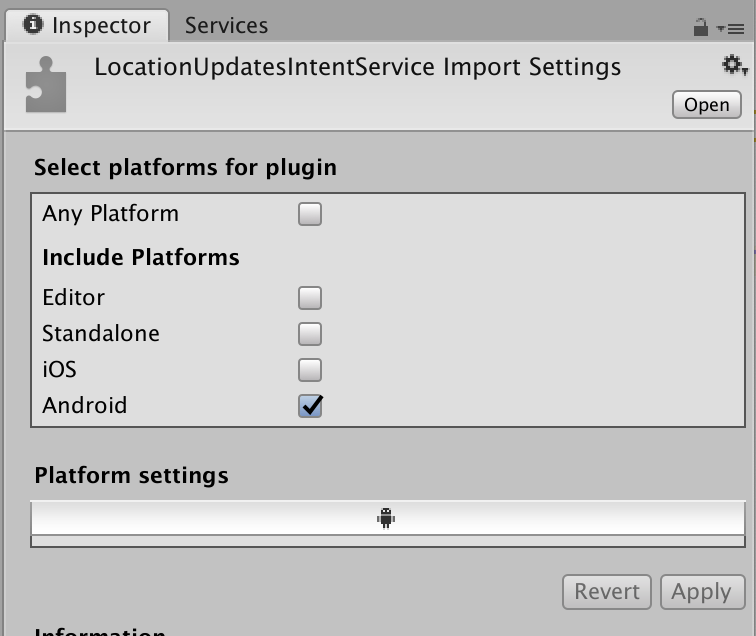
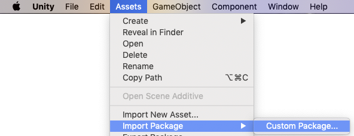
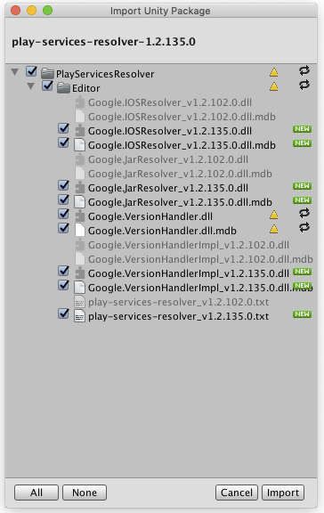
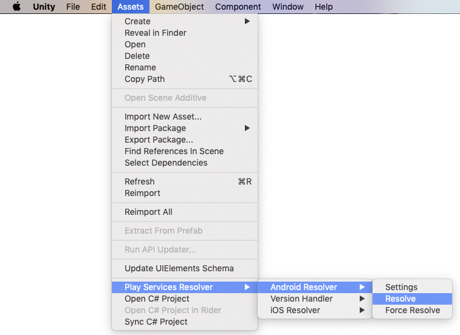

---
{
	title: "Integrating Native Android Code in Unity",
	description: 'Have you ever wanted to run native Java and Kotlin code from your mobile game written in Unity? Well you can! This article outlines how to set that up!',
	published: '2020-01-04T05:12:03.284Z',
	authors: ['crutchcorn'],
	tags: ['unity', 'android', 'csharp', 'java'],
	attached: [],
	license: 'cc-by-nc-sa-4'
}
---

Working on mobile games with Unity, you may come across some instances where you'll want to run native code. Whether it be to access specific sensors, run code in the background, or other closer-to-hardware mobile-specific actions, knowing how to call native code from within your Unity's C# environment can be a great boon to your developmental efforts.

Luckily for us, Unity has a system of "plugins" that allow us to do just that. Unity contains the ability to map code between C# and Java by using in-house-developed helper classes to cross-talk between the two languages. This article will outline [how to set up a development environment](#set-up-a-development-environment), [how to manage Android dependencies in Unity](#android-dependencies), and finally [how to call Android-specific code from C#](#call-android-from-c-sharp). Without further ado, let's dive in! 🏊‍♂️

> ⚠️ Be aware that this information is based on Unity 2018 versions. While this might be relevant for older versions of Unity, I have not tested much of this methodology of integration with older versions.

# Setting up Development Environment {#set-up-a-development-environment}

[Unity supports using either Java files or Kotlin source files as plugins](https://docs.unity3d.com/Manual/AndroidJavaSourcePlugins.html). This means that you're able to take Android source files (regardless of if they're written in Java or Kotlin) and treat them as callable compiled library code. Unity will then take these files and then include them into its own Gradle build process, allowing you — the developer — to focus on development rather than the build process.

> For anyone who may have experimented with doing so in older versions of Unity in the past will note that this is a massive improvement — it used to be that you'd have to compile to AAR files and include them manually.

That said, the editor you may be using may not be best suited for editing Android code, and it would be great to have a powerful development experience while working with. For this purpose, it would be great to edit code using [the official IDE for Android development: Android Studio](https://developer.android.com/studio/).

Unfortunately, I've had difficulties getting the same Android Studio development environment to sync with the "source file" interoperability that Unity provides. For this reason, I tend to have two folders:

- One of these folders lives at the root of the project (directly under `Unity/ProjectName`) called `AndroidStudioDev` that I open in Android Studio.

- The other folder is one that lives under `Assets` called `AndroidCode`, which contains copied-and-pasted files from `AndroidStudioDev` that are only the related source files I need to call.


Once the copying of the files from the Android Studio environment to `Assets` has finished, you'll need to mark it as being included in the Android build within Unity's inspector window that comes up when you highlight the source file.



> If you forget to do this, your class or file may not be found. This is an important step to keep in mind during debugging.

This will naturally incur a question for developers who have tried to maintain a system of duplication of any size:
**How do you manage dependencies between these two folders?**


## Managing Android Dependencies {#android-dependencies}

Luckily for us, managing Android code dependencies in Unity has a thought-out solution from a large company: Google. [Because Google writes a Firebase SDK for Unity](https://firebase.google.com/docs/unity/setup), they needed a solid way to manage native dependencies within Unity.

### Installing the Unity Jar Resolver {#installing-jar-resolver}

> ℹ️ If you've installed the Unity Firebase SDK already, you may skip the step of installing.

[This plugin, called the "Unity Jar Resolver"](https://github.com/googlesamples/unity-jar-resolver/), is hugely useful to us for synchronizing our development environment. You can start by downloading it from [their releases tab on GitHub](https://github.com/googlesamples/unity-jar-resolver/releases).

> If you have a hard time finding the download link, you'll want to press the three dots (or, if you're looking for the alt text: the "Toggle commit message" button). There will typically be a link for downloading the `.unitypackage` file.

In your project, you'll then want to select `Assets > Import Package > Custom Package` in order to import the downloaded plugin.



Then, you'll see a dialog screen that'll ask what files you want to import with your Unity Package. Ensure that all of the files are selected, then press "Import".



> Your screen may look slightly different from the one above. That's okay — so long as all of the files are selected, pressing "Import" is perfectly fine.

### Using the Jar Resolver {#using-jar-resolver}

Using the Jar resolver is fairly straightforward. Whenever you want to use a dependency in your Android code, you can add them to a file within [the `Assets/AndroidCode` folder](#set-up-a-development-environment) that adds dependencies with the same keys as the ones typically found in a `build.gradle` file for dependencies.

```xml
<!-- DeviceNameDependencies.xml -->
<dependencies>
	<androidPackages>
		<androidPackage spec="com.jaredrummler:android-device-names:1.1.8">
		</androidPackage>
	</androidPackages>
</dependencies>
```

The only rule with this file structure is that your file must end with `Dependencies.xml`. You can have as many of these files as you'd like. Let's say you want to separate out dependencies based on features? You can do that, just have separate files that follow that naming pattern!

```xml
<!-- LocationCodeDependencies.xml -->
<!-- Alongside the other file -->
<dependencies>
	<androidPackages>
		<androidPackage spec="com.google.android.gms:play-services-location:16.0.0">
		</androidPackage>
	</androidPackages>
</dependencies>
```

After creating the files, in the menubar, go to `Assets > Play Services Resolver > Android Resolver > Resolve`, and it should go fetch the AAR files related to those specific libraries and download them.



So long as your file ends with `Dependencies.xml`, it should be picked up by the plugin to resolve the AAR files.

#### Adding Support into Android Studio Environment {#add-android-studio-support}

But that's only half of the equation. When editing code in Android Studio, you won't be able to use the libraries you've downloaded in Unity. This means that you're stuck manually editing both of the locations for dependencies. This is where a simple trick with build files comes into play.

Assuming, like me, you used the built-in "Create Project" method of starting a codebase in Android Studio, you'll have a `build.gradle` file for managing dependencies. However, you'll notice that when you run the `Resolve` on the plugin in Unity, it'll download AAR and JAR files to `Assets/Plugins/Android`. You can tell Android Studio's Gradle to include them by adding the following line to your `dependencies`:

```groovy
dependencies {
	implementation fileTree(dir: '../../Assets/Plugins/Android', include: ['*.jar', '*.aar'])
}
```

This will take all of the AAR files and JAR files and treat them as if they were synced by Android Studio's Gradle sync.


For more information on how to manage your app's dependencies from within Unity, you may want to check out [this article created by the Firebase developers](https://medium.com/firebase-developers/how-to-manage-your-native-ios-and-android-dependencies-in-unity-like-firebase-921659843aef), who coincidentally made the plugin for managing Android dependencies in Unity.


# Call Android code from C# {#call-android-from-c-sharp}

It's great that we're able to manage those dependencies, but they don't mean much if you're not able to utilize the code from them!

For example, take the following library: https://github.com/jaredrummler/AndroidDeviceNames

That library allows you to grab metadata about a user's device. This might be useful for analytics or bug reporters you may be developing yourself. Let's see how we're able to integrate this Java library in our C# code when building for the Android platform.

## Introduction {#intro-call-android-from-c-sharp}

You must make your callback extend the type of callback that is used in the library. For example, take the following code sample from the README of the library mentioned above:

```java
DeviceName.with(context).request(new DeviceName.Callback() {
	@Override public void onFinished(DeviceName.DeviceInfo info, Exception error) {
		String manufacturer = info.manufacturer;  // "Samsung"
		String name = info.marketName;            // "Galaxy S8+"
		String model = info.model;                // "SM-G955W"
		String codename = info.codename;          // "dream2qltecan"
		String deviceName = info.getName();       // "Galaxy S8+"
	}
});
```

While this example may seem straightforward, let's dissct what we're doing step-by-step here. This will allow us to make the migration to C# code much simpler to do mentally.

```java
// Create a new "DeviceName.Callback" instance
DeviceName.Callback handleOnFinished = new DeviceName.Callback() {
	// Provide an implementation of the `onFinished` function in the `Callback` class
	// Notice that there are two parameters for this method: one for info, the other for errors
	@Override public void onFinished(DeviceName.DeviceInfo info, Exception error) {
		// ... Assignment logic here
	}
};

// Create a `DeviceName.Request` by passing the current context into the `DeviceName.with` method
DeviceName.Request withInstance = DeviceName.with(context);

// Use that request instance to pass the `DeviceName.Callback` instance from above to run the related code
withInstance.request(handleOnFinished);
```

You can see that we have a few steps here:

1) Make a new `Callback` instance
	- Provide an implementation of `onFinished` for said instance
2) Call `DeviceName.with` to create a request we can use later
	- This means that we have to gain access to the currently running context to gain device access. When calling the code from Unity, it means we have to get access to the `UnityPlayer` context that Unity engine runs on
3) Call that request's `request` method with the `Callback` instance

For each of these steps, we need to have a mapping from the Java code to C# code. Let's walk through these steps one-by-one

## Create `Callback` Instance {#android-c-sharp-callback}

In order to create an instance of a `Callback` in C# code, we first need a C# class that maps to the `Java` interface. To do so, let's start by extending the Android library interface. We can do this by using the `base` constructor of `AndroidJavaProxy` and the name of the Java package path. You're able to use `$` to refer to the interface name from within the Java package.

```csharp
private class DeviceCallback : AndroidJavaProxy
{
	// `base` calls the constructor on `AndroidJava` to pass the path of the interface
	// `$` refers to interface name
	public DeviceCallback() : base("com.jaredrummler.android.device.DeviceName$Callback") {}
}
```

> [This package path can be found in the library's code at the following path](https://github.com/jaredrummler/AndroidDeviceNames/blob/e23b73dbb81be6cb64dfa541a3e93800ee26b185/library/src/main/java/com/jaredrummler/android/device/DeviceName.java#L17). The `DeviceName` is referring to the path of the `.java` file name.

We can then provide an implementation of the `onFinished` method of that `Callback`. Recall how we previously had two params? Well, now the implementation will require we use the `AndroidJavaObject` type for both of those params.

Otherwise — if we type the function with a C# interface or class that matches the Java implementation — the method will not be called when we expect it to. This is due to function overloading expecting to get the `AndroidJavaObject` from the code Unity has developed to call mapped functions and classes.

This [`AndroidJavaObject` type has a myriad of methods that can be called to assist in gathering data from or interfacing with the Java object](https://docs.unity3d.com/ScriptReference/AndroidJavaObject.html). One of such methods is the [`Get` method](https://docs.unity3d.com/ScriptReference/AndroidJavaObject.Get.html). When called on an `AndroidJavaObject` instance in C#, it allows you to grab a value from Java. Likewise, if you intend to call a method from the Java code, you can use [`AndroidJavaObject.Call`](https://docs.unity3d.com/ScriptReference/AndroidJavaObject.Call.html).

```csharp
private class DeviceCallback : AndroidJavaProxy
{
	public DeviceCallback() : base("com.jaredrummler.android.device.DeviceName$Callback") {}
	// These both MUST be `AndroidJavaObject`s. If not, it won't match the Java method type and therefore won't be called
	void onFinished(AndroidJavaObject info, AndroidJavaObject err)
	{
		// When running `AndroidJavaObject` methods, you need to provide a type for the value to be assigned to
		var manufacturer = info.Get<string>("manufacturer"); // "Samsung"
		var readableName = info.Get<string>("marketName"); // "Galaxy S8+"
		var model = info.Get<string>("model"); // "SM-G955W"
		var codename = info.Get<string>("codename"); // "dream2qltecan"
		var deviceName = info.Call<string>("getName"); // "Galaxy S8+"
	}
}
```

## Get Current Context {#get-unity-context}

Just as all Android applications have some context to their running code, so too does the compiled Unity APK. When compiling down to Android, Unity includes a package called the "UnityPlayer" to run the compiled Unity code. The package path for the player in question is `com.unity3d.player.UnityPlayer`.

While there is not a docs reference page for this Java class, [some of the company's code samples](https://docs.unity3d.com/530/Documentation/Manual/PluginsForAndroid.html) provide us with some useful methods and properties on the class. For example, that page mentions a static property of `currentActivity` that gives us the context we need to pass to `DeviceName.with` later on:

```csharp
var player = new AndroidJavaClass("com.unity3d.player.UnityPlayer");
var activity = player.GetStatic<AndroidJavaObject>("currentActivity");
```

We can then gain access to the `DeviceName` Java class. If we look at [the related Java code from the previous section](#call-android-from-c-sharp), we can see that we're calling `DeviceName.with` without making a new instance of `DeviceName`:

```java
DeviceName.Request withInstance = DeviceName.with(context);
```

This means that `with` must be a static method on the `DeviceName` class. In order to call static Java methods, we'll use the `AndroidJavaClass.CallStatic` method in C#.

```csharp
var jc = new AndroidJavaClass("com.jaredrummler.android.device.DeviceName");
var withCallback = jc.CallStatic<AndroidJavaObject>("with", activity);
```

Finally, we can add the call to `request` with an instance of the `DeviceCallback` class.

```csharp
var deviceCallback = new DeviceCallback();
withCallback.Call("request", deviceCallback);
```

## Complete Code Example {#android-c-sharp-code-sample}

Line-by-line explanations are great, but often miss the wholistic image of what we're trying to achieve. The following is a more complete code sample that can be used to get device information from an Android device from Unity.

```csharp
public class DeviceInfo {
	public string manufacturer;  // "Samsung"
	public string readableName;  // "Galaxy S8+"
	public string model;         // "SM-G955W"
	public string codename;      // "dream2qltecan"
	public string deviceName;    // "Galaxy S8+"
}

class DeviceName : MonoBehaviour {
	private class DeviceCallback : AndroidJavaProxy {
		// Add in a field for us to gain access to the device info after the callback has ran
		public DeviceInfo deviceInfo;
		public DeviceCallback() : base("com.jaredrummler.android.device.DeviceName$Callback") {}
		void onFinished(AndroidJavaObject info, AndroidJavaObject err) {
			deviceInfo.manufacturer = info.Get<string>("manufacturer");
			deviceInfo.readableName = info.Get<string>("marketName");
			deviceInfo.model = info.Get<string>("model");
			deviceInfo.codename = info.Get<string>("codename");
			deviceInfo.deviceName = info.Call<string>("getName");
		}
	}

	private void Start() {
		var player = new AndroidJavaClass("com.unity3d.player.UnityPlayer");
		var activity = player.GetStatic<AndroidJavaObject>("currentActivity");
		var jc = new AndroidJavaClass("com.jaredrummler.android.device.DeviceName");
		var withCallback = jc.CallStatic<AndroidJavaObject>("with", activity);
		var deviceCallback = new DeviceCallback();
		withCallback.Call("request", deviceCallback);
		Debug.Log(deviceCallback.deviceInfo.deviceName);
	}
}
```

# Calling Source Code from Unity {#call-source-from-unity}

Calling native Android code can be cool, but what if you have existing Android code you want to call from Unity? Well, that's supported as well. Let's take the following Kotlin file:

```kotlin
// Test.kt
package com.company.example

import android.app.Activity
import android.util.Log

class Test() {
	fun runDebugLog() {
		Log.i("com.company.example", "Removing location updates")
	}
}
```

Assuming you [copied it over to the `Assets/AndroidCode` folder and marked it to be included in the Android build](#set-up-a-development-environment), you should be able to use the `package` name and the name of the class in order to run the related code.

```csharp
var testAndroidObj = new AndroidJavaObject("com.company.example.Test");
testAndroidObj.Call("runDebugLog");
```

# AndroidManifest.XML Overwriting {#manifest-file}

Many Android app developers know how important it can be to have the ability to customize their manifest file. By doing so, you're able to assign various metadata to your application that you otherwise would be unable to. Luckily for us, Unity provides the ability to overwrite the default XML file.

By placing a file under `Assets\Plugins\Android\AndroidManifest.xml`, you're able to add new values, change old ones, and much more.

If you want to find what the default manifest file looks like, you'll want to look for the following file:  `<UnityInstallationDirecory>\Editor\Data\PlaybackEngines\AndroidPlayer\Apk\AndroidManifest.xml`. This file is a good baseline to copy into your project to then extend upon. The reason I suggest starting with the default XML is that Unity requires its own set of permissions and such. After that, however, you're able to take the manifest and customize it to your heart's content.

> It's worth mentioning that if you use Firebase Unity SDK and wish to provide your own manifest file, you'll need to [customize the default manifest file to support Firebase opperations](https://firebase.google.com/docs/cloud-messaging/unity/client#configuring_an_android_entry_point_activity).

# Firebase Support {#firebase}

Let's say you're one of the users who utilizes the Firebase SDK for Unity. What happens if you want to send data from Android native code or even use background notification listeners in your mobile app?

You're in luck! Thanks to the Unity Firebase plugin using native code in the background, you're able to share your configuration of Firebase between your native and Unity code. So long as you've [configured Firebase for Unity properly](https://firebase.google.com/docs/cloud-messaging/unity/client#add-config-file) and [added the config change to Android Studio](#add-android-studio-support), you should be able to simply call Firebase code from within your source files and have the project configs carry over. This means that you don't have to go through the tedium of setting up and synchronizing the Unity and Android config files to setup Firebase — simply call Firebase code from your source files, and you should be good-to-go! No dependency fiddling required!

# Conclusion {#conclusion}

I hope this article has been helpful to anyone hoping to use Android code in their Unity mobile game; I know how frustrating it can be sometimes to get multiple moving parts to mesh together to work. Rest assured, once it does, it's a satisfying result knowing that you're utilizing the tools that Unity and the Firebase team have so graciously provided to game developers.

If you have any questions or comments, please leave them down below. Thanks for reading!
