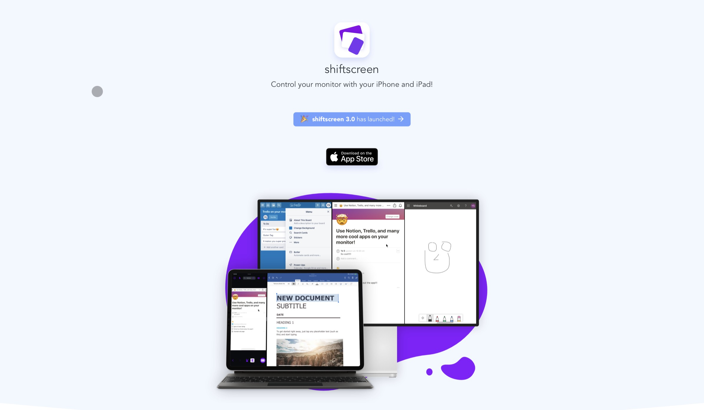
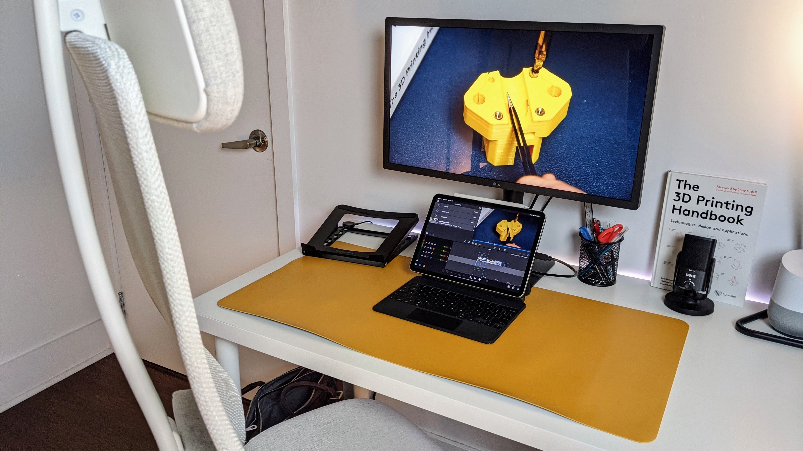
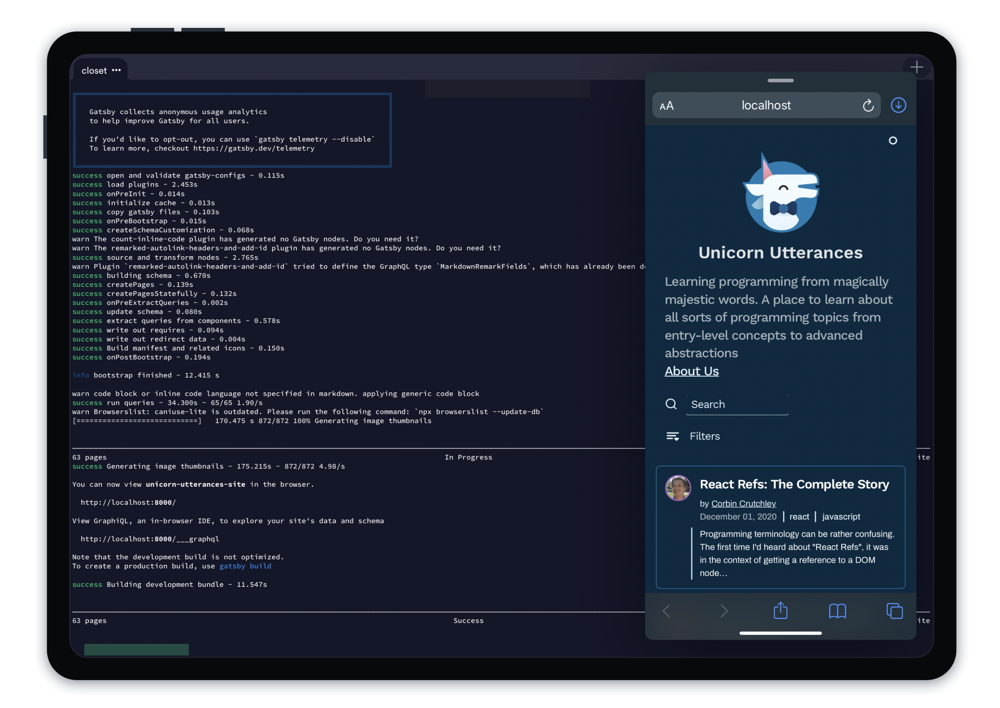
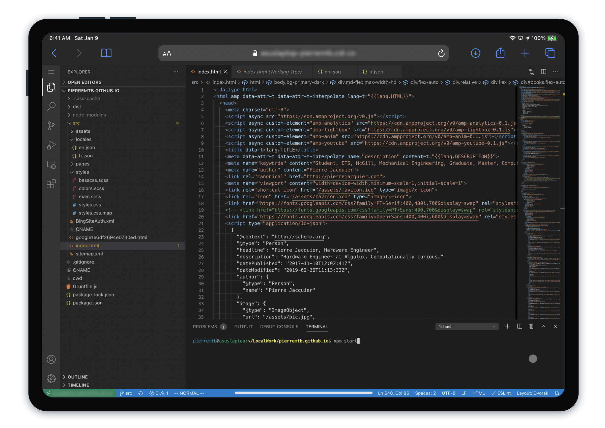
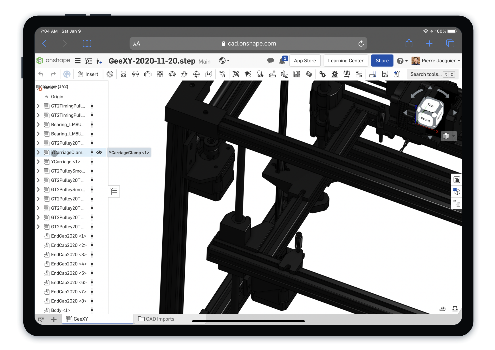

---
{
    title: 'Living off the iPad as an Engineer',
    description: "Tips on how to get yourself a proper development environment on the iPad to fully exploit its potential.",
    published: '2021-02-01T00:00:00.000Z',
    authors: ['pierremtb'],
    tags: ['tooling', 'ipad'],
    attached: [],
    license: 'cc-by-nc-nd-4'
}
---
Since I transitioned from working all day on my personal MacBook Pro to receiving a work computer for a new engineering position, I decided to go for the only financially wise thing: selling my beloved 16" MacBook Pro to live off the 2018 iPad Pro I had around for iOS app development as my **main computer** for my personal life.

While I loved the feeling of knowing that I could open and run anything on the MacBook Pro—aka a conventional laptop—the idea of moving solely to the efficient machine that is the iPad Pro was appealing for various reasons. Yet the question remained: how would I continue the work on side-projects, whether they be software or hardware? We see lots of talking these days on how [LumaFusion](https://freecadweb.org/) is real competition to Adobe Premiere, or that [Affinity Photo](https://affinity.serif.com/en-gb/photo/ipad/) has nothing to envy from desktop Photoshop. While I do spend some time on such creative apps, how am I supposed to maintain [my personal webpage](https://pierrejacquier.com), write code for my Raspberry Pi, or create CAD models for 3D printing?

The answer is mostly through remote access. Fear not, dear reader, we’ll try to rely on tools that are native or at least *feel* native on the iPad Pro, not just cheap Teamviewer-ing. What started as just a 9 to 5 setup challenge, not the other way around, is now much more than that.

*Note 1: This is merely a shoutout to great products I’m using daily and isn’t sponsored. The links are not affiliated either. I’ll try to provide different options as well as keep some focus on open-source software.*

*Note 2: The new iPad Air now features most of the laptop-like abilities of its Pro brother; therefore, I’ll only use the term “iPad” in the following. But bear in mind: the cheapest 2020 8th-gen iPad still has the old form-factor and a Lightning port, making it incompatible with some of the following.*

 on [Unsplash](https://unsplash.com/s/photos/magic-keyboard?utm_source=unsplash&utm_medium=referral&utm_content=creditCopyText)](cover.jpeg)

## External Monitor

 I was lucky enough to have an [LG Ultrafine 4K](https://www.apple.com/shop/product/HMUA2VC/A/lg-ultrafine-4k-display?fnode=01ed6570fcad8a82974ba2365bf1eaa7d05d2098f328a409870e96ca8209d73125b43501b2178d7e0da5e2a872812d90d869256e6fac4e035ad1db81d91c5dca98f07b0806b261899f5ca87dcdf5f2b3bdd2a569c5a005cfba29a467eb8ce95e6d29ec0c8c4548ba56c842fb8e09c74a) display in my possession for use with the MacBook Pro. These fancy displays designed hand-in-hand with Apple are both compatible with Thunderbolt devices like the MacBook and with standard USB-C devices like the iPad. However, you can’t use the same cable, so if you are to buy this one, make sure you’re using the one with an iPad label on it before returning it out of frustration!

I believe it’s common knowledge that you can’t just work out of a laptop form-factor all day without destroying your neck. Here the cheapest option would be to go with one of the pretty cool arm mount specifically designed to put the iPad right in front of your eyes or just a pile of books. This allows the expensive pixels to get their deserved amount of attention while also enabling instant video calling.

While an external monitor is really comfortable, one thing to note is the lack of *full* external monitor support with iPadOS at the time of writing (version 14.4). Connecting a USB-C display like the Ultrafine essentially triggers an AirPlay mirroring of the iPad’s and is therefore really not as satisfying as a standard laptop+display setup, with the extended desktop for greater multitasking. Depending on its size and resolution, you’ll most likely end up with black bars around the mirrored video flux. Annoying even though you do get used to it. But they are ways around it.

The workaround is indeed in the ability of iOS apps to specify how external monitor should be used. For instance, [Netflix](http://netflix.com) uses the iPad’s display for media controls while broadcasting the content onto the monitor. Luma Fusion has a mode for the video editor to stay on the iPad’s while live previewing on the monitor in full-screen.

And in a clever workaround, a popular app called [Shiftscreen](http://shiftscreen.app) leverages these APIs to enable side-by-side web multitasking on the full external monitor, pretty convenient since nowadays a lot of work is actually happening within web apps like Google Docs or JIRA. On top of that, the app is still able to project the side-by-side browser on the external monitor even in Split Mode, therefore enabling another iOS app to be interacted with, such as a todo-list or direct messaging.

I have to say, it’s an excellent option for specific tasks, but after a while, I just learned to love the mirrored interface, and I’m now rarely spending my time in apps that provide full monitor support. App Switching via Cmd+Tab or the gestures is hugely satisfying, plus I don’t think it has brought my productivity down, and on the flip side, it might have improved focus on the task at hand.

## External Keyboard and Mouse/Trackpad 

Speaking of hitting keys and performing gestures. While the iPad itself has an incredibly mobile form-factor, we owe ourselves a decent desk setup, for it’s becoming our personal workstation.

On the high-end of the spectrum lies the incredible [Magic Keyboard for iPad](https://www.apple.com/shop/product/MXQT2LL/A/magic-keyboard-for-ipad-air-4th-generation-and-ipad-pro-11-inch-2nd-generation-us-english). It’s heavy. It’s stupidly expensive. But it’s my best purchase of the year. It effectively turns the iPad into a laptop with its form-factor, Trackpad, and additional charging port. On top of that, the keys have nothing to envy from a real Magic Keyboard, so good it made it to my main desk. Thankfully though, Logitech came up with a much more affordable option, the [Folio Touch](https://www.logitech.com/en-ca/products/ipad-keyboards/folio-touch.html?crid=1762) for 11" iPads.

Now even cheaper options are possible, such as just getting a good regular Bluetooth keyboard to complete a stand mount like the mechanical [Keychron K2](https://www.keychron.com/products/keychron-k2-wireless-mechanical-keyboard), as well as a mouse—I can’t *not *recommend the [MX Master series](https://www.logitech.com/en-ca/products/mice/mx-master-3.910-005620.html), but the Pebble on the pocketable side is excellent and very affordable in the [K380 combo](https://www.logitech.com/en-ca/products/combos/k380-m350-keyboard-mouse-combo.html?crid=1759). The external [Magic Trackpad](https://www.apple.com/shop/product/MRMF2LL/A/magic-trackpad-2-space-gray?fnode=77ac33807229049f26bebb326a1b4522488e4f051b1a666c9afcaabe58587a06b83e6823fcf6b2252221dfa0a67c6d6503d4048f5a20ae59be372257a04c999d1c4039a886b6c06bad71362915abc57426612fc100c35fb1e968420f659be9e0) 2 is incredible to use with iPadOS but is, granted, on the expensive edge of pointing devices.

*Update: After quite some time with Magic Keyboard for iPad on the desk, I revised the setup, with the tablet laying flat under the monitor to quickly take handwritten notes or drawings, with the Keychron K2 + Magic Trackpad 2 as input devices. We’ll see if it sticks!*

## Software Dev: Remote Server and Native Apps

Let’s get into real engineering tools. As you may know very well already, there’s no walled garden like iOS/iPadOS. Apps are fully contained, *Files* is some kind of explorer yet remains very limited, and firing a local command line is pure fantasy.

*How the heck do we write and run our beloved code, Pierre? 💁*

As it’s common these days, the trick is in the cloud. While it comes with its drawbacks such as with spotty connections, offloading the work to a remote, safe, always-accessible machine has some nice things going for it. A hosted instance can be fired in minutes these days. To stay somewhat minimalist, I chose to keep an old laptop plugged in a closet, but there are many options out there.

There’s essentially two solutions that work for me at the moment: [Visual Studio Code](https://code.visualstudio.com/) in the browser, which can be achieved in various ways; or a native SSH client app such as [Termius](https://apps.apple.com/us/app/termius-ssh-client/id549039908) or [Blink Shell](https://blink.sh/). The former is a cross-platform cloud SSH/Mosh service that has really good iPad support, its main downside being the lack of a full external monitor integration, as mentioned earlier. Blink Shell features it, and it works quite well. Picture that clean tmux/vim session on a 4K monitor, at the cost of losing mouse support, though.

For a proper IDE, there are ways to run the undisputed leader of the last years—VS Code — in Safari. I personally only fire it for refactoring and large Git diffs, I’m happy with terminal-only work otherwise. [code-server](http://code-server.dev/) is a project that does exactly that, and at the time of writing comes with a Beta parameter --link [that does all the hard work of securing the connection](https://github.com/cdr/code-server#cloud-program-%EF%B8%8F). One line to install on various hosts, and one port-forwarding command to start the remote access. For more details on the setup with more technical bits, you can check out [my Notion project page](https://www.notion.so/iPad-Challenge-ba216d5956194453a0dd4d56f62d888c).

The big downside here is the [lack of scrolling support](https://github.com/microsoft/vscode/issues/106232). Lucky for me, I’m navigating keyboard-only with the help of the [Vim extension](https://marketplace.visualstudio.com/items?itemName=vscodevim.vim) ([Colemak version](https://marketplace.visualstudio.com/items?itemName=ollyhayes.colmak-vim)), but it’s a real barrier to entry. It’s related to a bug in the web engine. Nonetheless, there are a few hosted solutions with the same problem, such as [Stackblitz](https://stackblitz.com/) and [GitHub Codespaces](https://github.com/features/codespaces)—which both get honourable mentions yet aren’t open source—so I’m confident that issue might get solved soon.

In the example below, it runs in Safari for iPad. Still, it would be a great example where a Shiftscreen pane would help having both VS Code on one side and whatever docs on the other for a true multitasking experience on an external display.

Side note: there is no such thing as a system clipboard manager on iPadOS, which is quite inconvenient when coming from other desktop platforms. While there are various paid solutions that offer cloud clipboard syncing and beyond, the non-iPad-optimized [Clipboard++](https://apps.apple.com/ca/app/clipboard/id854707788) brought me exactly what I needed: a way to automatically save my Cmd+Cs so I don’t have to worry about overwriting the system buffer. Neat!

## Software Dev (Bonus): Local Raspberry Pi

The folks for whom a cloud connection isn’t an option can still hope: the most recent iteration of the sweet [Raspberry Pi](https://www.raspberrypi.org/products/raspberry-pi-4-model-b/) comes with a USB-C power and data port. Hence it’spossible to both run it and give it ethernet access from the iPad with one cable.

This enables a lot of possibilities, including local SSH, code-server’ing and access to the Desktop Environment. I have yet to test this, but they are plenty of guides out there, notably [one from the very official MagPi](https://magpi.raspberrypi.org/articles/connect-raspberry-pi-4-to-ipad-pro-with-a-usb-c-cable).

A great way to make sure some coding work gets done when we get to travel again ✈️

## Hardware Dev: Remote Server and Remote Desktop

Here comes the harder part: hardware (*easy)*.

To put it bluntly, there’s no SSHing into Computer Aided Design software. There’s no way of vim-editing a SolidWorks file. [OpenSCAD](https://www.openscad.org/) might be an exception to these statements, yet it’s most definitely niche.

Two options I have explored:

* use some kind of Remote Desktop software to access our closet computer/server and run the software remotely;

* choose a web-based CAD software.

The first option applies to a broad range of software beyond just CAD. The real bottleneck here is the quality of the iPad app. I’ve gone through many of the free options *à la* TeamViewer or Chrome Remote Desktop. Yet, none provided mandatory things for my use case like full mouse buttons support (including click-and-drag with the wheel, for instance). Jumping to the premium territory, Splashtop remains free for personal and same-network use, with a great iPad app, but has a monthly fee for real remote access. The one that ended up meeting all my needs was the $19.99 [Jump Destkop](https://jumpdesktop.com/). With its outdated app icon and steep price tag, this was clearly not my first choice, but their Fluid Remote Desktop protocol for Windows and macOS has just been the smoothest. It works wonders with external mice and Trackpads, plus has full external monitor support on the iPad with automatic resolution matching. On top of that, it supports VNC (even over SSH tunnels) to connect to Linux hosts such as a (local) Raspberry Pi or other instances I use for work daily.

And it resisted the test of time: the whole design for my [GeeXY 3D printer project](https://www.notion.so/Geeetech-CoreXY-Conversion-GeeXY-b46d9f7b4b0643faa60bd2f20399c0b6) was created through Jump Desktop on the iPad. No regret so far.

The second option lies in the cloud web-based CAD system: [Onshape](http://onshape.com). I’ve been bullish on their system through college since they’ve nailed quite a lot of CAD aspects that are out of this article’s scope. While I do use it from time to time on Safari on the iPad, I’ve been loyal to the great open-source [FreeCAD](https://freecadweb.org/) lately because I’m also using it at work (it even runs on Linux!).

A life of workarounds? Most definitely.

Coming from macOS, the holy grail for many curious people who care about a furnished software library, first-class terminal experience and compatibility whatsoever, the fully mobile iPad path is definitely not the safest journey for our specific needs as developers or engineers.

But the joy, I mean it, the joy, that this iPad experience brings is what got me up for the challenge and kept me on the hook for side-projects as well as WFH. At the moment  there’s no going back, and it’s become clear that Intel chips are not missed at all, by me or many people with the new M1 Macs.

One curious thing I noticed in the iPadOS environment is a widespread old-school pay-once/use-forever business model, which offers quite a shelter from our subscription-based world. Shiftscreen was $3.99, Jump $19.99, and LumaFusion $29.99. It’s now paid for. Let’s enjoy the ride.
