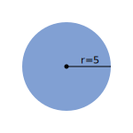
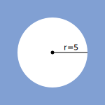
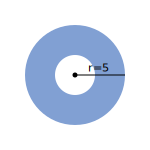
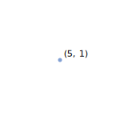
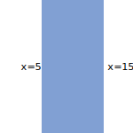
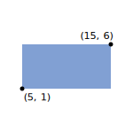

---
{
	title: "Minecraft Data Pack Programming: Command Syntax",
	description: "Learn the beginnings of data pack development in Minecraft - using positions, entity selectors, and conditional logic in commands!",
	published: '2022-06-15T21:12:03.284Z',
	authors: ['fennifith'],
	tags: [],
	attached: [],
	license: 'cc-by-nc-sa-4',
	series: "Minecraft Data Pack Programming",
	order: 2
}
---

> Please note: this guide specifically covers the **Java Edition** version of Minecraft. Bedrock Edition does not use data packs, but provides customization through [add-ons](https://minecraft.fandom.com/wiki/Add-on).

# A note on tooling

At this point, we're starting to write more complex behavior in our data packs, and it might be useful to have some tools to check that our commands are valid while we're writing them.

I use the [Visual Studio Code](https://code.visualstudio.com) editor with the [language-mcfunction](https://marketplace.visualstudio.com/items?itemName=arcensoth.language-mcfunction) extension by Arcensoth, which provides syntax highlighting and autocompletion for my commands directly in the text editor. However, there are many similar extensions with different features, and other text editors likely have their own plugins for providing this behavior as well.

# Conditional logic with the "/execute" command

In the previous post, we ended on an interesting question &mdash; how do we write a command that only executes if the player is standing on a particular block?

Well, Minecraft actually has a specific command for checking preconditions and other attributes of a command before running it - the [`/execute`](https://minecraft.fandom.com/wiki/Commands/execute) command!

This command can be used with an indefinite number of arguments, which might make it confusing to understand by reading its documentation &mdash; but this effectively means that you can add any number of preconditions to this command.

For example:

```shell
execute if block ~ ~ ~ air run say "You're standing in air!"
```

This uses two subcommands of the `execute` command: `if block ~ ~ ~ air` checks if the block at the player's location is air, and `run say hi` will invoke the `say hi` command if the previous conditions have passed.

Try running this command in Minecraft! As long as you're standing on a solid block (not in a slab or grass/foliage), you should see its message appear in the chat. If you stand underwater or in any block that isn't air, it should stop executing.

If we want to negate this condition, we can replace the `if` subcommand with `unless` &mdash; this will print its message as long as the player *isn't* standing in air.

```shell
execute unless block ~ ~ ~ air run say "You aren't standing in air!"
```

> In the following sections, it might help keep in mind that every command has a specific *context* that it executes in. This context consists of a **position in the world** and a **selected entity** that runs the command.
>
> This will make more sense after covering the following sections &mdash; but this context affects what blocks, locations, and entities certain commands and syntax will be referring to.

# Position syntax

So what do the tildes (`~ ~ ~`) mean in the previous command? This is referring to *the current position* (in the X, Y, and Z axes) of the player that is executing the command. There are a few different ways to write positions like these in Minecraft, which I'll explain here:

- ###### Absolute world coordinates
  Coordinates can be written as a fixed position in the world - say, `32 60 -94` (these coordinates can be obtained by opening the [F3 debug screen](https://minecraft.fandom.com/wiki/Debug_screen) and finding the "Targeted block" position.
- ###### Current coordinates (tilde notation)
  Using the tilde symbols (`~ ~ ~`) will reference *the current position* that the command is executed at. This can also be mixed with static values, such as `32 ~ -94`, which will reference the block at (x: 32, z: -94) using the player's current y-axis.
- ###### Relative world coordinates
  These positions can also be *offset* by a certain number of blocks in any direction by adding a number after the tilde. For example, `~2 ~-4 ~3` will move 2 blocks horizontally from the player's x-axis, 4 blocks down in the y-axis, and 3 blocks horizontally in the z-axis.
- ###### Directional coordinates (caret notation)
  Similar to relative coordinates, directional coordinates (`^ ^ ^`) will start from wherever the command is executed from. However, any offsets will be applied relative to *wherever the current player or entity is looking.* For example, `^2 ^-4 ^3` will move 2 blocks to the left of the player, 4 blocks downward, and 3 blocks in front of the direction the player faces.

To experiment with the position syntax and see where certain positions end up in the world, we can add coordinates to the `/summon` command to spawn entities at a specific location. `/summon pig ~ ~ ~` would use the current position of the player (its default behavior), while `/summon pig ~ ~-4 ~` would probably spawn the pig underground. If you spawn too many pigs, you can use `/kill @e[type=pig]` to remove them.

An important note when using these positions: for players (and most other entities), any positions will actually start *at the player's feet.* If we want to start at the player's head, we can use the `anchored eyes` subcommand to correct this &mdash; using directional coordinates, `/execute anchored eyes run summon pig ^ ^ ^4` should summon a pig 4 blocks forward in the exact center of wherever player is looking.

## Positions in an "/execute" subcommand

The `/execute` command also has a subcommand that can set the position of the command it runs: `positioned ~ ~ ~`. Using this, we can rewrite our previous command:

```shell
execute anchored eyes run summon pig ^ ^ ^4
execute anchored eyes positioned ^ ^ ^4 run summon pig ~ ~ ~
```

These two commands do the same thing! But there might be some cases where this subcommand is useful &mdash; for example, using our `fennifith:animals/spawn` function from the previous article in this series...

```shell
execute anchored eyes positioned ^ ^ ^4 run function fennifith:animals/spawn
```

Since our `spawn` function summons all of the animals at its position of execution, we can use the `/execute` command to change that position! This command should now spawn the animals in front of the player, rather than directly on top of them.

# Entity selectors

So we've figured out how to use positions for the player, but how can we refer to other entities in the world? If you've paid attention to the `/kill @e[type=pig]` command from earlier, this is actually using an *entity selector* to reference all of the pigs in the world. We're using the `@e` variable (all entities in the world), and filtering it by `type=pig` to only select the entities that are pigs.

Here's a list of some other selector variables we can use:
- `@p` targets only the **nearest player** to the command's execution
- `@a` targets **every player** in the world (useful for multiplayer servers / realms)
- `@e` targets **every player, animal, and entity** in the world
- `@s` targets only **the entity that executed the command**

And here are some of the ways that we can apply the filter attributes:
- `[type=player]` selects the entity type (`pig`, `cow`, `item_frame`, etc.)
- `[gamemode=survival]` can select players in a specific game mode (`creative`, `spectator`, etc.)
- `[limit=1]` will restrict the total number of entities that can be picked by the selector
- `[sort=nearest]` will affect the order of entities selected (`furthest`, `random`, `arbitrary`)

Using these selectors, we can use `@e[type=pig,sort=nearest,limit=3]` to reference the three nearest pigs to player that executes the command.

What if we use `/kill @a[type=pig]`? This won't select anything &mdash; because `@a` only selects *player* entities. Similarly, `@s[type=pig]` won't select anything either, because `@s` refers to the entity that runs the command &mdash; which is you, an entity of `type=player`.

## Entities in an "/execute" subcommand

Just like how `/execute positioned <x> <y> <z>` can be used to set the position of the command it runs, the `/execute as <entity>` subcommand can be used to set the entity that runs the command. This will effectively *change the entity that `@s` refers to* in anything it executes. Let's use this with our `/kill @e[type=pig]` command!

```shell
kill @e[type=pig]
execute as @e[type=pig] run kill @s
```

An important note about how this feature works is that, after the `as @a[type=pig]` subcommand, it will actually run any following subcommands *once for every entity it selects.* This means that it is individually running `kill @s` once for every entity of `type=pig`.

## Entity positions in an "/execute" subcommand

So, we *could* use this with our `if block ~ ~ ~ air` command from earlier to select only the pig entities that are standing in a block of air... but that might not work quite as we expect.

```shell
execute as @e[type=pig] if block ~ ~ ~ air run kill @s
```

You'll notice that this is actually affecting *all* pigs in the world... unless you stand underwater or in a block of foliage, in which case it won't do anything. This is because, while the `as <entity>` command changes the executing entity, it doesn't affect the position of the command's execution &mdash; it's still running at your location.

While we can use relative positions with the `positioned ~ ~ ~` subcommand, you'll notice that there isn't any way to refer to a selected entity in this syntax... that's why we'll need to use the `at <entity>` subcommand instead!

```shell
execute as @e[type=pig] at @s if block ~ ~ ~ air run kill @s
```

This command first selects all `@e[type=pig]` entities, then - for each pig - changes the position of the command to the position of `@s` (the selected entity). As a result, the position at `~ ~ ~` now refers to the position of `@s`.

This can also be used with functions, same as before! However, I'm going to add a `limit=5` onto our entity selector here &mdash; otherwise it might spawn an increasing number of entities each time it runs, which could cause lag in your game if executed repeatedly.

```shell
execute as @e[type=pig,limit=5] at @s run function fennifith:animals/spawn
```

# Filtering entities by position

In addition to the filter attributes we discussed earlier, the `[distance=<range>]` and `[x=<number>,dx=<number>]` attributes can be used to select entities based on their location in the world.

Here are a few examples of this in use:

## Radius selection

With the `[distance=<range>]` attribute, entities will be selected if they are within a specific radius of a position. However, for this to work as expected, the value needs to be a **range**, not a number. For example, `[distance=6]` will only select entities at a distance of exactly 6 blocks away.

Ranges can be specified by placing two dots (`..`) as the range between two numbers. If either side is left out, the range is interpreted as *open*, and will accept any number in that direction. By itself, `..` is a range that includes all numbers, `5..` will accept any number above 5, `..5` accepts any number below 5, and `1..5` accepts any number between 1 and 5.

| `@e[distance=..5]` | `@e[distance=5..]` | `@e[distance=2..5]` |
|--------------------|--------------------|---------------------|
|  |  |  |

## Area selection

The `[x=]`, `[y=]`, and `[z=]` attributes will filter entities by their exact position. However, since entities can move to positions in-between blocks, their coordinates usually aren't in whole numbers &mdash; so it is unlikely that these filters by themselves will select any entities.

However, these attributes can be paired with `[dx=]`, `[dy=]`, and `[dz=]` to select a range of values on the X, Y, and Z axes. For example, `[y=10,dy=20]` will filter any entity with a position between `Y=10` and `Y=30`.

Using all of these attributes togther can create a box area to search for entities within. For example, `@e[x=1,y=2,z=3,dx=10,dy=20,dz=30]` is effectively creating a box that is 10 blocks wide, 20 blocks high, 30 blocks deep, starting at the position (1, 2, 3).

| `@e[x=5,z=1]` | `@e[x=5,dx=10]` | `@e[x=5,z=1,dx=10,dz=5]` |
|---------------|-----------------|--------------------------|
|  |  |  |

# Challenge: Using "/execute" in our tick.mcfunction

In the previous post, we got our data pack to print a message on every game tick. Let's try to change that &mdash; see if you can write a command that will check *the block below the player* to see if it is `air`. If the player is standing on air, they are probably falling, so let's print "aaaaaaaaaaaaaaaaaaaa" in the text chat.

<details>
  <summary>Need a hint?</summary>

  There is some potential for confusion here, as the `tick` event doesn't actually run with any particular entity or position in the Minecraft world &mdash; by default, the location of `~ ~ ~` will be at (0, 0, 0), and `@s` will not refer to any entity.

  You'll need to use a different selector to find the player and get their position before using the `if block` condition.
</details>


<details>
  <summary>Solution</summary>

  This command should select the player, get their position, and execute `say aaaaaaaaaaaaa` for every tick when the player is falling down or jumping in the air.

  ```shell
execute at @a if block ~ ~ ~ air run say "aaaaaaaaaaaaaaaaaaaa!"
  ```

  There are a few different combinations of subcommands that could be used here &mdash; if you used `as @a at @s`, you'll notice that `say` actually prints your username before its message. This is because you've changed the selected entity to you, the player &mdash; so you're sending the message as yourself.

  If you try to flip the order those two subcommands, `at @a as @s` won't actually select the right entity. You'll need to use `at @a as @p` to get the nearest player to the position of the selected player &mdash; which is a bit redundant, when `as @a` could simply select the player entities to begin with.
</details>

**Note:** If you use the `as` and `at` subcommands together, be aware that both will run any consecutive subcommands *for every entity they select.* So `as @a at @a`, on a multiplayer server, will first select every player entity, then (for every player entity) will run at the position of every player entity. If `n = the number of players`, this will result in the command running `n * n` times in total.

You can try this with `@e[type=pig]` to see how many times it prints:

```shell
# This command will print far more messages than the number of pigs in your world.
execute as @e[type=pig] at @e[type=pig] run say hi
```

# Conclusion

So far, we've started using conditional logic and covered most of the syntax you need to add behavior to your data pack. Having discussed the uses of coordinate syntax and entity selectors, a lot of Minecraft's commands should start to make sense now.

Between articles, feel free to experiment with other [Minecraft commands](https://minecraft.fandom.com/wiki/Commands), such as `/setblock` or `/tp`. Most of these won't be directly mentioned in this series, as we'll be moving on to more complex methods for storing data and detecting events &mdash; so it'll be useful to read through this list to figure out what each command can do.

In the next post, we'll cover an entirely different feature of Minecraft: *player scoreboards!* These will allow us to keep count of different variables, detect certain in-game actions, and store a player-specific or global state in our data packs.
