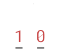
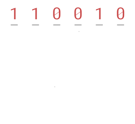
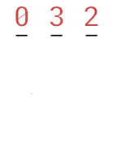
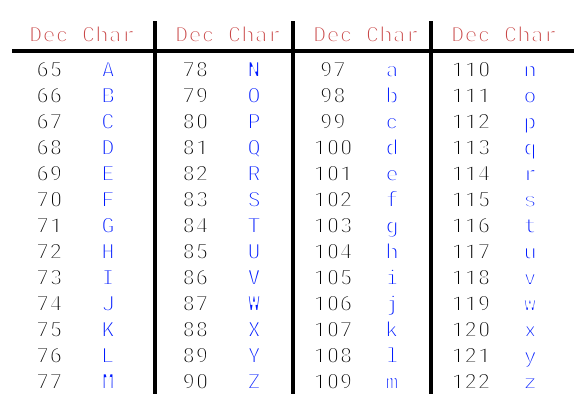

---
{
  title: "How Binary and Hexadecimal Work: An introduction to non-decimal number systems",
  description: "Learn how to convert decimal to binary and hexadecimal, how CSS colors are calculated, and how your computer interprets letters into binary",
  published: "2019-11-07T05:12:03.284Z",
  authors: ["crutchcorn"],
  tags: ["binary", "hexadecimal"],
  attached: [],
  license: "cc-by-nc-sa-4",
}
---

Computers - on a very low level - are built upon binary (ones and zeros). Think about that - all of the text you're reading on your screen started life as either a one or a zero in some form. That's incredible! How can it turn something so simple into a sprawling sheet of characters that you can read on your device? Let's find out together!

# Decimal {#decimal}

When you or I count, we typically use 10 numbers in some variation of combination to do so: `0`, `1`, `2`, `3`, `4`, `5`, `6`, `7`, `8`, and `9`.

When you count to `10`, you're really using a combination of `1` and `0` in order to construct a larger number that we cognizantly recognize. The number `10` persists in our minds even when we have it written out; **ten**.

Knowing that we can separate the number from our thoughts allows us to categorize the number in a further manor, breaking it down into smaller groupings mentally. For example, if we take the number `34`, for example, we can break it down into three groups: the _ones_, the _tens_, and the _hundreds_.

For the number `34`, we break it down into: `0` _hundreds_, `3` _tens_, and `4` _ones_. We can then multiply the higher number with the lower number (the column they're on) to get the numbers **`30`** (`3` _tens_) and **`4`** (`4` _ones_). Finally, we add the sum of them together to make the number we all know and love: **`34`**.

This breakdown showcases a limitation with having 10 symbols to represent numbers; with only a single column, the highest number we can represent is _`9`_.
Remember that the number **`10`** is a combination of **`0`** and **`1`**? That's due to this limitation. Likewise - with two columns - the highest number we can represent is _`99`_

# Binary {#binary}

Now this may seem rather simplistic, but it's important to demonstrate this to understand binary. Our numerical system is known as the _base 10 system_. **Called such because there are 10 symbols used to construct all other numbers** (once again, that's: `0`, `1`, `2`, `3`, `4`, `5`, `6`, `7`, `8`, and `9`).
Binary, on the other hand, is _base two_. **This means that there are only two symbols that exist in this numerical system.**

> For the latin enthusiasts, binary comes from "binarius" meaning "two together". _Deca_, meaning 10, is where "decimal" comes from

Instead of using numbers, which can get very confusing very quickly while learning for the first time, let's use **`X`**s and **`O`**s as our two symbols for our first few examples. _An **`X`** represents if a number is present and we should add it to the final sum_, _an **`O`** means that the number is not present and we should not add it_.
Take the following example:

In this example, both `1` and `2` are present, so we add them together to make **`3`**. You'll see that since we can only have a value present or not present — because we only have two symbols in binary — this conversion has less steps than using decimal. For example, if you only wanted the number two, you could simply mark the `1` as "not present" using the **`O`**

You can even replace the two symbols with `1` and `0` to get the actual binary number of `10` in order to represent `2`

So how does this play out when trying to represent the number **`50`** in binary?

As you can see, we create columns that are exponents of the number `2` for similar reasons as exponents of `10`; You can't represent `4`, `8`, `16`, or `32` without creating a new column otherwise.

> Remember, in this system a number can only be present or not, there is no _`2`_. Because of this, without the **`4`** column, there can only be a `1` and a `2`, which makes up **`3`**. Continuing on with this pattern: without an **`8`** column, you can only have a `4`, `2`, and `1` which would yeild you **`7`**.

Once each of these exponents is laid out, we can start adding 1s where we have the minimum amount of value. EG:
Is `64` less than or equal to `50`? No. That's a **`0`**
Is `32 <= 50`? Yes, therefore that's a **`1`**
`50 - 32 = 18`
Moving down the list, is `16 <= 18`? Yes, that's a **`1`**
`18 - 16 = 2`
Is `8 <= 2`? No, that's a **`0`**
`4 <= 2`? No, that's a **`0`** as well
`2 <= 2`? Yes, that's a **`1`**
`2 - 2` is **`0`**. That means every number afterwards (in this case only `1` is left) is not present, therefore is a **`0`**.

Add up all those numbers:
|Column|Value|
|--|--|
|`64`| **`0`**|
|`32`| **`1`**|
|`16`| **`1`**|
|`8`| **`0`**|
|`4`| **`0`**|
|`2`| **`1`**|
|`1`| **`0`**|

And voilà, you have the binary representation of `50`: **`0110010`**

> Author's note:
>
> While there are plenty of ways to find the binary representation of a decimal number, this example uses a "greedy" alogrithm. I find this algorithm to flow the best with learning of the binary number system, but it's not the only way (or even the best way, oftentimes).

# Hexadecimal {#hexadecimal}

But binary isn't the only non-deciamal system. You're able to reflect any numerical base so long as you have the correct number of symbols for that system. Let's look at another example of a non-decimal system: _Hexadecimal_.

Hexadecimal is the base 16 number system.

> _Hexa_ meaning "six" in Latin, _deca_ meaning "ten", combining to mean "sixteen".

Now you may wonder how you can count to 16 in a single column when we only use 10 numbers. The answer, to many developers, is to fill the remaining last 6 with other symbols: letters.

`0`, `1`, `2`, `3`, `4`, `5`, `6`, `7`, `8`, `9`, `A`, `B`, `C`, `D`, `E`, `F`

These are the symbols that makeup the hexadecimal numerical systems for many devs. _`A`_, in this case, represents the number **`10`**. _`F`_ being the number **`15`**. In this numerical system, there are the _sixteens_, the _two-hundred fifty sixs_ (gathered by multiplying 16 by itself — 16 ^ 2), and other exponents of 16.

Given this information, how would we represent the number **`50`**?

Assuming we have a _ones_ column, a _sixteens_ column, and a _two-hundred fifty sixths_, let's do a similar method of calulating the number as we did with binary.

Is `256` less than or equal to `50`? No. That's a **`0`**
Is `16 <= 50`? Yes. So we know it's _at least_ _`1`_.

Now, how many times can you put `16` in `50`?

`16 * 2 = 32` and `32 <= 50`, so it's _at least_ _`2`_

`16 * 3 = 48` and `48 <= 50` so it's _at least_ _`3`_

`16 * 4 = 64`. However, `64 > 50`, therefor the _sixteenth_ place cannot be _`4`_, therefore it must be **`3`**

So now that we know the most we can have in the _sixteenth_ place, we can subtract the sum (`48`) from our result (`50`)

`50 - 48 = 2`

Now onto the _ones_ place:

How many _ones_ can fit into _`2`_?

`1 * 1 = 1` and `1 <= 2`, so it's _at least_ _`1`_

`1 * 2 = 2` and `2 <= 2` and because these number equal, we know that there must be **`2`** _twos_.

Now if we add up these numbers:

| Column | Value   |
| ------ | ------- |
| `256`  | **`0`** |
| `16`   | **`3`** |
| `1`    | **`2`** |

## Why `256`?

While reading through this, you may wonder "Where did the `256` come from?". Let's take a step back to anaylize this question.

If you recall, we use the 15 symbols in hexadecimal:

`0`, `1`, `2`, `3`, `4`, `5`, `6`, `7`, `8`, `9`, `A`, `B`, `C`, `D`, `E`, `F`

If we reflect these numbers in a single digit (1 number column), the biggest number we can reflect is `F`: `15`.

This is similar to how the biggest number we can reflect with a single digit in the decimal system is `9`.

In order to add a number larger than `15` in the hexadecimal system, we need to add another decimal/column. This column would represent the _sixteens_ place. Having `F` in this column, the highest we can represent, and an `F` in the _ones_ would allow us to have `FF`: `255`. As a result, we need to add a _two-hundred-fifty-six_ column to represent any numbers higher.

> For those that have experience in algebra, you'll notice that these are all exponents of each other.
>
> Just as _`100`_ is `10^2` for the decimal system, `256` is `16^2`. We can follow this pattern to the next number in the hexadecimal column: `4096`, which is `16^3`. You can even apply it to `1` which is `16^0`
>
> Binary works in the same manor. The first 5 columns/digits of binary are: `1`, `2`, `4`, `8`, `16` . These numbers align respectively to their binary exponents: `2^0`, `2^1`, `2^2`, `2^3`, `2^4`

## To Binary {#hexadecimal-to-binary}

# Applications

## CSS Colors {#hex-css}

Funnily enough, if you've used a "HEX" value in HTML and CSS, you may already be loosely familiar with a similar scenario to what we walked through with the hexadecimal section.

For example, take the color `#F33BC6` (a pinkish color). This color is a combination of `3` two-column hexadecimal numbers back-to-back. These numbers are:

`F3`, `3B`, `C6`

_They reflect the amount of red, green, and blue (respective) in said color._ Because these numbers are two-column hexadecimal numbers, _the highest a number can be to reflect one of these colors is `255`_ (which is **FF** in hexadecimal).

> If you're unfamiliar with how red, green and blue can combine to make the colors we're familiar with (such as yellow, orange, purple, and much more), it might be worth taking a look at some of the color theory behind it. [You can find resources on the topic on Wikipedia](https://en.wikipedia.org/wiki/RGB_color_model) and elsewhere

These numbers, in decimal, are as follows:

| HEX  | Decimal |
| ---- | ------- |
| `F3` | `243`   |
| `3B` | `59`    |
| `C6` | `196`   |

And construct the amount of `Red`, `Green`, and `Blue` used to construct that color

| Represents | HEX  | Decimal |
| ---------- | ---- | ------- |
| Red        | `F3` | `243`   |
| Green      | `3B` | `59`    |
| Blue       | `C6` | `196`   |

Even without seeing a visual representation, you can tell that this color likely has a purple hue - since it has a high percentage of red and blue.

## Text Encoding {#ascii}

While hexadecimal has much more immediately noticable application with colors, we started this post off with a question: "How does your computer know what letters to display on screen from only binary?"

The answer to that question is quite complex, but let's answer it in a very simple manor (despite missing a lot of puzzle pieces in a very ["draw the owl"](https://knowyourmeme.com/memes/how-to-draw-an-owl) kind of way).

Let's take a real way that computers used to (and still ocationally do) represent letters internally: [ASCII](https://en.wikipedia.org/wiki/ASCII). ASCII is an older standard for representing letters as different numbers inside your computer. Take the following (simplified) chart:

When the user types _"This"_, what the computer interprets (using ASCII) is `84`, `104`, `105`, and `115` for `T`, `h`, `i`, and `s` respectively.

> You might be wondering "Why is there a bunch of missing numbers"?
>
> I've removed them to keep the examples simple, but many of them are for symbols (EG: `#`, `/`, and more) and some of them are for internal key commands that were used for terminal computing long ago that your computer now does without you noticing
>
> It's also worth mentioning that ASCII, while there are more characters than what's presented here, was eventually replaced in various applications by [Unicode](https://en.wikipedia.org/wiki/Unicode) and other text encoding formats as it lacks various functionality we expect of our machines today, such as emoji and non-latin symbols (like Kanji).

### To Binary {#ascii-binary}

... But we can go a step further - binary

# Conclusion

While this has been only a high-level overview of how your computer interprets these non-decimal numbers (and some of their applications), it can provide some basic insights to what your computer is doing every time you type in a keystroke or see a color on screen. Under the hood everything is binary, and now you understand the introduction to how to convert binary to numbers you and I may understand better: to decimal!