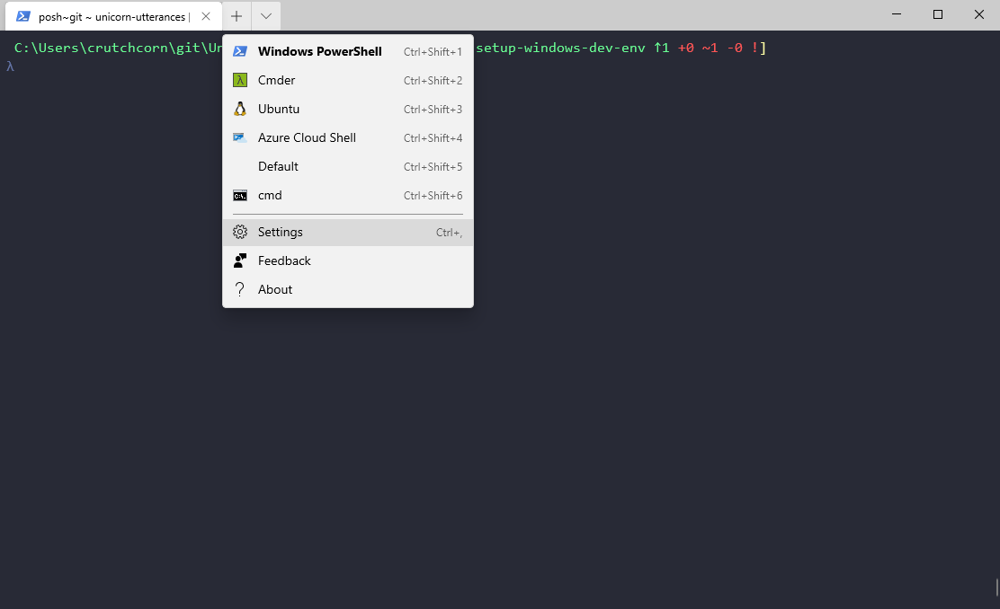
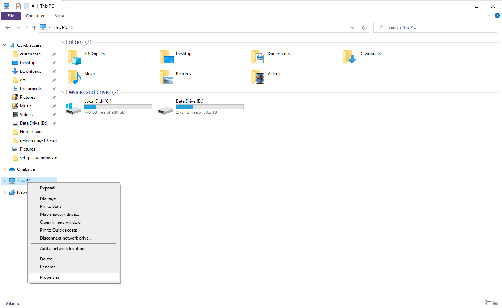
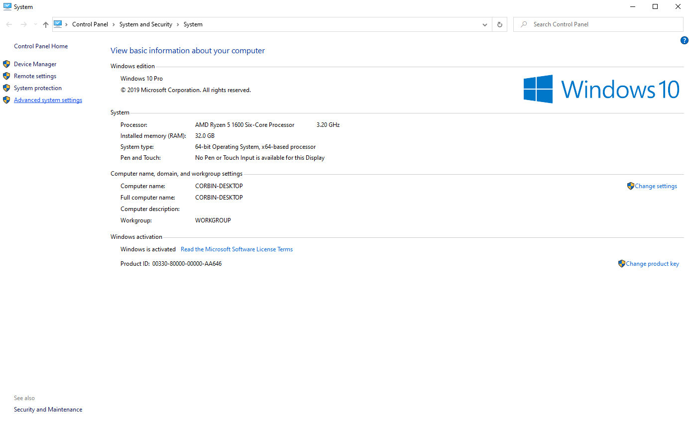
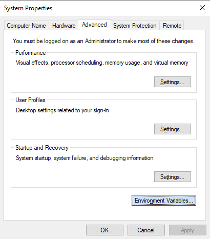
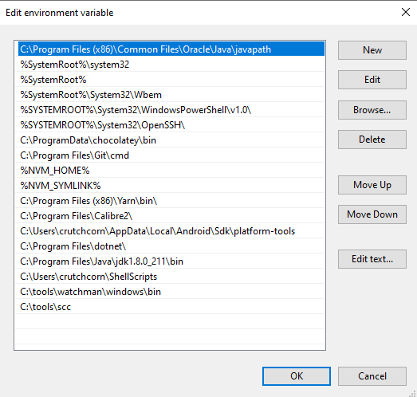
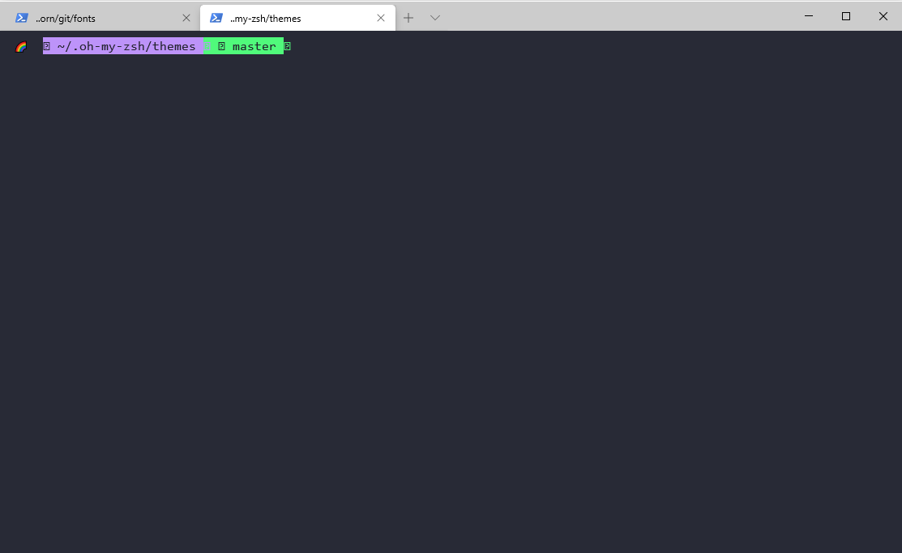

---
{
	title: "The Ultimate Windows Development Environment Guide",
	description: "Many developers like MacOS or Linux for development environments, but don't know that Windows has plenty to offer. Let's explore that in this deep dive into Windows development environments!",
	published: '2020-04-07T05:12:03.284Z',
	authors: ['crutchcorn'],
	tags: ['tooling', 'windows'],
	attached: [],
	license: 'cc-by-nc-sa-4'
}

---

Ask any developer running off of a Linux or macOS machine, and they'll be able to tell you what about their systems make them such a strong contender for development usage. Some of the top contenders I've heard are:

- [Package management](#package-management)
- [Terminal usage](#terminal-usage)
- [Keyboard Usage](#keyboard-usage)
- [Customization](#customization)
- [Functionality](#functionality)

What many don't know is that Windows has gained many of these options over the years. Between official tooling such as [WSL2](https://docs.microsoft.com/en-us/windows/wsl/wsl2-install) right around the corner to third-party offerings becoming more-and-more mature, there's never been a better time to be a developer on the Windows platform.

Moreover, much of what we'll be taking a look at today is either free, open-source, or both! There will be a few mentions of paid software as alternatives to free options, but I've personally used every paid software that I'll be mentioning. None of the paid software we mention here has been included as a deal of sponsorship in any way, I just like them and use them.

> I understand that for some, Windows simply isn't their cup of tea. Additionally, I acknowledge that other platforms may do things *_better_* than Windows can. However, Windows is undisputedly a cheaper option than MacOS and often required for application usage where WINE and others fall flat. Just keep an open mind and understand that this isn't a put-down of other options.

# Package Management {#package-management}

When it comes to CLI package management on Windows, nothing beats [Chocolatey](https://chocolatey.org/). [It only takes a single PowerShell command to install](https://chocolatey.org/install), not unlike [Homebrew for macOS](https://brew.sh/). The comparisons with Homebrew don't stop there, either; Much like it, Chocolatey is an unofficial repository of software but does include checks of verification for a select number of popular packages.

It's also popular amongst sysadmins due to its ease of deployment across multiple devices and stability.

You'll need to run in an administrator window, but once you do, you'll find the utility straightforward. A simple `choco search package-name` will find related packages to the name you input where areas `choco install package-name` will install the package.

## Manage Packages via GUI {#chocolatey-gui}

Readers, I won't lie to you. I'm not the kind of person to use CLIs for everything. I see their worth entirely, but it's simply not my strong suit remembering various commands even if I understand the core concepts entirely. For people like me, you might be glad to hear that _Chocolatey has a GUI for installing, uninstalling, updating, and searching packages_. It's as simple as (Chocolate) pie!


You can see that it gives a list of installed packages with a simple at-glance view of what packages need updating.


## Suggested Packages {#suggested-packages}

While Chocolatey has a myriad of useful packages to developers, there are some packages that I have installed on my local machine that I'd like to highlight.

For starters, what's a developer machine without `git`? Let's throw that on:

```
choco install git.install
```

Additionally, I know a lot of developers would like to have access to common GNU utilities, such as `rm` and `touch`. Using an install flag, you're able to add those to your path for usage:

```
choco install git.install--params "/GitAndUnixToolsOnPath"
```

### CLI Utilities {#cli-packages}

| Package Name | Explanation                                                  |
| ------------ | ------------------------------------------------------------ |
| `micro`      | A great terminal editor (ala Nano). It even supports using mouse usage! |
| `bat`        | A great alternative to `cat` with line numbers and syntax highlighting |
| `gh`         | GitHub's official CLI for managing issues, PRs, and more     |
| `nvm`        | "Node version manager" - Enables users to have multiple installs of different Node versions and dynamically switch between them |
| `yarn`       | An alternative to `npm` with better monorepo support. If installed through `choco`, it will support `nvm` switching seamlessly. |

You're able to install all of these packages using:

```
choco install micro bat gh nvm yarn
```

### IDEs {#ides}

| Package Name                                                 | Explanation                                                |
| ------------------------------------------------------------ | ---------------------------------------------------------- |
| `vscode`                                                     | Popular Microsoft IDE for many languages                   |
| `sublimetext3`                                               | Popular text editor with syntax support for many languages |
| `visualstudio2019professional` / `visualstudio2019community` | Microsoft's flagship IDE                                   |
| `jetbrainstoolbox`                                           | The installer/updater for JetBrains' popular IDEs          |

You're able to install all of these packages using:

```
choco install vscode sublimetext3 visualstudio2019community jetbrainstoolbox
```

### Others {#utilities}

| Package Name                               | Explanation                                                  |
| ------------------------------------------ | ------------------------------------------------------------ |
| `powertoys`                                | Built by MS itself, provides SVG/Markdown previews, provides utility for mass renaming, image resizing all from the file explorer itself. It also allows you to configure tiling and more. We'll talk about this more later |
| `ext2fsd`                                  | A program that enables you to read/write from ex2/ex3/ex4 formatted filesystems |
| `virtualbox`                               | A program that allows you to create, run, and edit virtual machines |
| `virtualbox-guest-additions-guest.install` | The extension to `virtualbox` that provides better USB passthrough support |
| `firacode`                                 | A popular programming font that supports ligatures           |
| `scrcpy`                                   | A utility that allows you to mirror your Android phone screen via ADB |
| `typora`                                   | A markdown editor with a "preview edit" mode allowing you to edit markdown files similarly to Word |
| `postman`                                  | A REST API tester                                            |
| `Firefox`                                  | The popular web browser by Mozilla                           |
| `licecap`                                  | A quick-and-easy GIF capture software                        |
| `7zip`                                     | Compressed file format manager. Allows you to extract files from various formats |
| `jdk` / `jre`                              | Java runtime and development kit                             |

You're able to install all of these packages using:

```
choco install powertoys ext2fsd virtualbox virtualbox-guest-additions-guest.install firacode scrcpy typora postman Firefox licecap 7zip jdk jre
```

## Microsoft Store {#microsoft-store}

I'm sure some avid Microsoft fans will have pointed out by now that I forgot something. You know, the official solution by Microsoft? Naturally, I haven't forgotten about the Microsoft Store.

While some of you may be surprised to hear this, the Microsoft Store has gained a fair number of development tools on its storefront. For example, there's now a package for Python that's now there. You're also able to get quick updates for all of your apps and seamlessly integrate them as-if they were typical windows apps.


# Terminal Usage {#terminal-usage}

Terminal usage is essential for most developers. It's a relatively universal utility regardless of what form of programming you're into. It's important to make sure that your terminal is fully featured for functionality and customizable for tastes and fun.

## Terminal Options {#terminals}

One of the most important elements to one's terminal usage is, well, the terminal itself! While Windows has not historically had many options in this regard, things have turned around in recent years. Additional to the built-in CMD and PowerShell windows, we now have many newcomers, including one from Microsoft itself.

First, let's start with the unofficial offerings. We have many options, but the two I want to highlight is `Cmder` and `Terminus`.

### Cmder {#cmder}

[Cmder is an open-source terminal offering](https://github.com/cmderdev/cmder) built on top of a long-standing base called [ConEmu](https://conemu.github.io/). Not only is it a terminal window for you to interface with, but it provides a massive set of configurations. It not only provides configurations for the CMD shell backend, but for PowerShell as well, meaning you can freely switch between them (and WSL) to suite your current needs. These configurations can even be used without having to utilize the terminal window. I think the config makes the terminal much more useful and pretty. For example, this is the default view of Cmder:


As you can see, there's some custom logic for embedding Git metadata in the prompt, a custom `λ` prompt, and even contains some logic for more effective tab autocomplete. You're even able to install it via Chocolatey using `choco install cmder`! 

The terminal itself contains all kinds of functionality:

- Multi-line copy+paste
- Tiling
- Tabs
- Customizable UI

Those are just the features at the top of my head! What's nice about Cmder is that even if you don't use the terminal itself, you can use the configurations for CMD and PowerShell with other shells if you'd like. All of the screenshots for the other terminals will be shown using the Cmder configs.

### Terminus {#terminus}

Terminus is another excellent option for those looking for alternative terminal shells. Because it's rendered using web tech, it's UI is much more customizable. It also has an easy-to-install plugin system to add further functionality to the shell. What you're seeing is the initial out-of-the-box experience [with the Cmder configuration applied](https://github.com/cmderdev/cmder/wiki/Seamless-Terminus-Integration)


### Windows Terminal {#windows-terminal}

Last, but certainly not least, we have the newly-introduced Windows Terminal. This is the new terminal that's being built by Microsoft themselves. [The project is open-source](https://github.com/microsoft/terminal) and the preview is even installable   [via the Microsoft Store](https://aka.ms/windowsterminal).


This terminal shell has been the most stable in my usage. It supports tabs, a highly customizable UI, and different tabs with the different shells supported.

#### Cmder Integration {#windows-terminal-cmder}

While Cmder integration with Windows Terminal is relatively trivial, it's not very well documented. Let's walk through how to do so.

You'll want to start by making sure you have an environmental variable called `cmder_root`. This should be set up by default if you installed it using `choco`, but if you're unsure, you can check manually. [We outline how to set environmental variables in this article](#env-variables).

Once we're sure that we have the configuration setup properly, we'll open up the settings file in Windows Terminal by pressing the dropdown button and selecting "Settings."



Once this is done, update your `cmd` setting to have the following `commandline` config property:

```json
"commandline": "cmd.exe /k %cmder_root%/vendor/init.bat",
```

You can even do so for PowerShell:

```json
"commandline": "powershell.exe -ExecutionPolicy Bypass -NoLogo -NoProfile -NoExit -Command \"Invoke-Expression 'Import-Module ''%cmder_root%/vendor/profile.ps1'''\"",
```

This is what my `profiles` looks like all together:

```json
"profiles": [
    {
        "guid": "{5b4ef9a8-4506-4ac9-930a-5eb1fd0ebf20}",
        "name": "Cmder",
        "commandline": "cmd.exe /k %cmder_root%/vendor/init.bat",
        "icon": " %cmder_root%/icons/cmder.ico",
        "hidden": false,
        "startingDirectory": "%USERPROFILE%/git"
    },
    {
        "guid": "{61c54bbd-c2c6-5271-96e7-009a87ff44bf}",
        "name": "Windows PowerShell",
        "commandline": "powershell.exe -ExecutionPolicy Bypass -NoLogo -NoProfile -NoExit -Command \"Invoke-Expression 'Import-Module ''%cmder_root%/vendor/profile.ps1'''\"",
        "hidden": false,
        "startingDirectory": "%USERPROFILE%/git",
    },
],
```

Finally, if you want to set one of these profiles as default (I wanted to make my new PowerShell config default), you can update the `defaultProfile ` parameter at the top of the file. Mine looked like this:

```json
"defaultProfile": "{61c54bbd-c2c6-5271-96e7-009a87ff44bf}",
```

#### Color Configuration {#windows-terminal-colors}

Windows terminal also supports customization of the colors for the terminal, among other things. The color settings I used for the screenshot above is the Dracula color theme.  You can add that color theme by adding the following to the `schemes` array in the `profiles.json` file:

```json
"schemes": [
    {
        "name" : "Dracula",
        "background" : "#282A36",
        "black" : "#21222C",
        "blue" : "#BD93F9",
        "brightBlack" : "#6272A4",
        "brightBlue" : "#D6ACFF",
        "brightCyan" : "#A4FFFF",
        "brightGreen" : "#69FF94",
        "brightPurple" : "#FF92DF",
        "brightRed" : "#FF6E6E",
        "brightWhite" : "#FFFFFF",
        "brightYellow" : "#FFFFA5",
        "cyan" : "#8BE9FD",
        "foreground" : "#F8F8F2",
        "green" : "#50FA7B",
        "purple" : "#FF79C6",
        "red" : "#FF5555",
        "white" : "#F8F8F2",
        "yellow" : "#F1FA8C"
    }
],
```

Then, for each of the profiles you want to have that color scheme, add the following property:

```
"colorScheme": "Dracula"
```

Resulting in the following for my PowerShell config:

```json
{
    "guid": "{61c54bbd-c2c6-5271-96e7-009a87ff44bf}",
    "name": "Windows PowerShell",
    "commandline": "powershell.exe -ExecutionPolicy Bypass -NoLogo -NoProfile -NoExit -Command \"Invoke-Expression 'Import-Module ''%cmder_root%/vendor/profile.ps1'''\"",
    "hidden": false,
    "startingDirectory": "%USERPROFILE%/git",
    "colorScheme": "Dracula"
}
```

### Comparisons {#compare-different-terminals}

While each of the three terminals offers something different, they each have their own set of pros and cons. Here's how I see it:

- [Cmder](#cmder) has the most features of the three. It has so many features that I have not used most of them. That said, it has been known to crash on me from time-to-time.
- [Terminus](#terminus) is by far the best looking and most configurable of the three. I have even written custom CSS to style every aspect of the terminal before. It's easy to do. That said, I've suffered even greater instability and general lack of integration polish (resizing a window has negative impacts, namely) than Cmder.
- [WIndows Terminal](#windows-terminal)'s weakest link currently is it's lack of features. It lacks many of the same conveniences that you might miss from the other two options. That said, between the three, I'd say it's by far the most stable. Additionally, it's under heavy development, and the team behind it is moving fast. This is the terminal I use daily, armed with the configuration from Cmder.

While I only outlined three here, there are many other options out there. These are just the three I have used and liked the most of the options out there.

## Make Configuration Changes {#terminal-system-config}

While terminals are important, another factor to be considered is the configuration of those terminal shells. It's important to keep system-level configuration settings in mind as well. For example, if you need to [make or modify environmental variables](#env-variables) or [make changes with the system path](#env-path). Luckily for us, they both live on the same path. As such, let's showcase how to reach the dialog that contains both of these settings before explaining each one in depth.



After this, select "Advanced system settings."



After this, a dialog should pop up. This dialog should contain as one of the lower buttons "Environmental variables," which is where settings for both environmental variables and path should live.




### Environmental Variables {#env-variables}

When working with the CLI, it's often important to have environmental variables to customize the functionality of a utility or program. Because Windows has the concept of users, there are two kinds of environment variables that can be set:

- User-specific
- System-level

Each of them follows their namesakes in their usage. If I set a user-specific environmental variable and change users, I will not receive the same value as the user I'd set the variable for. Likewise, if I set it for the system, it will apply to all users. The top of the "environmental variables" section applies to the user-level, whereas the bottom level applies to the system. 

In order to add a new one, simply select "New" on whichever level you want to create the environmental variables on. You should see this dialog appear:


Simply add the name of the variable and the value of the environmental variable to continue.

You're able to do the same with editing a variable. Simply find the variable, highlight it, then select "Edit" and follow the same process.

### Adding Items to Path {#env-path}

Have you ever run into one of these errors?

- `The term 'program-name' is not recognized as the name of a cmdlet, function, script file, or operable program.`
- `'program-name' is not recognized as an internal or external command, operable program or batch file.`

It could be because you don't have the program attached to your system path. Your path is what dictates what scripts and programs you're able to access globally. For example, there's a tool that I like to use [to count the LOC I have in a given project: `scc`](https://github.com/boyter/scc). This project is incredibly useful for quick estimations for fun. The problem? It doesn't live on Chocolatey and doesn't have an MSI installer. This means that it's harder to access via the terminal. Well, no longer! [If I download the ZIP from the releases tab](https://github.com/boyter/scc/releases), and extract it, I'll see that it contains a file called `scc.exe`. If I move that folder to `C:\tools\scc` and add it to the path, then I can use it in the terminal as if it were any other global util.


In order to add the file to the path, I need to edit the `path` environmental variable.

> [Just as there are two sets of environmental variables](#env-path), there are two sets of `path` env variables. As such, you'll have to decide if you want all users to access a variable or if you want to restrict it to your current user. In this example, I'll be adding it to the system. 

Find the `path` environmental variable and select `"Edit."` 




Just as before, you're able to delete and edit a value by highlighting and pressing the respective buttons to the left. Otherwise, you can press "new" which will allow you to start typing. Once you're done, you can press "OK" to save your new path settings.

> In order to get SCC running, you may have to close and then re-open an already opened terminal window. Otherwise, running `refreshenv` often updates the path so that you can use the new commands.

## Git Configurations {#git-config}

### Editor {#git-editor}

Git, by default, uses `vim` to edit files. While I understand and respect the power of `vim`, I have never got the hang of `:!qnoWaitThatsNotRight!qq!helpMeLetMeOut`. As such, I tend to change my configuration to use `micro`, the CLI editor mentioned in [the CLI packages section](#cli-packages). In order to do so, I can just run:

``` 
git config --global core.editor "micro"
```

However, we can go a step further. Let's say that we want the full power of VSCode when editing a file via Git - we can do that!

```
git config --global core.editor "code --wait"
```

### Difftool {#git-difftool}

Not only are you able to set VSCode as your editor for rebase messages, but [you can use it as your difftool as well](https://code.visualstudio.com/docs/editor/versioncontrol#_vs-code-as-git-diff-tool)!

Simply edit your global git config (typically found under `%UserProfile%/.gitconfig`) to reflect the following:

```
[diff]
  tool = default-difftool
[difftool "default-difftool"]
  cmd = code --wait --diff $LOCAL $REMOTE
```

And it should take care of the rest for you.

### Line Endings {#git-line-endings}

While most high-level language code is interoperable between different OSes, one of the primary differences between high-level codebases in Windows vs. macOS or Linux is the line-endings. As you might know, Windows uses `\r\n` line-ending where Linux and macOS end with `\n`.
Luckily for us, Git can automatically convert the Windows line-endings before committing them to the repository. To do so, simply run the following command:

```
git config --global core.autocrlf true
```

## WSL {#wsl}

Alright, alright, I'm sure you've been expecting to see this here. I can't beat around the bush any longer. Windows Subset for Linux (WSL) enables users to run commands on a Linux instance without having to dual-boot or run a virtual-machine themselves. The way that it works differs from version to version. The initial version worked by mapping system calls from Windows to Linux in a somewhat complex method. The new version (WSL2), right around the corner, works by running a Linux container in the background and enabling you to call into that container.

Because of the foundational differences, compatibility with programs should be better in WSL2.

[The way to enable them is the same between both versions](https://docs.microsoft.com/en-us/windows/wsl/install-win10).

You'll simply want to run the following command in PowerShell as an administrator:

```powershell
Enable-WindowsOptionalFeature -Online -FeatureName Microsoft-Windows-Subsystem-Linux
```

Then reboot your machine. After a reboot, you should be able to search for a Linux distro via the Microsoft Store. There are different options available to you, such as:

- [Debian](https://www.microsoft.com/en-us/p/debian/9msvkqc78pk6)
- [Kali Linux](https://www.microsoft.com/en-us/p/kali-linux/9pkr34tncv07)
- [openSUSE](https://www.microsoft.com/en-us/p/opensuse-leap-15-1/9njfzk00fgkv)
- [Ubuntu](https://www.microsoft.com/en-us/p/ubuntu/9nblggh4msv6)

There are more distros than just those and more to come in the future.

Once done, you simply run `bash` in a terminal Window or search for the distro name as an app. Either way should start-up the distro's instance of `bash` in the directory you were currently in. This is a full installation of Linux, meaning that you're able to access its package manager, run programs from it, and modify Windows files.

There are even tweaks that're done with Windows to make it easier to use. If you run the `code` command to open a file, it will download a "VSCode remote server" to allow you to use your Windows install for both Linux and Windows commands. You can even [share SSH keys between Windows and WSL](https://devblogs.microsoft.com/commandline/sharing-ssh-keys-between-windows-and-wsl-2/)!

The cross-WSL compatibility isn't uni-directional, either. You can [open files from your Linux filesystem in Windows](https://devblogs.microsoft.com/commandline/whats-new-for-wsl-in-windows-10-version-1903/), [call Windows executables from WSL](https://docs.microsoft.com/en-us/windows/wsl/interop#run-windows-tools-from-wsl), and much more!

### Shell Configuration {#linux-shell}

If you prefer an alternative shell, such as ZSH or Fish, you're able to install those in your distro as well. For example, I have an [`oh-my-zsh`](https://ohmyz.sh/) instance that runs anytime I start-up `bash`.

To get the alternative shell running any time you call `bash`, you'll need to configure your `.bashrc` file. You're able to run `nano ~/.bashrc` to open the file. Once done, add `bash -c zsh` to the top of the file. After this, every time `bash` runs, it will open `zsh`.

You're even able to tell Windows Terminal to use WSL as default! If you open Windows Terminal, it should have a default profile for WSL:

```json
 {
     "guid": "{2c4de342-38b7-51cf-b940-2309a097f518}",
     "hidden": false,
     "name": "Ubuntu",
     "source": "Windows.Terminal.Wsl"
 },
```

All you need to do is change the `defaultProfile` to match the `guid` of the WSL profile.

#### Powerline Fonts {#powerline-fonts}

Once setting up an `oh-my-zsh` theme, you may notice that your terminal display looks weird:



To get some `oh-my-zsh` themes working properly, you may need to install a [powerline](https://github.com/ryanoasis/powerline-extra-symbols) enabled font. You have a few options to do this. 

You can do so by [cloning this repository using PowerShell](https://github.com/powerline/fonts). Then `cd fonts` and `./install.ps1`. This script will install all of the fonts one-by-one on your system, fixing the font issues in your terminal. Find which font is your favorite and remember the name of it.

Alternatively, [Microsoft has made a custom font themselves that supports powerline symbols](https://github.com/microsoft/cascadia-code/releases?WT.mc_id=-blog-scottha). To use that font, simply download the `CascadiaPL.ttf` file and install it.

The final step is to configure your terminal editor to use the new font. Let's use the Windows Terminal as an example. Open your settings and inject `"fontFace":  "Cascadia Code PL"` into one of the profiles. The final result should look something like this:

```
 {
     "guid": "{2c4de342-38b7-51cf-b940-2309a097f518}",
     "hidden": false,
     "name": "Ubuntu",
     "source": "Windows.Terminal.Wsl",
     "fontFace":  "Cascadia Code PL"
 }
```

Then, when you open the terminal, you should see the correct terminal display.


# Keyboard Usage {#keyboard-usage}

When asking many of my Linux-favoring friends why they love Linux so much, I've noticed one answer reoccur time and time again. They love being able to control their computer front, back, and sideways without having to touch their mouse. Well, dear reader, I assure you that Windows provides the same level of control.

## Built-Ins {#built-in-keyboard-shortcuts}

Windows, by default, includes a myriad of shortcuts baked right in that allow you to have powerful usage of your system using nothing but your keyboard. Here are just a few that I think are useful to keep-in-mind:

| Key Combo                                           | What It Does                                                 |
| --------------------------------------------------- | ------------------------------------------------------------ |
| <kbd>Win</kbd> + <kbd>S</kbd>                       | Perform a partial screenshot. Allow you to select what you want screenshotted |
| <kbd>Win</kbd> + <kbd>.</kbd>                       | Bring up the emoji picker. After pressing, start typing to search. |
| <kbd>Win</kbd> + <kbd>R</kbd>                       | Bring up the "Run" dialog. Will allow you to type in the internal executable name to run it |
| <kbd>Win</kbd> + <kbd>V</kbd>                       | Open the Windows clipboard manager                           |
| <kbd>Win</kbd> + <kbd>X</kbd>                       | Bring up a list of actions, including "Start PowerShell as Admin" |
| <kbd>Win</kbd> + <kbd>L</kbd>                       | Lock your screen                                             |
| <kbd>Win</kbd> + <kbd>Tab</kbd>                     | Bring up the overview mode of all windows                    |
| <kbd>Win</kbd> + <kbd>E</kbd>                       | Open file explorer                                           |
| <kbd>Win</kbd> + <kbd>S</kbd>                       | Open search dialog                                           |
| <kbd>Win</kbd> + <kbd>D</kbd>                       | Show/hide the desktop                                        |
| <kbd>Shift</kbd> + <kbd>F10</kbd>                   | Bring up the context menu for the selected item              |
| <kbd>Win</kbd> + <kbd>Ctrl</kbd> + <kbd>D</kbd>     | Add a new virtual desktop                                    |
| <kbd>Win</kbd> + <kbd>Ctrl</kbd> + <kbd>Arrow</kbd> | Move between virtual desktops                                |
| <kbd>Win</kbd> + <kbd>Ctrl</kbd> + <kbd>F4</kbd>    | Close current virtual desktop                                |


## Window Tiling {#window-tiling}

"Surely, you can't forget about window tiling!"

Oh, don't worry, I haven't. Out of the box, windows supports tiling using the <kbd>Win</kbd> +  <kbd>Arrow</kbd> keys. With these keys, you can lock a window into any of the four corners of a screen, make it take up half the screen, or fill the screen entirely.

More than that, though, there are many other options out there. One of the paid options that I like using is called [Divvy](https://mizage.com/windivvy/). While it's paid, it enables users a powerful ability to layout windows either with their keyboard or mouse alike. I often use it to size windows with my mouse, in fact.


Back at the (Redmond-based) ranch, the [previously mentioned Microsoft made PowerToys](#utilities) gives users [a feature called "FancyZones"](https://github.com/microsoft/PowerToys/blob/master/src/modules/fancyzones/README.md). Using this feature, users can dictate what locations their window snapping behaves in. This overwrites the existing <kbd>Win</kbd> +  <kbd>Arrow</kbd> shortcuts to move a window.


As you can see, there's an incredible amount of customization available with "FancyZones".

# Customization {#customization}

I'm not sure about you, but when I get a new machine, I want it to feel _mine_. This applies just as much to my wallpaper as it does the stickers I plaster my laptops in. The following software enables some new functionality or aesthetic difference that users might enjoy.

## Free {#free-customization-software}

| Program Name                                                 | What It Is                                                   |
| ------------------------------------------------------------ | ------------------------------------------------------------ |
| [Audio Band](https://github.com/dsafa/audio-band)            | Adds an interactive music preview to the taskbar. Integrates with Spotify and others |
| [QuickLook](https://pooi.moe/QuickLook/)                     | Adds MacOS like file preview on pressing spacebar            |
| [EarTrumpet](https://github.com/File-New-Project/EarTrumpet) | Allows a more complex audio mixer. Support per-app volume control |
| [Rainmeter](https://www.rainmeter.net/)                      | Enables new interactive desktop widgets                      |
| [TranslucentTB](https://github.com/TranslucentTB/TranslucentTB) | Allows for more flexibility of taskbar                       |
| [FalconX](https://chrisandriessen.nl/web/falconx/)           | Like TranslucentTB but also supports centering icons in the TaskBar |
| [Files UWP](https://github.com/duke7553/files-uwp/releases)  | A modern rewrite of the file explorer in UWP                 |
| [Open-Shell](https://github.com/Open-Shell/Open-Shell-Menu)  | An open-source replacement for the start menu                |

## Paid

> Just a reminder that none of this software is being sponsored. Please understand that this is all software that I personally use and thought that I would share. I've tried my best to find some form of free/open-source replacement and linked them in the "Free" section

| Program Name                                          | What It Is                                                   | Price         |
| ----------------------------------------------------- | ------------------------------------------------------------ | ------------- |
| [DisplayFusion](http://www.displayfusion.com/)        | A multi-monitor utility program. Enables tons of functionality to help manage multiple monitors | Starts at $29 |
| [OneCommander](http://onecommander.com/)              | A replacement for the File Explorer with various improvements | $5            |
| [TrayStatus](https://www.traystatus.com/)             | Status tray indicators for HDD, CPU, Capslock, and more      | Starts at $10 |
| [Start10](https://www.stardock.com/products/start10/) | A replacement for the Windows 10 start menu                  | $5            |
| [Groupy](https://www.stardock.com/products/groupy/)   | A replacement for the [now-defunct Sets](https://www.zdnet.com/article/windows-10s-sets-feature-is-gone-and-not-expected-to-return/) functionality. Group unrelated programs into tabs, even if they didn't previously support tabs | $10           |

# Functionality {#functionality}

Windows also has some differing functionality to Linux/macOS in some critical ways. Some of the functionality you might be used to simply doesn't have an obvious analog in Windows. Let's take a look at some of these that we have an alternative to.

## Symbolic Links {#symlinks}

Symbolic links are a method of having a shortcut of sorts from one file/folder to another. Think of it as Windows Shortcuts but baked directly into the filesystem level. This may come as a surprise to some developers, but Windows actually has support for symbolic links!

To use symbolic links from the CLI, you have to first enable developer mode on your install of Windows. To do this, go to your settings app, open "Update & Security," then select in the sidebar "For developers."


Once done, you're able to run `mklink`, which provides you the ability to make a symbolic link.

### Usage {#using-mklink}

By default, it creates a soft link from the first argument to the second. 
```
mklink Symlink SourceFile
```

You're also able to add `/D` to make a soft link to a directory:
```
mklink /D SymlinkDir SourceFolder
```

Finally, to make hard links, you use `/H` for files:

```
mklink /H Symlink SourceFile
```

And `/J` for folders:

```
mklink /J SymlinkDir SourceFolder
```

### GUI Alternative {#link-shell-extension}

While the CLI enables you to make hard and soft symbolic links, it's far from graceful. It'd be ideal to have that functionality baked right into the explorer menu options if used frequently. Luckily for us, there's an app for that! [Link Shell Extension](https://schinagl.priv.at/nt/hardlinkshellext/linkshellextension.html) adds the options to the context menu itself. It's even able to be installed using [Chocolatey](#package-management):

```
choco install linkshellextension
```

Simply right click (or [use the <kbd>Shift</kbd> + <kbd>F10</kbd> shortcut](#built-in-keyboard-shortcuts)) and select "Pick Link Source":


Then you're able to navigate to the folder you're looking for, right click, and select "Drop as...":


There are a myriad of options to choose from and should handle any type of symlink you'd need.

# Conclusion

You'll notice that despite the raw power and capabilities that WSL2 will be bringing to us right around the corner, that I didn't touch on it until later in the article. That's because, while it's an amazing toolset to be able to utilize for those that need it, it's not the only thing that you can do to enable your Windows instance to be powerful for development. Windows (and Microsoft as a whole) has come a long way in the past 10 years, and with their continued effort on projects like WSL, VS Code, and the Windows Terminal, the future looks brighter than ever. 

I want to take a moment to stop and appreciate all of the hard work that the folks at Microsoft and everyone involved in the projects mentioned have done to enable the kind of work I do daily. Thank you.

With that, we're closing off the article. If you have any questions or comments, feel free to ring off in the comment box below. Otherwise, we have [our community Discord](https://discord.gg/FMcvc6T) where we talk not only talk Windows, but Linux, macOS, programming, and everything in between. We look forward to seeing you there!
