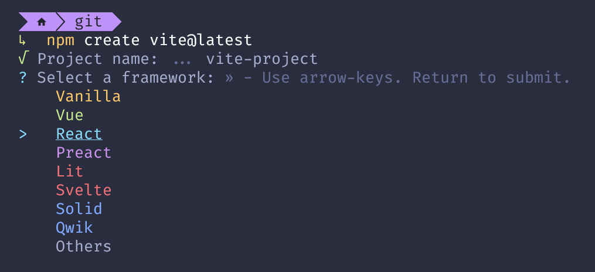
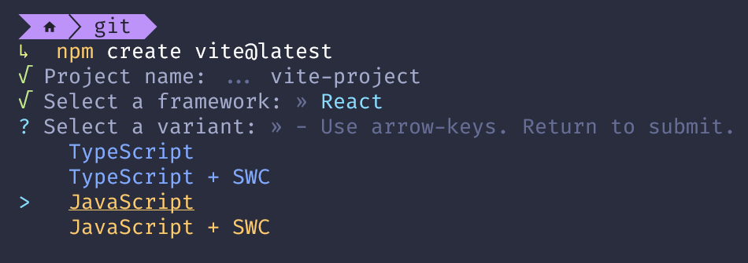
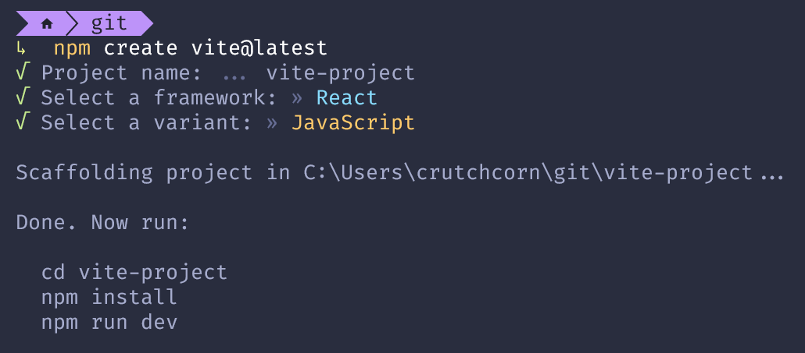
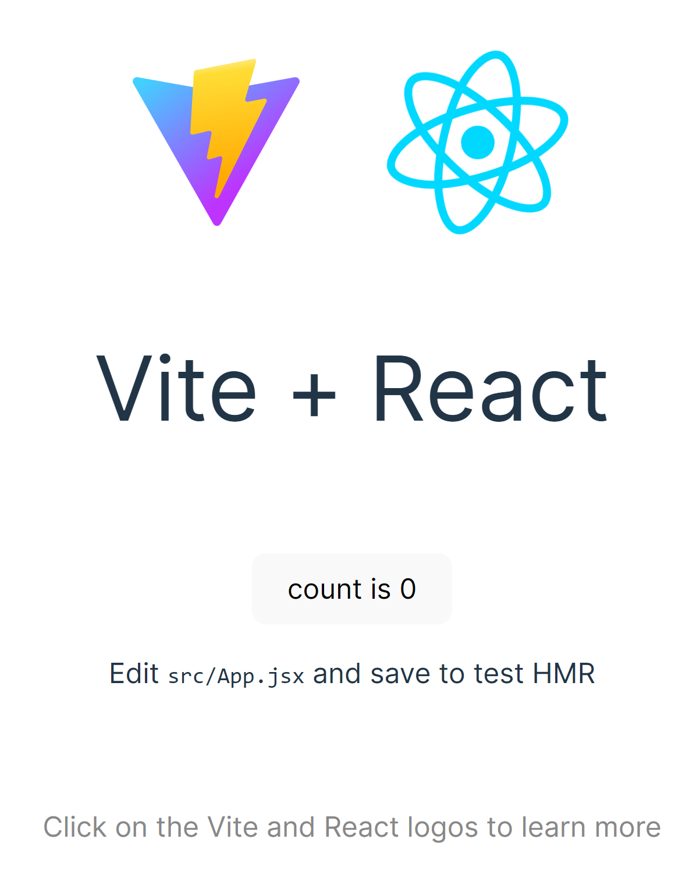
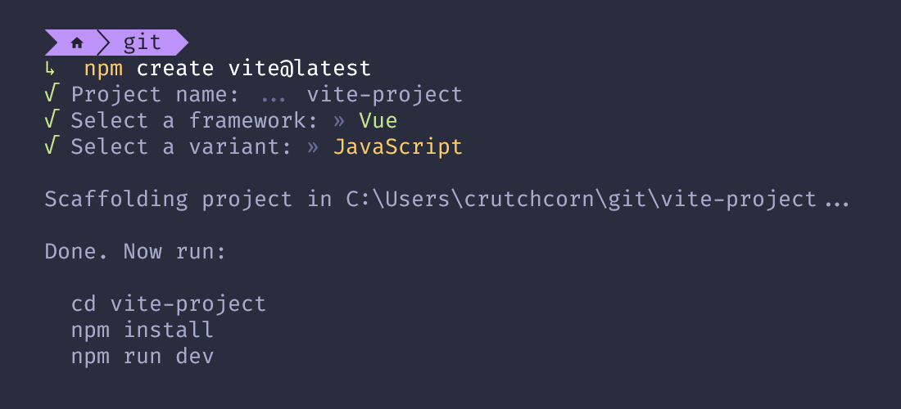

---
{
	title: "Web Framework Quickstart Guide",
	description: "",
	published: "2024-01-18T04:45:30.247Z",
	authors: ["crutchcorn"],
	tags: ["react", "angular", "vue"],
	attached: [],
	license: "cc-by-nc-sa-4"
}
---

Not that long ago, figuring out how to generate a code template for your favorite framework was a challenge in itself. Older configuration tools like Webpack, Gulp and Grunt had complex configurations to get things up-and-running.

Thankfully, today it's much easier to get a quick [client-side application](/posts/what-is-ssr-and-ssg#csr) up-and-running with your preferred framework.

Let's take a quick look at how we can scaffold a project for React, Angular, and Vue:

<!-- tabs:start -->

# React

While React used to have a dedicated tool called `create-react-app`, it's [no longer suggested to use for modern React apps.](https://github.com/reactjs/react.dev/pull/5487#issuecomment-1409720741)

Instead, we can use a tool built by the Vue maintainers (of all things!) that supports React and other frameworks as first-party integrations: [**Vite**](https://vitejs.dev/). 


Using Vite, we can quickly generate a React project.

### Pre-requisites

To get started with Vite, there's a few things we should know about first:

- [Know what Node and NPM are and how to use them](/posts/how-to-use-npm)
- [How to install Node and NPM](https://nodejs.org/en/download/)

That's it!

## Usage

Now that we have our pre-requisites out of the way, let's create a React template using Vite:

```shell
npm create vite@latest
```

This will start a script that guides you through an interactive setup process.

1) First, give Vite your project name:


2) Select "React" as your framework:



3) Select "JavaScript" or "TypeScript":



> If you're unfamiliar with TypeScript, it's an addition to JavaScript that allows you to add "compile-time types" to your code.
>
> Confused? [I wrote an article that explains what that means here](/posts/introduction-to-typescript).

You may select SWC if you'd like here as well. At a high level, it's an alternative method of compiling your code from the default. You may or may not notice a speed increase if you select it, but errors may be harder to debug as it's less commonly used.

> **Note:**
> If you're following along with my book series ["The Framework Field Guide"](/collections/framework-field-guide), please select "JavaScript". TypeScript is useful but complex and the series' code samples do not use TypeScript, nor does the series teach TypeScript.

4. Run the commands printed in the final output of Vite:



```shell
cd [your-project-name]
npm install
npm run dev
```

5. If all worked, once your packages are installed you should see this template screen:



Now when you modify `src/App.jsx` (or `src/App.tsx` if you selected TypeScript) it will refresh the screen for you and preview your changes immediately.

> This auto-refresh on code change is called "HMR" or "Hot Module Reloading"

# Angular

The Angular team maintains a CLI tool that allows you to generate new projects, upgrade existing projects, and more called [**Angular CLI**](https://angular.dev/tools/cli).

# Vue

While Vue used to have a CLI tool aptly named "Vue CLI" that let you scaffold projects, it's been replaced by a new tool made by the Vue team: [**Vite**](https://vitejs.dev/).


Using Vite, we can quickly generate a Vue project.

### Pre-requisites

To get started with Vite, there's a few things we should know about first:

- [Know what Node and NPM are and how to use them](/posts/how-to-use-npm)
- [How to install Node and NPM](https://nodejs.org/en/download/)

That's it!

## Usage

Now that we have our pre-requisites out of the way, let's create a Vue template using Vite:

```shell
npm create vite@latest
```

This will start a script that guides you through an interactive setup process.

1) First, give Vite your project name:


2) Select "Vue" as your framework:


3. Select "JavaScript" or "TypeScript":


> If you're unfamiliar with TypeScript, it's an addition to JavaScript that allows you to add "compile-time types" to your code.
>
> Confused? [I wrote an article that explains what that means here](/posts/introduction-to-typescript).

> **Note:**
> If you're following along with my book series ["The Framework Field Guide"](/collections/framework-field-guide), please select "JavaScript". TypeScript is useful but complex and the series' code samples do not use TypeScript, nor does the series teach TypeScript.

4. Run the commands printed in the final output of Vite:



```shell
cd [your-project-name]
npm install
npm run dev
```

5. If all worked, once your packages are installed you should see this template screen:

![[A page with "Vite + Vue" header, some interactive elements, and "Edit components/HelloWorld.vue" and save to test HMR]](./vite_vue_preview.png)

Now when you modify `components/HelloWorld.vue` or any other code in the project it will refresh the screen for you and preview your changes immediately.

> This auto-refresh on code change is called "HMR" or "Hot Module Reloading"

<!-- tabs:end -->

Keep in mind, this is only one option for configuring your code's build tooling. There's lots of other tools and options for configuring the aforementioned tools.

> Want to learn more about that? Check out my upcoming book called ["The Framework Field Guide: Ecosystem"](/collections/framework-field-guide#ecosystem-title), which walks you through each of the tools and how to properly configure each of them in-depth, regardless of which framework you use.

Happy hacking!
