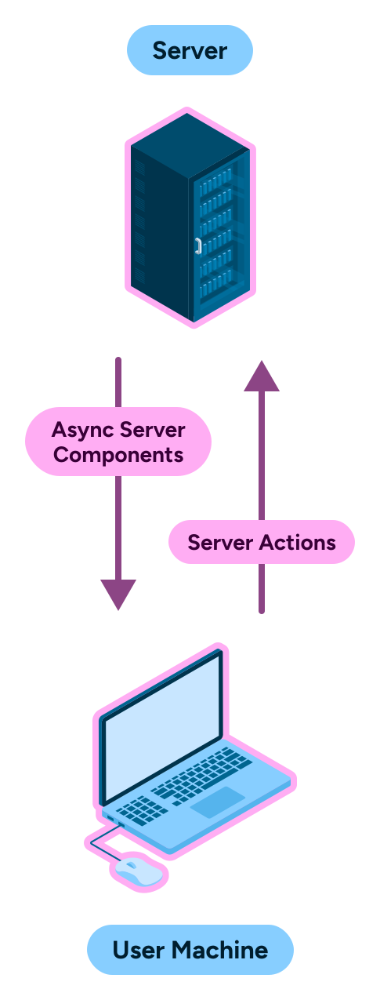

---
{
    title: "What are React Server Actions?",
    description: "",
    published: '2023-12-19T21:52:59.284Z',
    authors: ['crutchcorn'],
    tags: ['react', 'webdev'],
    attached: [],
    license: 'cc-by-4',
    collection: "react-beyond-the-render",
    order: 6
}
---

In our last article, we talked about [React's `use` hook and Async Server Components](/posts/what-is-react-suspense-and-async-rendering); both means to handle async operations to display in a render.

In the conclusion of that article, I hinted that there was going to be more to the Server Components story. Well, sure enough there is in the form of React Server Actions.

# What are React Server Actions?

In short; React Server Actions are a way to call server-side code in React client components. If asynchronous server components with `await` in them allow you to pass server data to the client, server actions enable you to pass data back from the client to the server.



However, to pass a function from a server component down to a client component we must designate our functions we want to pass with a special boundary string.

# What is `"use server"`?

`"use server"` is the boundary string in React server apps that allows us to mark a function as "ready to pass to the client".

--------------------------

--------------------------

--------------------------

--------------------------

--------------------------

--------------------------

Now this is great for loading data, but what about actions? Not everything happens at load and we may want to find ourselves listening for a user submitting a form

Well, this is where the React Actions come into play. Let's again move back to client land and see how we can listen for a form submission and add an item to a todo:

```tsx
import { useState } from "react";

export default function Todo() {
  const [todos, setTodos] = useState([]);
  async function addTodo(formData) {
    const todo = formData.get("todo");
    setTodos([...todos, todo]);
  }
  return (
    <>
      <ul>
        {todos.map((todo) => {
          return <li>{todo}</li>;
        })}
      </ul>
      <form action={addTodo}>
        <input name="todo" />
        <button type="submit">Add Todo</button>
      </form>
    </>
  );
}
```

Annnnd of course this works on the server as well:

```tsx
"use client"
import { useState } from "react";

export default function Todo() {
  const [todos, setTodos] = useState([]);
  async function addTodo(formData) {
    "use server"
    const todo = formData.get("todo");
    addTodoToDatabase(todo);
  }
  return (
    <>
      <ul>
        {todos.map((todo) => {
          return <li>{todo}</li>;
        })}
      </ul>
      <form action={addTodo}>
        <input name="todo" />
        <button type="submit">Add Todo</button>
      </form>
    </>
  );
}
```

Just as "use client" is used to denote a client component in an otherwise fully-server environment; "use server" is used to mark a function as running on the server rather than the client.


--------------------------

--------------------------

--------------------------

--------------------------

--------------------------

--------------------------
## What happens if you don't mark a function with `"use server"`?

If you forget to mark your server action with the `"use server"` string, like so;

```jsx
// Server component
import { Todo } from "./client";
import { getTodos } from "./todos";

export default async function Home() {
	const todos = await getTodos();
	const addTodo = () => {
		// ...
	};
	return <Todo todos={todos} addTodo={addTodo} />;
}
```

You get the following error, reminding you to explicitly mark your function as being ready to pass to the client:

```
⨯ Error: Functions cannot be passed directly to Client Components unless you explicitly expose it by marking it with "use server".
<... todos={[...]} addTodo={function}>
^^^^^^^^^^
```

This is a safety feature so you don't end up enabling the client to call functions that aren't allowed.

## Are synchronous functions allows in React server actions? 

No. Only `async` functions are allowed in server actions. If you forget to mark your action as `async`;

```jsx
// Server component
import { Todo } from "./client";
import { getTodos } from "./todos";

export default async function Home() {
	const todos = await getTodos();
	const addTodo = () => {
        "use server"
		console.log("Testing");
	};
	return <Todo todos={todos} addTodo={addTodo} />;
}
```

You'll receive the following error:

```
Error:
  × Server actions must be async functions
```

## Can you define server actions in a client component file?

No. You cannot mix-and-match server action definitions within your client component files. If you do the following:

```jsx
"use client"

export function Todo({ todos }) {
  // ...
  
  export async function addTodo(formData) {
    "use server";
    // ...
  }
  
  return (
    <>
      {/* ... */}
      <form
        action={addTodo}
      >
        {/* ... */}
      </form>
    </>
  );
}
```

You'll see an error that looks like:

```
Error:
  × It is not allowed to define inline "use server" annotated Server Actions in Client Components.
  │ To use Server Actions in a Client Component, you can either export them from a separate file with "use server" at the top, or pass them down through props from a Server Component.
  │
  │ Read more: https://nextjs.org/docs/app/api-reference/functions/server-actions#with-client-components
```

> **Remember where to place your server actions:**
> Server actions can only be defined in a file with `"use server"` at the top or passed in via a server component marked with `"use server"` at the top of the function definition.

# Conclusion


