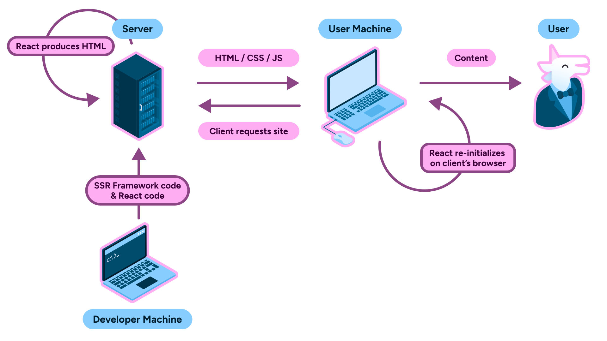

---
{
    title: "What are React Server Components (RSCs)?",
    description: "React Server Components have been a topic of regular discussion in the WebDev space as-of late. What are they? How do they improve the SSR story for React? Let's take a look.",
    published: '2023-12-16T21:52:59.284Z',
    authors: ['crutchcorn'],
    tags: ['react', 'webdev', 'javascript'],
    attached: [],
    license: 'cc-by-4',
    collection: "react-beyond-the-render",
    order: 4
}
---

[In our last article in the series, we talked about how React is able to pre-generate HTML from JSX on the server (or developer's machine) prior to being shipped to the end-user](/posts/what-is-ssr-and-ssg). This process is called "SSR" and can be mission-critical in getting your applications as performant as possible.

I originally wrote that article in early 2020. At this point in React's development lifecycle, there was an inherent problem to using SSR; it would lead to duplicate effort between the server and the client.

See, up to that point Next.js and other React SSR solutions had one way of doings things:

1) Render [the VDOM](/posts/what-is-reconciliation-and-the-vdom) on the server
2) Generate HTML from the server's VDOM
3) Ship HTML and all of the React code to the client
4) Re-generate the VDOM from scratch on the client
5) Wipe away the old DOM and re-render all components from the new client's VDOM instance




This process is called "Rehydration" and while it _worked_ the way it did before, it introduced a new performance problem. Rehydration could be needlessly expensive if most of your content coming from the server was going to be static anyway. This was a huge problem that the React team had to solve.

Later, in the same year of my article (December 2020), they had the answer: [React Server Components](https://legacy.reactjs.org/blog/2020/12/21/data-fetching-with-react-server-components.html).

# What is a React Server Component (RSC)?

In short; React Server components allow you to designate which React components render on the server and which components re-initialize on the client. This is done using a special syntax in your components and allows for special server-only data loading patterns when implemented properly.

For example, take the following:

```jsx
function App() {
	return <>
		{/* Render parts on the client */}
		<Header/>
		{/* Render all of it on the client */}
		<Dashboard/>
		{/* Render all of it on the server */}
		<Footer/>
	</>
}
```

When executed, it might look something like the following process:


Here, we can see that `<ProfilePicture>`, `<Dashboard/>`, and all of their children will be re-initialized on the client. Meanwhile the `<Footer>` and `<Header>` components will not re-initialize on the client.

> Keep in mind, client-components will still pre-generate HTML on the server by default. The difference here is that the client re-initialization is now informed by the VDOM constructed on the server, allowing for drastically reduced required execution.

# What is `"use server"` and `"use client"`?

In React Server Components, `"use server"` and `"use client"` are strings at the top of the file or function that indicate where the React component should render. If `"use client"`, it will rehydrate on the client; otherwise it won't.

Let's use Next.js' syntax to build out the example from above, distinguishing which type of component is which along the way:

```jsx
"use server"
// page.jsx
import {ProfilePicture, Dashboard} from "./client-components"

export function App() {
	return <>
		<Header/>
		<Dashboard/>
		<Footer/>
	</>
}

function Footer() {
	// ...
}

function Header() {
	return (
		<>
			<SearchBar/>
			<ProfilePicture/>
		</>
	)
}


function SearchBar() {
	// ...
}
```

```jsx
"use client"
// client-components.jsx
export function Dashboard() {
	return (
		<Chart/>
	)
}


function Chart() {
	// ...
}

export function profilePicture() {
	// ...
}
```

# Limitations of Server Components

Because a server component runs entirely on the server, there are a few limitations you should be aware of:

- No usage of React Hooks (`useState`, `useReducer`, etc)

  - This includes importing code that lazily uses React Hooks, although [library authors have found a way around this for their needs](https://npmjs.com/package/rehackt).

- `<Context.Provider>` usage

- No usage of browser APIs ([`localstorage`](https://developer.mozilla.org/en-US/docs/Web/API/Window/localStorage), [`querySelector`](https://developer.mozilla.org/en-US/docs/Web/API/Document/querySelector), etc)

- You cannot pass the following property values from a server component to a client component:

  - React Elements/JSX
  - Functions (unless it's a Server Action - more on that in a future article)
  - Classes
  - Instances of Custom Classes
  - Custom [Symbols](https://developer.mozilla.org/en-US/docs/Web/JavaScript/Reference/Global_Objects/Symbol)

- Cannot be called inside of a Client component. IE:

  ```jsx
  const ClientComponent = () => {
  	return <ServerComponent/>
  }
  ```

  Is not allowed but:

  ```jsx
  const ClientComponent = ({children}) => {
  	return <div>{children}</div>
  }
  
  const App = () => {
  	return <ClientComponent><ServerComponent/></ClientComponent>
  }
  ```

  Is allowed.

# Conclusion

React Server Components have been a huge topic of discussion lately. So much so that while the fixes to rehydration are useful, you may be left wondering:

> Is that all there is to RSCs?

Luckily, it's not!

See, by providing a primitive for server behavior in React, the team has unlocked a great deal of potential in regards to data loading.

But that's a story for next time. Next up? React's Suspense APIs!
