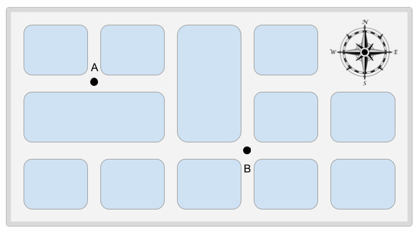
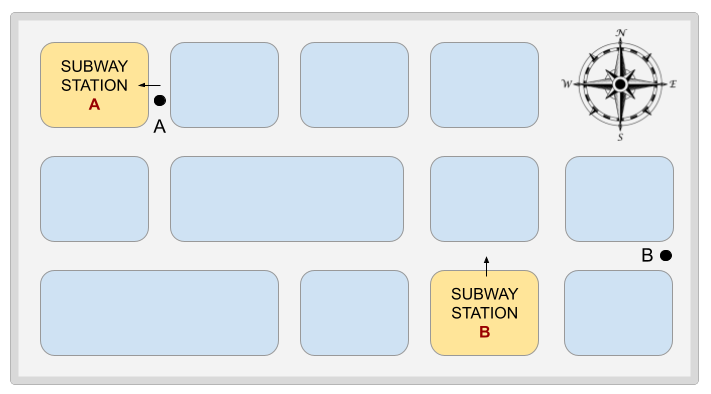

---
{
	title: "What's An Algorithm?",
	description: "",
	published: '',
	authors: ['qarnax'],
	tags: [],
	attached: [],
	license: 'cc-by-nc-sa-4',
}
---

If you ever used GPS instructions to get somewhere, or followed a recipe book to make apple pie, or even dialed a phone to call a friend, then you already executed what you can call an **Algorithm**.

In simple terms, an algorithm is a set of instructions that lead to a certain result. If you execute it correctly, you get the result you wanted, a delicious apple pie!
But if you somehow mess up an instruction (like leaving the pie in the oven for 2 hours instead of 1 hour like the recipe book tells you to) then you end up with a bad result, and you would have to start over.

The same thing applies for machines. If you give a computer a clear set of instructions, it’ll execute them in order to reach the desired result. There is, however, a huge difference between telling another person how to solve a certain equation, and telling a computer to do the same thing, because computers have [their own language](https://unicorn-utterances.com/posts/how-computers-speak#hdd), which is very different from human language.
However, if you understand what an algorithm is, and how to break down tasks into a small set of very basic instructions, it will be a lot easier to deal with Programming languages later in your learning journey.

# Algorithms & Computers

To emphasize why the concept of algorithms is very important, you have to understand that an algorithm describes the steps that need to be taken (from **START** to **END**) to do a certain task, independently from any programming language.
In other words, no matter what programming language people use for a certain task, the same “thought process” can be applied everywhere.

Let’s say you are asked to write down the instructions needed to go from point A to point B as shown in this map below:


A very basic algorithm can be written down as such:
**START**
- Head East
- Head South to the intersection
- Head East to the intersection
**END**

Of course there are other routes you can take to get to point B, so you can make your set of instructions as simple or as complex as you want to, but you’ll learn with time that sometimes, just because there are very few instructions, doesn’t mean that your algorithm is the most efficient.

Let’s look at the example here below:


Here we can do one of two algorithms to get from point A to point B:
#### Algorithm N°1:
**START**
- Head South
- Head East
**END**

#### Algorithm N°2:
**START**
- Enter “Subway station A”
- Take the subway to “Subway station B”
- Exit “Subway station B”
- Head East
**END**

While Algorithm N°1 only has **2 instructions**, it would take someone more time and energy to walk from point A to B, while if you follow Algorithm N°2, it has **4 instructions**, but you save time and energy.

The same thing goes for a computer program, sometimes, just because there are a few lines of code, doesn’t mean it’s gonna run the fastest or be the most performant.

# 1 + 1

Let’s now take a look at an example that has something more to do with computers: *a basic arithmetic operation.*

If you were asked to calculate 1 + 2, it would take you less than a second, because in your brain “it’s obviously 3”, right? But what if you were asked to break down that operation into steps like we did in the previous example?

If we follow the same thought process as before, we could write something like this:

**START**
- Take the number 1
- Take the number 2
- Add them together
- Obtain the number 3
**END**

Pretty simple algorithm. But for a computer to be able to take two values and apply an arithmetic operation between them, it needs to store them somewhere first, which brings us to out next point: **Variables**

# Variables

In any computer program, we often have to temporarily store values for different operations. These values can be inputs (from the user through the keyboard) or from the computer storage, or sometimes even be values from other operations made by the computer itself as shown in this example:

#### Calculating 2 to the power of 3:
**START**
- Take the number 2
- Take another number 2
- Multiply 2 by 2
- Obtain the number 4
- Take another number 2
- Multiply 2 by 4
- Obtain the number 8
**END**

In step 4, we have to store the value 4 which is returned by the computer itself, in order to multiply it again by the number 2 to get the final result.

Values stored by a computer don’t always have to be numbers though, they can also be letters (known in programming languages as characters, like a, b, k, y…), words (known as “strings”, which means “strings of characters”), and other types of variables that you’ll meet later on as you deal with programming languages.

Whenever the computer needs to store a value of any kind, it uses what we call a “Variable”.

A variable can be initially considered as a box with a tag on it that has its name and where it belongs in the memory (also called “address”) to differentiate it from other variables.
A more extensive explanation on how computers store and handle variables can be found [here](https://unicorn-utterances.com/posts/how-computers-speak).

# Algorithm Structure

Now that we covered the essentials of what an algorithm is and how to break down tasks into instructions or “pseudo-code”, let’s have a little taste of programming languages, by comparing an algorithm (written in English) to how it’s written in two different programming languages.

Let’s take our previous example where we calculated 1 + 2, and see how it’s written in two of the most popular programming languages nowadays: JavaScript and Python.

**START**
- Take the number 1
- Take the number 2
- Add them together
- Obtain the number 3
**END**

```JavaScript
JavaScript:
variableOne = 1;
variableTwo = 2;
console.log(variableOne + variableTwo)
// We obtain the number 3
```

```Python
variableOne = 1
variableTwo = 2
print(variableOne + variableTwo)
# We obtain the number 3
```

If we compare the 3 different programs line by line, we can see that the steps are exactly the same:
- We put the number 1 in a variable (that we call variableOne in this case)
- We put the number 2 in another variable (that we call variableTwo)
- We “Add the two values together” using the + operator.
- We get the result, which is 3

Note that `console.log` and `print` are functions in JavaScript and Python respectively, used to log values for the user to see on screen.

Of course there’s a lot more to programming languages than these steps, but this will hopefully give you an idea on how they work in general, and how you can break down any process before you actually write in in JavaScript or Python or any other language you may get into as you go further into coding.

# Conclusion

Algorithms are not an alien concept to anyone, since each of us tends to follow different sets of steps to achieve the different tasks we run into everyday, and in this article we covered how to break down any task into very small steps and how that concept is exactly how a computer runs programs.
We’ve also seen how different programs can be written in many different ways, and that there's no correlation whatsoever between how long the code is and how performant it is.
Those basics, along with the sneak peek we had into actual programming languages, will hopefully serve as a good base for the coding splendor up ahead! And If you have any questions at all, make sure you drop a comment or [join our discord community]().
