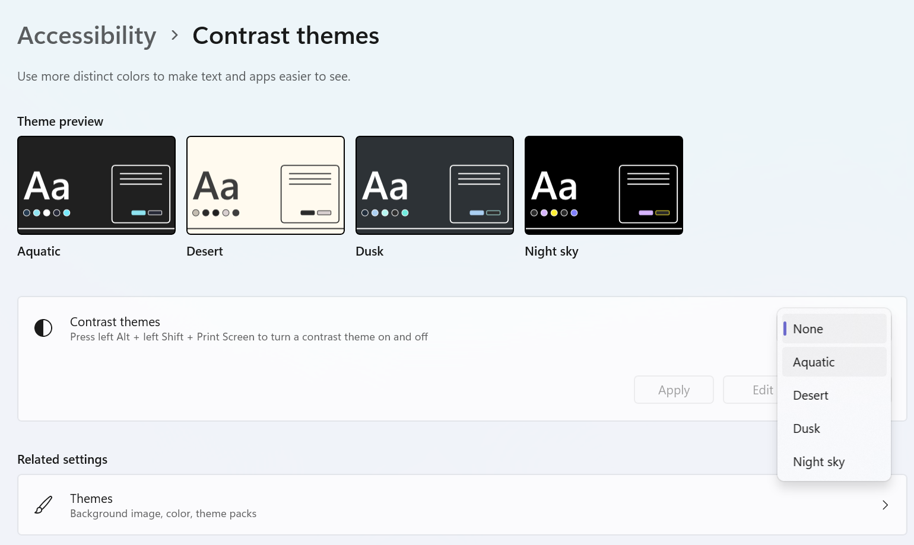

---
{
    title: "Text",
    description: "TODO: Change",
    published: '2026-01-01T22:12:03.284Z',
    tags: ['webdev', 'accessibility'],
    order: 3
}
---

Think about your site. Yes, the one you're working on. What is it mostly comprised of?

If the answer isn't "text", you're either thinking on too high of an abstraction level (remember, a button has text too), or you're working on something _very_ bespoke.

Given the predominance of text on most sites, it probably won't come as a surprise that there's some important paradigms to follow to ensure your text is accessible.

# Color Contrast

Take the following text:

<p style="opacity: 0.2">This is hard to read</p>

> If you can't see the text, it says "This is hard to read" and is intentionally visually challenging to see due to a low opacity. We'll cover why in a moment.

Can you read it well? How about if you squint? How about from far away?

<p style="opacity: 0.2; filter: blur(2px)">This is hard to read</p>

> This text says the same thing but is now also blurred.

How about _now_?

The reason you're struggling to see this is because it has _low contrast_. For users with [twenty-twenty vision](https://en.wikipedia.org/wiki/Visual_acuity#Definition), the blurred text helps emulate what it _might_ be like to see some text in low contrast for other users.

Let's see what that blurred text looks like with proper color contrast:

 <p style="filter: blur(2px)">This is hard to read</p>

A little easier to see? Good! That's the point. Sufficient contrast can help many users - especially those with color blindness or other visual challenges - see what might otherwise be too difficult to visualize otherwise.

> It's important to note that good contrast doesn't supplement proper screen-reader usage and vice-versa. 
>
> Some users may utilize both their eyes and screen reader technology at the same time to help clarify any challenging to see parts of the screen.

## WCAG AA vs AAA

[As mentioned in the preface](/posts/art-of-a11y-preface), there are three levels of compliance with the "Web Content Accessibility Guidelines" (WCAG) - the industry standard guidelines on accessibility: A, AA, and AAA.

While there are no rules in WCAG's A ruleset, AA and AAA both have different requirements for color contrast between a foreground color and background color:

| Ruleset | Content Type | Min Contrast Ratio |
| --- | --- | --- |
| AA | Small Text | `4.5:1` |
| AA | Large Text | `3:1` |
| AA | Graphical Elements | `3:1` |
| AAA | Small Text | `7:1` |
| AAA |Large Text | `4.5:1` |
| AAA | Graphical Elements| `3:1` |

[This ratio can be calculated either programmatically](https://www.w3.org/TR/WCAG20-TECHS/G17.html#G17-procedure):

```javascript
const CONTRAST_RATIO = (L1 + 0.05) / (L2 + 0.05)
```

> L1 is the relative luminance of the lighter of the colors.
> L2 is the relative luminance of the darker of the colors.

Or manually, using various tools such as [WebAIM's Color Contrast Checker](https://webaim.org/resources/contrastchecker/):


## CSS Detection

When comparing AA to AAA compliance, a common qualm lodged against AAA is that its contrast requirements feel too constrictive for a site's "look and feel" compared to AA's easier compliance ratios.

Luckily, there are ways we can have both!

Users are able to opt into an operating system's "high contrast" mode, which will notify the browser to follow in suit.



// TODO: Get the high contrast mode screenshot from macOS

This, in turn, is exposed to our site's CSS through [the `prefers-contrast` media query](https://developer.mozilla.org/en-US/docs/Web/CSS/@media/prefers-contrast) :

```css
@media (prefers-contrast: more) {
  .contrast {
    color: black;
    background: #f0efef;
  }
}
```

### Contract Detection Demo

// TODO: Write code sample

​	

-------------

-------------

-------------

-------------

-------------

-------------

-------------

-------------

-------------


- `rem` vs `px`
  - Show browser resizing	
  - Usage with `vh` and such
- Heading map
  - Only one `h1` on page (at the top)
  - Only descend one level at a time
  - [CODE] how to handle `as` casting of inner component types per-framework
    - Show the TypeScript types

