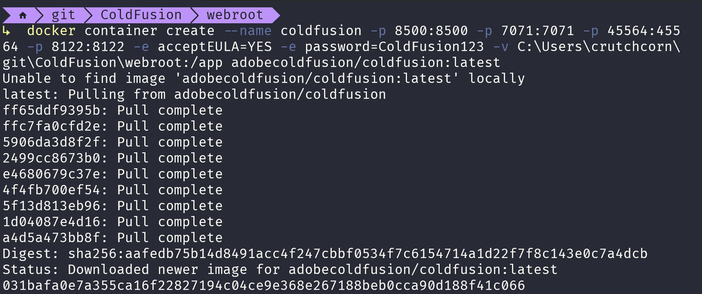
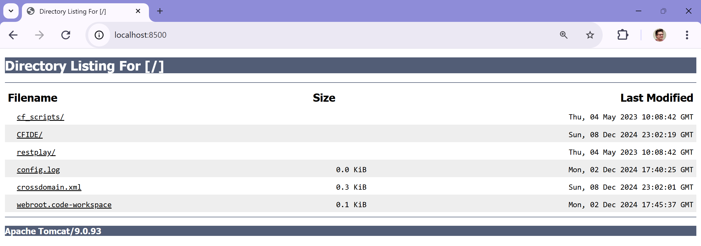
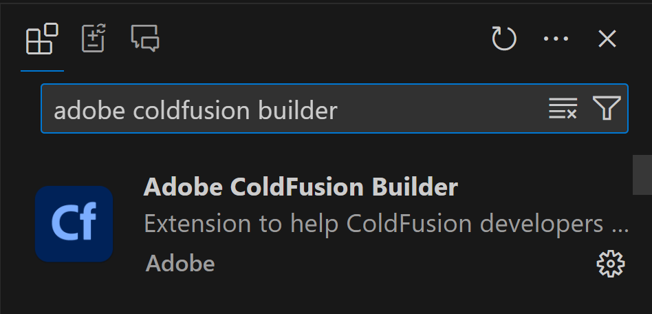
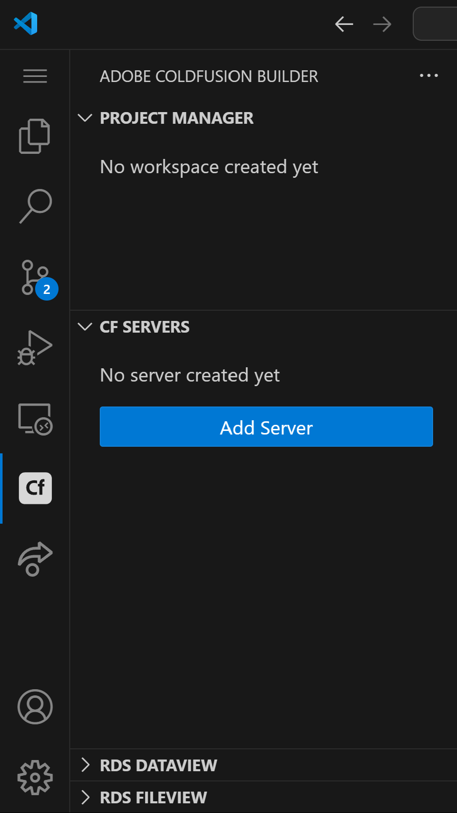

---
{
    title: "Setup ColdFusion in Docker",
    description: "",
    published: '2024-12-12T20:12:03.284Z',
    tags: ['coldfusion'],
    license: 'cc-by-4'
}
---

[Adobe ColdFusion](https://www.adobe.com/products/coldfusion-family.html) is having a comeback moment of sorts. While many associate the language with its time in the 90s, it has been seeing growth and continual improvements in the past few years.

One area where ColdFusion has seen intense growth is in local developer experience.

Nowadays, you can setup a Visual Studio Code environment and run a ColdFusion server in Docker to easily manage a free and easy to configure programming environment.

Let's explore how to set that up.

# Docker

We'll first start with a pretty fundamental prerequisite: Installing Docker.

You can choose between [Docker Desktop GUI](https://www.docker.com/products/docker-desktop/) and the [Docker Engine CLI](https://docs.docker.com/engine/install/). Follow the installation steps for one of the tools to get started.

-----

Regardless of the tool you have selected, you should be able to access the `docker` CLI command.

We can use this `docker` utility to create a container for ColdFusion using the following command:

```shell
docker container create --name coldfusion -p 8500:8500 -p 7071:7071 -p 45564:45564 -p 8122:8122 -e acceptEULA=YES -e password=YOUR_PASSWORD_HERE -v LOCAL_PATH_HERE:/app adobecoldfusion/coldfusion:latest
```

<details>
<summary>Example Command</summary>

```shell
docker container create --name coldfusion -p 8500:8500 -p 7071:7071 -p 45564:45564 -p 8122:8122 -e acceptEULA=YES -e password=ColdFusion123 -v C:\Users\crutchcorn\git\ColdFusion\webroot:/app adobecoldfusion/coldfusion:latest
```

</details>



This command:

- Names the created container `coldfusion`
- Forwards four ports needed for ColdFusion from the container to the host operating system
- Accepts the EULA for ColdFusion
- Sets `YOUR_PASSWORD_HERE` as the password for the admin account you'll use to configure the ColdFusion dashboard 
- Exposes the host machine's `LOCAL_PATH_HERE` folder as an empty folder you'll use to upload files to your ColdFusion instance.

------

Now that we have our container created, we can start it using the command:

```shell
docker start coldfusion
```

> You can configure much more on the ColdFusion container. To do this, [please follow the ColdFusion docs for Docker Images](https://helpx.adobe.com/coldfusion/using/docker-images-coldfusion.html)

# Looking at the ColdFusion Dashboard

Once the container is started you can go to [`localhost:8050`](https://localhost:8050) to see a directory listing of the ColdFusion server:



While this isn't overly helpful on its own, it tells you that ColdFusion is running properly.

From there, you can access [http://localhost:8500/CFIDE/administrator/](http://localhost:8500/CFIDE/administrator/) to get to the admin portal.

// TODO: Add image of dashboard login

On this screen, you'll type in the password you passed to the `docker create` command earlier.

This will show the rest of the dashboard for you to configure ColdFusion with:

// TODO: Add image of dashboard

> While you can deep-dive into configuring ColdFusion, we'll leave the settings all as defaults for now.

# Visual Studio Code

To use ColdFusion with Visual Studio Code (VSCode), we'll:

- [Install VSCode from their site](https://code.visualstudio.com/)
- [Install Java 18 from their site](https://www.oracle.com/java/technologies/downloads/)
- [Set the `JAVA_HOME` environmental variable](https://helpx.adobe.com/coldfusion/coldfusion-builder-extension-for-visual-studio-code/get-started-coldfusion-builder-extension-visual-studio-code.html)
- [Install the "Adobe ColdFusion Builder" extension](https://marketplace.visualstudio.com/items?itemName=com-adobe-coldfusion.adobe-cfml-lsp)



Once this is configured, we should see the "Cf" logo in our VSCode's sidebar:



------

Once the extension is installed, we'll press "`Add Server`" to add a reference to our local ColdFusion Docker installation:


# Uploading Files

```html
<!-- index.cfm -->
<cfscript>
function testStuff(){
    writeOutput(NOW());
}

testStuff();
</cfscript>
```