---
{
	title: "The Ultimate Windows Development Environment Guide",
	description: "Many developers like MacOS or Linux for development environments, but don't know that Windows has plenty to offer. Become a Windows pro!",
	published: '2020-04-07T05:12:03.284Z',
	edited: "2022-01-05T04:45:30.247Z",
	tags: ['tools', 'windows'],
	license: 'cc-by-nc-sa-4'
}

---

Ask any developer running a Linux or MacOS machine, and they'll be able to tell you what makes their systems such a strong contender for software development. Some of the top contenders I've heard are:

- [Package management](#package-management)
- [Terminal usage](#terminal-usage)
- [Keyboard Usage](#keyboard-usage)
- [Customization](#customization)
- [Functionality](#functionality)

What many don't know is that Windows has gained many of these options over the years. Between official tooling such as [WSL2](https://docs.microsoft.com/en-us/windows/wsl/wsl2-install) right around the corner to third-party offerings becoming more-and-more mature, there's never been a better time to be a developer on the Windows platform.

Moreover, much of what we'll be taking a look at today is either free, open-source, or both! There will be a few mentions of paid software as alternatives to the free options, but I've personally used every piece of commercial software in this article. None of the paid software we mention here has been included as part of a sponsorship or financial deal in any way, I just like them and use them myself.

# Package Management {#package-management}

When it comes to CLI package management on Windows, you have two main choices:

- [Chocolatey](https://chocolatey.org/) - a third party package manager that's been around since 2011
- [`winget`](https://github.com/microsoft/winget-cli) - Microsoft's official CLI package manager as-of 2020

Both of them are incredibly polished and ready-to-use today. While `winget` is Microsoft's official solution, Chocolatey works on a wider range of systems (back to Windows 7) and more packages.

Let's look through both.

## Winget {#winget}

One of the strongest advantages of `winget` is that it's built right into all builds of Windows 11 and most newer builds of Windows 10. 

What's more, you don't need to be in an elevated admin shell to install packages. Instead, installers will individually ask you to accept the dialog to give admin rights.

You can start by searching for a package using `winget search` followed by the name of the package you're looking for.

```
winget search OBS
```


Then, once you've found an `Id` you want to install, simply type it in as `winget install`:

```
winget install OBSProject.OBSStudio
```

You can see a list of all packages installed using `winget` with the following command:

`winget list`

Finally, you can upgrade all of your `winget` installed packages simply by running:

`winget upgrade --all`

## Chocolatey {#chocolatey}

[Chocolatey only takes a single PowerShell command to install](https://chocolatey.org/install), not unlike [Homebrew for macOS](https://brew.sh/). The comparisons with Homebrew don't stop there either. Much like it's *nix-y counterparts, Chocolatey is an unofficial repository of software that includes checks of verification for a select number of popular packages.

It's also popular amongst sysadmins due to its ease of deployment across multiple devices and stability.

You'll need to run it in an administrator window, but once you do, you'll find the utility straightforward. A simple `choco search package-name` will find related packages to the name you input where areas `choco install package-name` will install the package.

You can also use `choco list --local-only` to see a list of all locally installed packages. 

Finally, `choco upgrade all` will upgrade all locally installed packages.

### Manage Packages via GUI {#chocolatey-gui}

Readers, I won't lie to you. I'm not the kind of person to use a CLI for everything. I absolutely see their worth, but remembering various command is simply not my strong suit even if I understand the core concepts entirely. For people like me, you might be glad to hear that _Chocolatey has a GUI for installing, uninstalling, updating, and searching packages_. It's as simple as (Chocolate) pie! More seriously, installing the GUI is as simple as:
```
choco install ChocolateyGUI
```

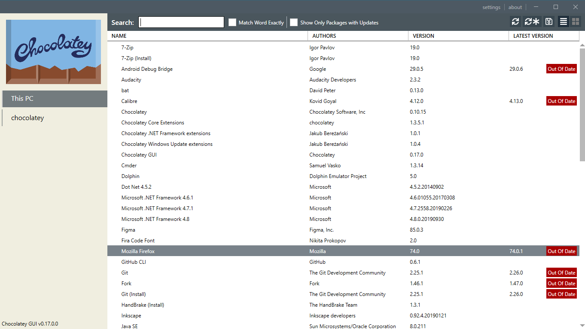

You can see that it gives a list of installed packages with a simple at-glance view of what packages need updating.

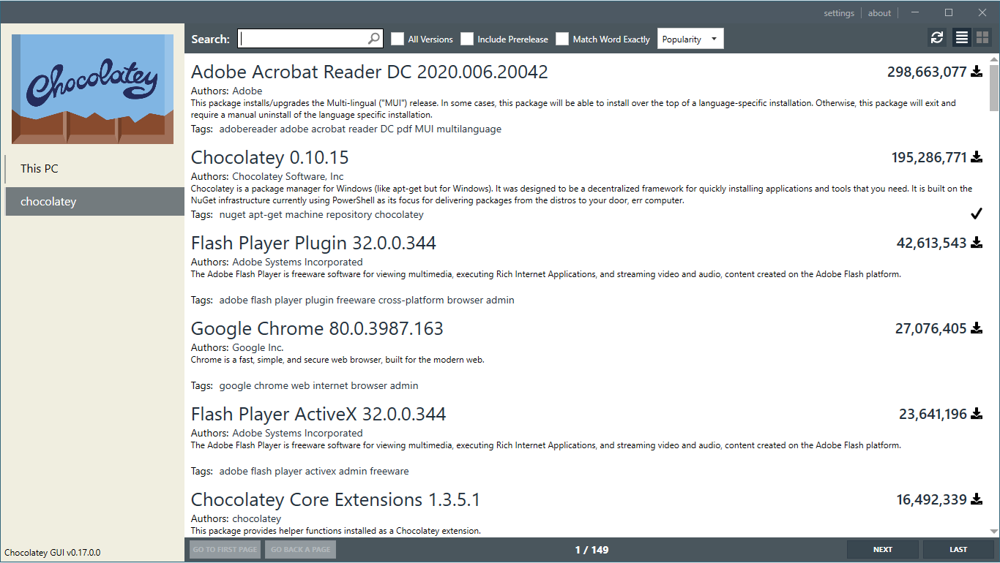

## Suggested Packages {#suggested-packages}

While Chocolatey has a myriad of useful packages for developers, there are some that I have installed on my local machine that I'd like to highlight in particular.

For starters, what's a developer machine without `git`? Let's throw that on:

```
choco install git.install
```

Additionally, I know a lot of developers would like to have access to common GNU utilities, such as `rm` and `touch`. Using an install flag, you're able to add those to your path and put them to work for you:

```
choco install git.install--params "/GitAndUnixToolsOnPath"
```

### CLI Utilities {#cli-packages}

| Name                                              | Choco Package | Winget Package | Explanation                                                  |
| ------------------------------------------------- | ------------- | -------------- | ------------------------------------------------------------ |
| [Micro Editor](https://github.com/zyedidia/micro) | `micro`       | N/A            | A great terminal editor (ala Nano). It even supports using the mouse! |
| [Bat](https://github.com/sharkdp/bat)             | `bat`         | N/A            | A great alternative to `cat` with line numbers and syntax highlighting |
| [GitHub CLI](https://cli.github.com/)             | `gh`          | `GitHub.cli`   | GitHub's official CLI for managing issues, PRs, and more     |
| [NVM](https://github.com/coreybutler/nvm-windows) | `nvm`         | N/A            | "Node version manager" - Enables users to have multiple installs of different Node versions and dynamically switch between them |
| [Yarn](https://yarnpkg.com/)                      | `yarn`        | `Yarn.Yarn`    | An alternative to `npm` with better monorepo support. If installed through `choco`, it will support `nvm` switching seamlessly. |

You're able to install all of these packages using `choco`:

```
choco install micro bat gh nvm yarn
```

Or, the ones supported by `winget`:

```
winget install --id=GitHub.cli -e  && winget install --id=Yarn.Yarn -e 
```

### IDEs {#ides}

| Name                                                        | Choco Package                                                | Winget Package                                               | Explanation                                                |
| ----------------------------------------------------------- | ------------------------------------------------------------ | ------------------------------------------------------------ | ---------------------------------------------------------- |
| [Visual Studio Code](https://code.visualstudio.com/)        | `vscode`                                                     | `Microsoft.VisualStudioCode`                                 | Popular Microsoft IDE for many languages                   |
| [Sublime Text](https://www.sublimetext.com/)                | `sublimetext4`                                               | `SublimeHQ.SublimeText.4`                                    | Popular text editor with syntax support for many languages |
| [Visual Studio](https://visualstudio.microsoft.com/)        | `visualstudio2019professional` / `visualstudio2019community` | `Microsoft.VisualStudio.2019.Professional` / `Microsoft.VisualStudio.2019.Community` | Microsoft's flagship IDE                                   |
| [Jetbrains Toolbox](https://www.jetbrains.com/toolbox-app/) | `jetbrainstoolbox`                                           | `JetBrains.Toolbox`                                          | The installer/updater for JetBrains' popular IDEs          |

You're able to install all of these packages using `choco`:

```
choco install vscode sublimetext3 visualstudio2019community jetbrainstoolbox
```

Or, with `winget`:

```
winget install --id=Microsoft.VisualStudioCode -e && winget install --id=SublimeHQ.SublimeText.4 -e && winget install --id=Microsoft.VisualStudio.2019.Community -e && winget install --id=JetBrains.Toolbox -e 
```

### Others {#utilities}

| Name                                                        | Choco Package                              | Winget Package                                    | Explanation                                                  |
| ----------------------------------------------------------- | ------------------------------------------ | ------------------------------------------------- | ------------------------------------------------------------ |
| [PowerToys](https://github.com/microsoft/PowerToys)         | `powertoys`                                | `Microsoft.PowerToys`                             | Built by MS itself, provides SVG/Markdown previews, provides utility for mass renaming, image resizing all from the file explorer itself. It also allows you to configure tiling and more. We'll talk about this more later |
| [Ext2Fsd](https://sourceforge.net/projects/ext2fsd/)        | `ext2fsd`                                  | N/A                                               | A program that enables you to read/write from ex2/ex3/ex4 formatted filesystems |
| [VirtualBox](https://www.virtualbox.org/)                   | `virtualbox`                               | `Oracle.VirtualBox`                               | A program that allows you to create, run, and edit virtual machines |
| [VirtualBox Guest Additions](https://www.virtualbox.org/)   | `virtualbox-guest-additions-guest.install` | N/A                                               | The extension to `virtualbox` that provides better USB passthrough support |
| [FiraCode](https://github.com/tonsky/FiraCode)              | `firacode`                                 | N/A                                               | A popular programming font that supports ligatures           |
| [`scrcpy`](https://github.com/Genymobile/scrcpy)            | `scrcpy`                                   | N/A                                               | A utility that allows you to mirror your Android phone screen via ADB |
| [Typora](https://typora.io/)                                | `typora`                                   | `Typora.Typora`                                   | A paid markdown editor with a "preview edit" mode allowing you to edit markdown files similarly to Word |
| [Postman](https://www.postman.com/)                         | `postman`                                  | `Postman.Postman`                                 | A REST API tester                                            |
| [Firefox](https://www.mozilla.org/en-US/firefox/new/)       | `Firefox`                                  | `Mozilla.Firefox`                                 | The popular web browser by Mozilla                           |
| [Licecap](https://www.cockos.com/licecap/)                  | `licecap`                                  | `Cockos.LICEcap`                                  | A quick-and-easy GIF capture software                        |
| [ScreenToGIF](https://www.screentogif.com/)                 | `screentogif`                              | `NickeManarin.ScreenToGif`                        | Another quick-and-easy GIF capture software with more software options |
| [7Zip](https://www.7-zip.org/)                              | `7zip`                                     | `7zip.7zip`                                       | Compressed file format manager. Allows you to extract files from various formats |
| [Java](https://www.oracle.com/java/technologies/downloads/) | `jdk` / `jre`                              | `Oracle.JDK.17` / `Oracle.JavaRuntimeEnvironment` | Java runtime and development kit                             |

You're able to install all of these packages using `choco`:

```
choco install powertoys ext2fsd virtualbox virtualbox-guest-additions-guest.install firacode scrcpy typora postman Firefox licecap 7zip jdk jre
```

Or, the ones supported by `winget`:

```
winget install --id=Microsoft.PowerToys -e && winget install --id=Oracle.VirtualBox -e && winget install --id=Typora.Typora -e && winget install --id=Postman.Postman -e && winget install --id=Mozilla.Firefox -e && winget install --id=Cockos.LICEcap -e && winget install --id=NickeManarin.ScreenToGif -e && winget install --id=7zip.7zip -e && winget install --id=Oracle.JDK.17 -e && winget install --id=Oracle.JavaRuntimeEnvironment -e
```

### Missing from the List {#awesome-windows}

Didn't see your favorite utilities or tools? Unfortunately, I only can highlight a few options. That said, there's no shortage of utilities, tools, and customization options for Windows. A great collection of utilities to look through would be [the Awesome Windows list](https://github.com/Awesome-Windows/Awesome). At the time of writing, it includes over 300 programs with a short description and a link learn more.

## Microsoft Store {#microsoft-store}

I'm sure some avid Microsoft fans will have pointed out by now that I forgot something. You know, the official solution by Microsoft? Naturally, I haven't forgotten about the Microsoft Store.

While some of you may be surprised to hear this, the Microsoft Store has put together a pretty good catalogue of development tools on its storefront. For example, there's now a package for Python right on the Microsoft Store. You're also able to get quick updates for all of your apps and seamlessly integrate them as if they were typical windows apps.

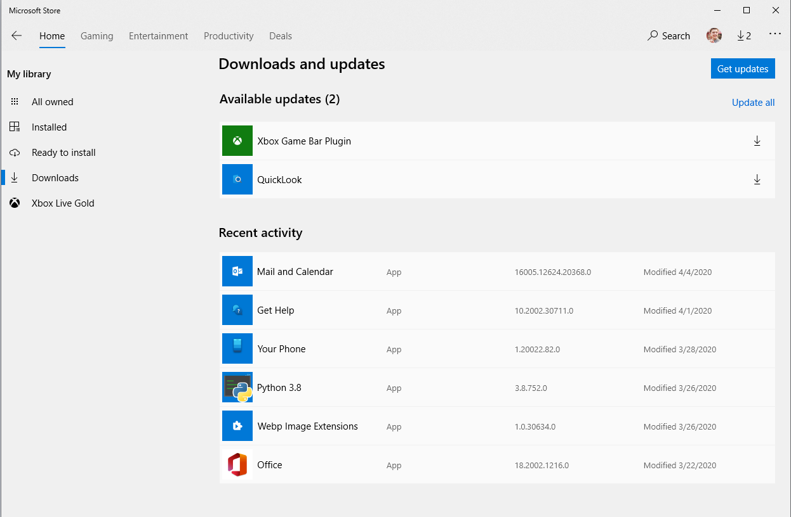

# Terminal Usage {#terminal-usage}

The terminal is essential for most developers. It's a relatively universal utility regardless of what form of programming you're into. It's important to make sure that your terminal is fully featured  both for functionality and so the user can customize to their taste.

<!-- ::in-content-ad title="Consider supporting" body="Donating any amount will help towards further development of articles like this." button-text="Visit our Open Collective" button-href="https://opencollective.com/unicorn-utterances" -->

## Terminal Emulators {#terminals}

One of the most important elements to one's experience with the terminal is, well, the terminal itself! While Windows has not historically had many options in this regard, things have turned around in recent years. Additional to the built-in CMD and PowerShell applications, we now have many newcomers, including one from Microsoft itself.

First, let's start with the third party offerings. We have many options, but the two I want to highlight is `Cmder` and `Terminus`.

### Cmder {#cmder}

[Cmder is an open-source terminal offering](https://github.com/cmderdev/cmder) built on top of a long-standing base called [ConEmu](https://conemu.github.io/). Not only is it a terminal window for you to interface with, but it provides a massive set of configurations. It not only provides configurations for the CMD shell backend but for PowerShell as well, meaning you can freely switch between them (and WSL) to suit your current needs. These configurations can even be used without having to utilize the terminal window. I think the config makes the terminal much more useful and pretty. For example, this is the default view of Cmder:


As you can see, there's some custom logic for embedding Git metadata in the prompt, a custom `λ` prompt, and even contains some logic for more effective tab autocomplete. You're even able to install it via Chocolatey using `choco install cmder`! 

The terminal itself contains all kinds of functionality:

- Multi-line copy+paste
- Tiling
- Tabs
- Customizable UI

Those are just the features I can think of off the top of my head! What's nice about Cmder is that even if you don't use the terminal itself, you can use the configurations for CMD and PowerShell with other shells if you like. All of the screenshots for the other terminals will be shown using the Cmder configs.

### Terminus {#terminus}

Terminus is another excellent option for those looking for alternative terminal shells. Because it's rendered using web tech, it's UI is much more customizable. It also has an easy-to-install plugin system to add further functionality to the shell. What you're seeing is the initial out-of-the-box experience [with the Cmder configuration applied](https://github.com/cmderdev/cmder/wiki/Seamless-Terminus-Integration)

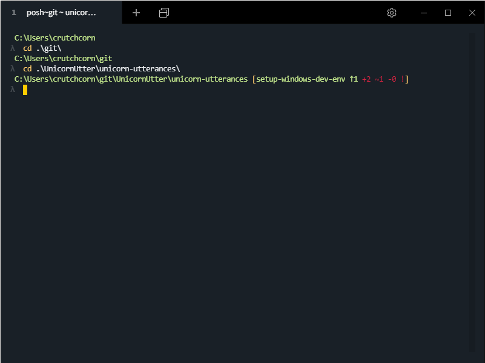

### Windows Terminal {#windows-terminal}

Last, but certainly not least, we have the newly-introduced Windows Terminal. This is the new terminal that's built by Microsoft itself. [The project is open-source](https://github.com/microsoft/terminal) and is available now [via the Microsoft Store](https://aka.ms/windowsterminal). In fact, in Windows 11, this terminal is now built-in and acts as the default terminal emulator.


This terminal shell has been the most stable in my experience. It supports tabs, a highly customizable UI, and supports using multiple terminal applications in different tabs.

#### Cmder Integration {#windows-terminal-cmder}

While Cmder integration with Windows Terminal is relatively trivial, it's not very well documented. Let's walk through how to get it up and running.

You'll want to start by making sure you have an environmental variable called `cmder_root`. This should be set up by default if you installed it using `choco`, but if you're unsure, you can check manually. [We outline how to set environmental variables in this article](#env-variables).

Once we're sure that we have the configuration setup properly, we'll open up the settings file in Windows Terminal by pressing the dropdown button and selecting "Settings."


Once this is done, update your `cmd` setting to have the following `commandline` config property:

```json
"commandline": "cmd.exe /k %cmder_root%/vendor/init.bat",
```

You can even do so for PowerShell:

```json
"commandline": "powershell.exe -ExecutionPolicy Bypass -NoLogo -NoProfile -NoExit -Command \"Invoke-Expression 'Import-Module ''%cmder_root%/vendor/profile.ps1'''\"",
```

This is what my `profiles` looks like all together:

```json
"profiles": [
    {
        "guid": "{5b4ef9a8-4506-4ac9-930a-5eb1fd0ebf20}",
        "name": "Cmder",
        "commandline": "cmd.exe /k %cmder_root%/vendor/init.bat",
        "icon": " %cmder_root%/icons/cmder.ico",
        "hidden": false,
        "startingDirectory": "%USERPROFILE%/git"
    },
    {
        "guid": "{61c54bbd-c2c6-5271-96e7-009a87ff44bf}",
        "name": "Windows PowerShell",
        "commandline": "powershell.exe -ExecutionPolicy Bypass -NoLogo -NoProfile -NoExit -Command \"Invoke-Expression 'Import-Module ''%cmder_root%/vendor/profile.ps1'''\"",
        "hidden": false,
        "startingDirectory": "%USERPROFILE%/git",
    },
],
```

Finally, if you want to set one of these profiles as default (I wanted to make my new PowerShell config default), you can update the `defaultProfile ` parameter at the top of the file. Mine looked like this:

```json
"defaultProfile": "{61c54bbd-c2c6-5271-96e7-009a87ff44bf}",
```

#### Color Configuration {#windows-terminal-colors}

Windows Terminal also supports text and background color customization, among other things. The color settings I used for the screenshot above is the Dracula color theme.  You can add that color theme by adding the following to the `schemes` array in the `profiles.json` file:

```json
"schemes": [
    {
        "name" : "Dracula",
        "background" : "#282A36",
        "black" : "#21222C",
        "blue" : "#BD93F9",
        "brightBlack" : "#6272A4",
        "brightBlue" : "#D6ACFF",
        "brightCyan" : "#A4FFFF",
        "brightGreen" : "#69FF94",
        "brightPurple" : "#FF92DF",
        "brightRed" : "#FF6E6E",
        "brightWhite" : "#FFFFFF",
        "brightYellow" : "#FFFFA5",
        "cyan" : "#8BE9FD",
        "foreground" : "#F8F8F2",
        "green" : "#50FA7B",
        "purple" : "#FF79C6",
        "red" : "#FF5555",
        "white" : "#F8F8F2",
        "yellow" : "#F1FA8C"
    }
],
```

Then, for each of the profiles you want to have that color scheme, add the following property:

```
"colorScheme": "Dracula"
```

Resulting in the following for my PowerShell config:

```json
{
    "guid": "{61c54bbd-c2c6-5271-96e7-009a87ff44bf}",
    "name": "Windows PowerShell",
    "commandline": "powershell.exe -ExecutionPolicy Bypass -NoLogo -NoProfile -NoExit -Command \"Invoke-Expression 'Import-Module ''%cmder_root%/vendor/profile.ps1'''\"",
    "hidden": false,
    "startingDirectory": "%USERPROFILE%/git",
    "colorScheme": "Dracula"
}
```

### Comparisons {#compare-different-terminals}

While each of the three terminals offers something different, they each have their own set of pros and cons. Here's how I see it:

- [Cmder](#cmder) has the most features of the three. It has so many features that I have not used most of them. That said, it has been known to crash on me from time-to-time.
- [Terminus](#terminus) is by far the best looking and most configurable of the three. I have even written custom CSS to style every aspect of the terminal before. It's easy to do. That said, I've suffered even greater instability and general lack of integration polish (resizing a window has negative impacts, namely) than Cmder.
- [Windows Terminal](#windows-terminal)'s weakest link currently is it's lack of features. At the moment, it doesn't have many of the same conveniences that you might miss from the other two options. That said, between the three, I'd say it's by far the most stable. Additionally, it's under heavy development, and the team behind it is moving fast. This is the terminal I use daily, armed with the configuration from Cmder.

I only outlined three terminal emulators here. They are my favorites; I've used them and know they are great terminal solutions, but there are plenty of other options out there. Some of the honorable mentions include:

- [Fluent Terminal](https://github.com/felixse/FluentTerminal)
- [Hyper Terminal](https://hyper.is/)

## Terminal Styling {#terminal-styling}

Anyone that's used `ohmyzsh` on Mac or Linux before can tell you that customizing your terminal shell doesn't just stop at picking an emulator.

In fact, regardless of your emulator, you have a wide swath of customization options such as:

- Various display colors
- Icons on your path string
- Spacing between commands

[While some terminals have a quick single (or zero) config change to add some fancy styling](#windows-terminal-cmder), you can have full control over your terminal styling.

### OhMyPosh {#oh-my-posh}

One option to customize your windows shell styling is [OhMyPosh](https://ohmyposh.dev/). Named after the similarly powerful [`OhMyZSH`](https://ohmyz.sh/), it allows you to have themes you can utilize for both PowerShell and CMD alike.

For example, this is [my terminal theme](https://github.com/crutchcorn/dotfiles/blob/master/.myposh.json) that's being used in PowerShell


> That emoji at the start? That's randomized on every shell start with a preselected list of emoji. Pretty 🔥 if you ask me.

### Powerline Fonts {#powerline-fonts}

Once setting up OhMyPosh in CMD/PowerShell or OhMyZSH in WSL, you may notice that your terminal display looks weird with some themes:


To get some of these themes working properly, you may need to install a [powerline](https://github.com/ryanoasis/powerline-extra-symbols) enabled font. You have a few options to do this. 

You can do so by [cloning this repository using PowerShell](https://github.com/powerline/fonts). Then `cd fonts` and `./install.ps1`. This script will install all of the fonts one-by-one on your system, fixing the font issues in your terminal. Find which font is your favorite and remember the name of it.

Alternatively, [Microsoft has made a custom font themselves that supports powerline symbols](https://github.com/microsoft/cascadia-code/releases?WT.mc_id=-blog-scottha). To use that font, simply download the `CascadiaPL.ttf` file and install it.

The final step is to configure your terminal editor to use the new font. Let's use the Windows Terminal as an example. Open your settings and inject `"fontFace":  "Cascadia Code PL"` into one of the profiles. The final result should look something like this:

```
 {
     "guid": "{2c4de342-38b7-51cf-b940-2309a097f518}",
     "hidden": false,
     "name": "Ubuntu",
     "source": "Windows.Terminal.Wsl",
     "fontFace":  "Cascadia Code PL"
 }
```

Then, when you open the terminal, you should see the correct terminal display.

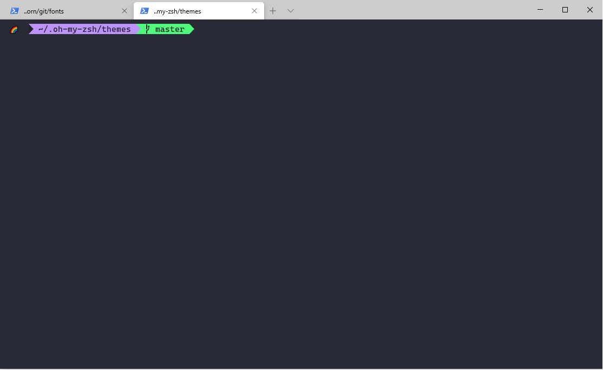


## Make Configuration Changes {#terminal-system-config}

While terminals are important, another factor to be considered is the configuration of those terminal shells. It's important to keep system-level configuration settings in mind as well. For example, if you need to [make or modify environmental variables](#env-variables) or [make changes to the system path](#env-path). Luckily for us, they both live on the same path. As such, let's showcase how to reach the dialog that contains both of these settings before explaining each one in depth.


After this, select "Advanced system settings."


After this, a dialog should pop up. This dialog should contain as one of the lower buttons "Environmental variables," which is where settings for both environmental variables and path should live.


### Environmental Variables {#env-variables}

When working with the CLI, it's often important to have environmental variables to customize the functionality of a utility or program. Because Windows has the concept of users, there are two kinds of environment variables that can be set:

- User-specific
- System-level

Each of them follows their namesakes in their usage. If I set a user-specific environmental variable and change users, I will not receive the same value as the user I'd set the variable for. Likewise, if I set it for the system, it will apply to all users. The top of the "environmental variables" section applies to the user-level, whereas the bottom level applies to the system. 

In order to add a new one, simply select "New" on whichever level you want to create the environmental variables on. You should see this dialog appear:


Simply add the name of the variable and the value of the environmental variable to continue.

You're able to do the same with editing a variable. Simply find the variable, highlight it, then select "Edit" and follow the same process.

### Adding Items to Path {#env-path}

Have you ever run into one of these errors?

- `The term 'program-name' is not recognized as the name of a cmdlet, function, script file, or operable program.`
- `'program-name' is not recognized as an internal or external command, operable program or batch file.`

It could be because you don't have the program attached to your system path. Your path is what dictates what scripts and programs you're able to access globally. For example, there's a tool that I like to use [to count the LOC I have in a given project: `scc`](https://github.com/boyter/scc). This project is incredibly useful for quick estimations for fun. The problem? It doesn't live on Chocolatey and doesn't have an MSI installer. This means that it's harder to access via the terminal. Well, no longer! [If I download the ZIP from the releases tab](https://github.com/boyter/scc/releases), and extract it, I'll see that it contains a file called `scc.exe`. If I move that folder to `C:\tools\scc` and add it to the path, then I can use it in the terminal as if it were any other global util.

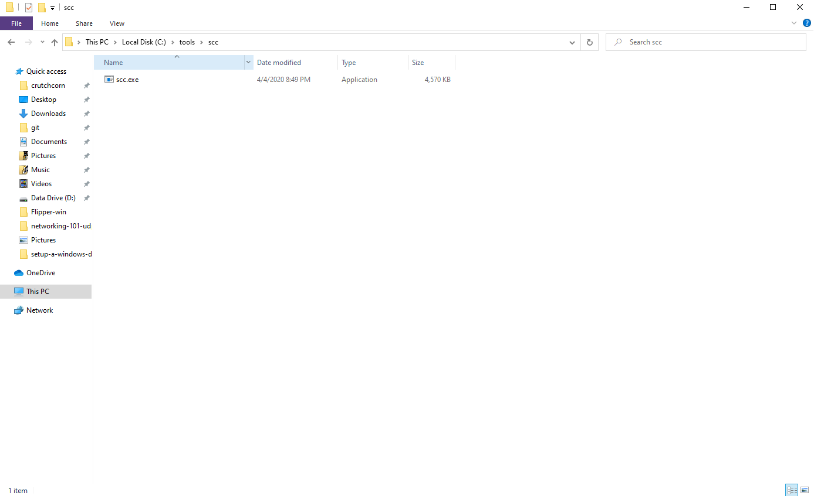

In order to add the file to the path, I need to edit the `path` environmental variable.

> [Just as there are two sets of environmental variables](#env-path), there are two sets of `path` env variables. As such, you'll have to decide if you want all users to access a variable or if you want to restrict it to your current user. In this example, I'll be adding it to the system. 

Find the `path` environmental variable and select `"Edit."` 


Just as before, you're able to delete and edit a value by highlighting and pressing the respective buttons to the left. Otherwise, you can press "new" which will allow you to start typing. Once you're done, you can press "OK" to save your new path settings.

> In order to get SCC running, you may have to close and then re-open an already opened terminal window. Otherwise, running `refreshenv` often updates the path so that you can use the new commands.

## Git Configurations {#git-config}

### Editor {#git-editor}

Git, by default, uses `vim` to edit files. While I understand and respect the power of `vim`, I have never got the hang of `:!qnoWaitThatsNotRight!qq!helpMeLetMeOut`. As such, I tend to change my configuration to use `micro`, the CLI editor mentioned in [the CLI packages section](#cli-packages). In order to do so, I can just run:

```
git config --global core.editor "micro"
```

However, we can go a step further. Let's say that we want the full power of VSCode when editing a file via Git - we can do that!

```
git config --global core.editor "code --wait"
```

### Difftool {#git-difftool}

Not only are you able to set VSCode as your editor for rebase messages, but [you can use it as your difftool as well](https://code.visualstudio.com/docs/editor/versioncontrol#_vs-code-as-git-diff-tool)!

Simply edit your global git config (typically found under `%UserProfile%/.gitconfig`) to reflect the following:

```
[diff]
  tool = default-difftool
[difftool "default-difftool"]
  cmd = code --wait --diff $LOCAL $REMOTE
```

And it should take care of the rest for you.

### Line Endings {#git-line-endings}

While most high-level language code is interoperable between different OSes, one of the primary differences between high-level codebases in Windows vs. macOS or Linux is the line-endings. As you might know, Windows uses `\r\n` line-ending where Linux and macOS end with `\n`.
Luckily for us, Git can automatically convert the Windows line-endings before committing them to the repository. To do so, simply run the following command:

```
git config --global core.autocrlf true
```

## WSL {#wsl}

Alright, alright, I'm sure you've been expecting to see this here. I can't beat around the bush any longer. Windows Subsystem for Linux (WSL) enables users to run commands on a Linux instance without having to dual-boot or run a virtual machine themselves. 

> While the initial v1 worked by mapping system calls from Windows to Linux in a somewhat complex method, the new version (WSL2) works differently. WSL2 utilizes a Linux container in the background and enabling you to call into that container. 
>
> Because of the foundational differences, compatibility with programs should be better in WSL2. If you last tried WSL when it first launched and were underwhelmed, try it again today.

You'll simply want to run the following command in PowerShell as an administrator:

```powershell
wsl --install
```

Then reboot your machine. After a reboot, you should be able to search for a Linux distro via the Microsoft Store. There are different options available to you, such as:

- [Debian](https://www.microsoft.com/en-us/p/debian/9msvkqc78pk6)
- [Kali Linux](https://www.microsoft.com/en-us/p/kali-linux/9pkr34tncv07)
- [openSUSE](https://www.microsoft.com/en-us/p/opensuse-leap-15-1/9njfzk00fgkv)
- [Ubuntu](https://www.microsoft.com/en-us/p/ubuntu/9nblggh4msv6)

There are more distros on the Microsoft Store if you search for them.

Once done, you simply run `wsl` in a terminal window. This should start-up the distro's shell in the directory you were currently in. This is a full installation of Linux, meaning that you're able to access its package manager, run programs from it, and modify Windows files.

There are even tweaks that are done with Windows to make it easier to use. If you run the `code` command to open a file, it will download a "VSCode remote server" to allow you to use your Windows install for both Linux and Windows commands. You can even [share SSH keys between Windows and WSL](https://devblogs.microsoft.com/commandline/sharing-ssh-keys-between-windows-and-wsl-2/)!

The cross-WSL compatibility isn't uni-directional either. You can [open files from your Linux filesystem in Windows](#access-wsl-files), [call Windows executables from WSL](https://docs.microsoft.com/en-us/windows/wsl/interop#run-windows-tools-from-wsl), and much more!

### Shell Configuration {#linux-shell}

If you prefer an alternative shell, such as ZSH or Fish, you can install those in your distro as well. For example, I have an [`oh-my-zsh`](https://ohmyz.sh/) instance that runs anytime I start-up `wsl`.

To get the alternative shell running any time you call `bash`, you'll need to configure your `.bashrc` file. You're able to run `nano ~/.bashrc` to open the file. Once done, add `bash -c zsh` to the top of the file. After this, every time `bash` runs, it will open `zsh`.

That said, there's something a little awkward about using a program called `bash` to run a shell outside of `bash` itself. Additionally, you'll notice that if you type `exit` in `zsh`, it won't exit to the Windows shell. Instead, it will bring you to `bash` and require one more `exit` before you are back to the shell from whence you came.

To solve these problems, simply run `chsh -s $(which zsh)` in your WSL instance and use the `wsl` command (as opposed to `bash`) to open your shell. `bash` will still work and bring up the `bash` shell while `wsl` will bring you to `zsh` and work with the `exit` command as expected.

You can even able to tell Windows Terminal to use WSL as default! If you open Windows Terminal, it should have a default profile for WSL:

```json
 {
     "guid": "{2c4de342-38b7-51cf-b940-2309a097f518}",
     "hidden": false,
     "name": "Ubuntu",
     "source": "Windows.Terminal.Wsl"
 },
```

All you need to do is change the `defaultProfile` to match the `guid` of the WSL profile.

### Accessing Linux Files {#access-wsl-files}

Since [Windows 10 (1903)](https://devblogs.microsoft.com/commandline/whats-new-for-wsl-in-windows-10-version-1903/), you're able to access your WSL Linux distro files directly from Windows explorer. To do this, simply look to the sidebar panel of your File Explorer.

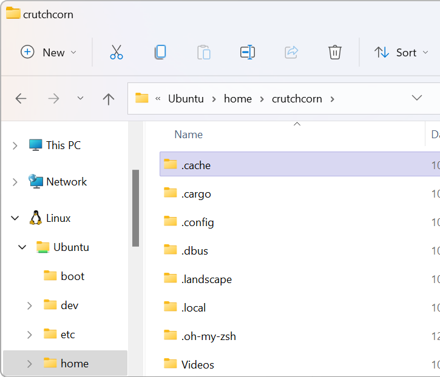

Here, you can read and write files to and from your Linux installation in WSL.

### Linux GUI Programs {#wsl-gui}

[In Windows 11, you're now able to run Linux GUI apps with WSL](https://docs.microsoft.com/en-us/windows/wsl/tutorials/gui-apps). Simply install them as you usually would using your distro's package manager and run them from the command line.

Here, I'm using `gedit` that I installed using:

```
sudo apt install gedit
```

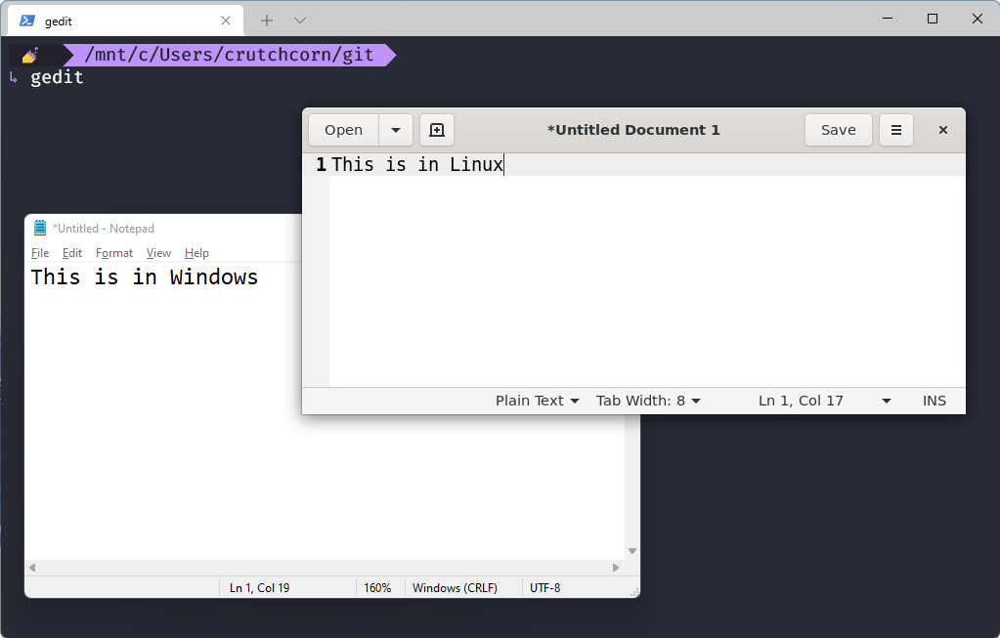


### USB Pass-thru {#wsl-usb}

For some development usage, having USB access from Linux is immensely useful. In particular, when dealing with Linux-only software for flashing microcontrollers or other embedded devices it's an absolute necessity.

Luckily, as of late [Microsoft has worked with a third party project to add support to WSL](https://devblogs.microsoft.com/commandline/connecting-usb-devices-to-wsl/) to directly connect USB to Linux. This allows you to do flashing with `dd` and similar

# Keyboard Usage {#keyboard-usage}

When asking many of my Linux-favoring friends why they love Linux so much, I've heard one answer time and time again. They love being able to control their computer front, back, and sideways without having to touch the mouse. Well, dear reader, I assure you that Windows provides the same level of control.

## Built-Ins {#built-in-keyboard-shortcuts}

By default, Windows includes a myriad of shortcuts baked right in that allow you to have powerful usage of your system using nothing but your keyboard. Here are just a few that I think are useful to keep-in-mind:

| Key Combo                                           | What It Does                                                 |
| --------------------------------------------------- | ------------------------------------------------------------ |
| <kbd>Win</kbd> + <kbd>S</kbd>                       | Perform a partial screenshot. Allow you to select what you want screenshotted |
| <kbd>Win</kbd> + <kbd>.</kbd>                       | Bring up the emoji picker. After pressing, start typing to search. |
| <kbd>Win</kbd> + <kbd>R</kbd>                       | Bring up the "Run" dialog. Will allow you to type in the internal executable name to run it |
| <kbd>Win</kbd> + <kbd>V</kbd>                       | Open the Windows clipboard manager                           |
| <kbd>Win</kbd> + <kbd>X</kbd>                       | Bring up a list of actions, including "Start PowerShell as Admin" |
| <kbd>Win</kbd> + <kbd>L</kbd>                       | Lock your screen                                             |
| <kbd>Win</kbd> + <kbd>Tab</kbd>                     | Bring up the overview mode of all windows                    |
| <kbd>Win</kbd> + <kbd>E</kbd>                       | Open file explorer                                           |
| <kbd>Win</kbd> + <kbd>S</kbd>                       | Open search dialog                                           |
| <kbd>Win</kbd> + <kbd>D</kbd>                       | Show/hide the desktop                                        |
| <kbd>Shift</kbd> + <kbd>F10</kbd>                   | Bring up the context menu for the selected item              |
| <kbd>Win</kbd> + <kbd>Ctrl</kbd> + <kbd>D</kbd>     | Add a new virtual desktop                                    |
| <kbd>Win</kbd> + <kbd>Ctrl</kbd> + <kbd>Arrow</kbd> | Move between virtual desktops                                |
| <kbd>Win</kbd> + <kbd>Ctrl</kbd> + <kbd>F4</kbd>    | Close current virtual desktop                                |


## Window Tiling {#window-tiling}

"Surely, you can't forget about window tiling!"

Oh, don't worry, I haven't. Out of the box, windows supports tiling using the <kbd>Win</kbd> +  <kbd>Arrow</kbd> keys. With these keys, you can lock a window into any of the four corners of a screen, make it take up half the screen, or fill the screen entirely.

More than that, though, there are many other options out there. One of the paid options that I like using is called [Divvy](https://mizage.com/windivvy/). While it's paid, it enables users a powerful ability to layout windows either with their keyboard or mouse alike. I often use it to size windows with my mouse, in fact.


Back at the (Redmond-based) ranch, the [previously mentioned Microsoft made PowerToys](#utilities) gives users [a feature called "FancyZones"](https://github.com/microsoft/PowerToys/blob/master/src/modules/fancyzones/README.md). Using this feature, users can dictate what locations their window snapping behaves in. This overwrites the existing <kbd>Win</kbd> +  <kbd>Arrow</kbd> shortcuts to move a window.

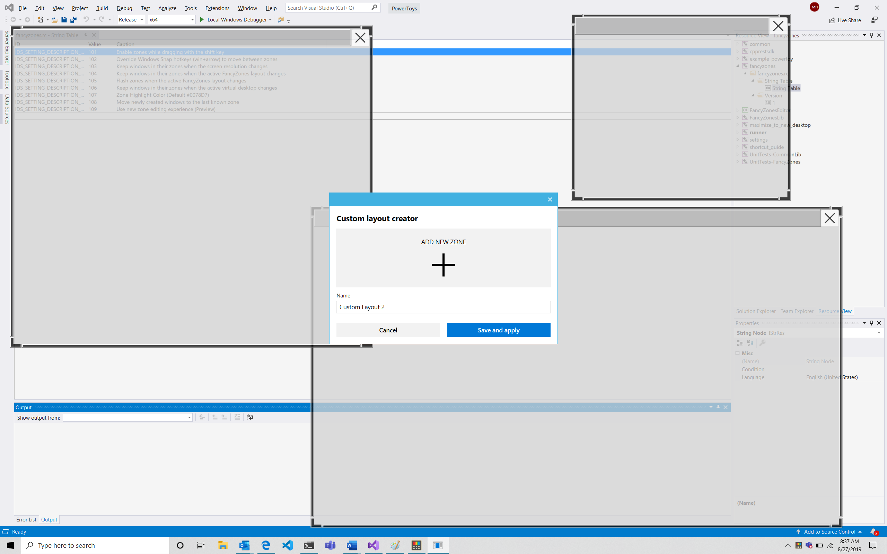

As you can see, there's an incredible amount of customization available with "FancyZones".

# Customization {#customization}

I'm not sure about you, but when I get a new machine, I want it to feel _mine_. This applies just as much to my wallpaper as it does the stickers I plaster my laptops with. The following software enables some new functionality or aesthetic difference that users might enjoy.

## Free {#free-customization-software}

| Program Name                                                 | What It Is                                                   | Windows Compatibility |
| ------------------------------------------------------------ | ------------------------------------------------------------ | --------------------- |
| [Audio Band](https://github.com/dsafa/audio-band)            | Adds an interactive music preview to the taskbar. Integrates with Spotify and others | Windows 10            |
| [QuickLook](https://github.com/QL-Win/QuickLook)             | Adds MacOS like file preview on pressing spacebar            | Windows 10, 11        |
| [EarTrumpet](https://github.com/File-New-Project/EarTrumpet) | Allows a more complex audio mixer. Support per-app volume control | Windows 10, 11        |
| [Rainmeter](https://www.rainmeter.net/)                      | Enables new interactive desktop widgets                      | Windows 7, 8, 10, 11  |
| [TranslucentTB](https://github.com/TranslucentTB/TranslucentTB) | Allows for more flexibility of taskbar                       | Windows 10, 11*       |
| [RoundedTB](https://github.com/torchgm/RoundedTB)            | Allows for a rounded, more macOS-dock-like taskbar           | Windows 10, 11        |
| [TaskbarX](https://github.com/ChrisAnd1998/TaskbarX)         | Like TranslucentTB but also supports centering icons in the TaskBar in Windows 10 | Windows 10, 11*       |
| [Files UWP](https://github.com/duke7553/files-uwp/releases)  | A modern rewrite of the file explorer in UWP                 | Windows 10, 11        |
| [Open-Shell](https://github.com/Open-Shell/Open-Shell-Menu)  | An open-source replacement for the start menu                | Windows 7, 8, 10      |

> \* Functionality may be limited or require further modification for some reason

## Paid

> Just a reminder that none of this software mentioned here due to a sponsorship or financial arrangement of any kind. Please understand that this is all software that I personally use and wanted to share. I've tried my best to find some form of free/open-source replacement and linked them in the "Free" section.

| Program Name                                          | What It Is                                                   | Windows Compatibility | Price         |
| ----------------------------------------------------- | ------------------------------------------------------------ | --------------------- | ------------- |
| [DisplayFusion](http://www.displayfusion.com/)        | A multi-monitor utility program. Enables tons of functionality to help manage multiple monitors | Windows 7, 8, 10, 11  | Starts at $29 |
| [OneCommander](http://onecommander.com/)              | A replacement for the File Explorer with various improvements | Windows 10, 11        | $5            |
| [TrayStatus](https://www.traystatus.com/)             | Status tray indicators for HDD, CPU, Capslock, and more      | Windows 10, 11        | Starts at $10 |
| [Groupy](https://www.stardock.com/products/groupy/)   | A replacement for the [now-defunct Sets](https://www.zdnet.com/article/windows-10s-sets-feature-is-gone-and-not-expected-to-return/) functionality. Group unrelated programs into tabs, even if they didn't previously support tabs | Windows 10, 11        | $10           |
| [Start10](https://www.stardock.com/products/start10/) | A replacement for the Windows 10 start menu                  | Windows 10            | $5            |
| [Start11](https://www.stardock.com/products/start11/) | A replacement for the Windows 11 start menu | Windows 11            | $6            |
| [StartAllBack](https://www.startallback.com/) | Windows 11 start menu replacement |Windows 11|$5|
| [StartIsBack](https://www.startisback.com/) | Windows 10 start menu replacement |Windows 10|$5|

# Functionality {#functionality}

Windows also has some differing functionality to Linux/macOS in some critical ways. Some of the functionality you might be used to simply doesn't have an obvious analog in Windows. Let's take a look at some of these that we have an alternative to.

## Virtual Desktops {#virtual-desktops}

Longtime users of Linux will be quick to note that they've had virtual desktops for years. While a newer feature to the Windows product line, it too was actually introduced in Windows 10! 

If [you press <kbd>Win</kbd> + <kbd>Tab</kbd>, it will open a task view](#built-in-keyboard-shortcuts). On the top right of your screen, you should see a "New desktop" button. If you press it, it will create a new desktop.

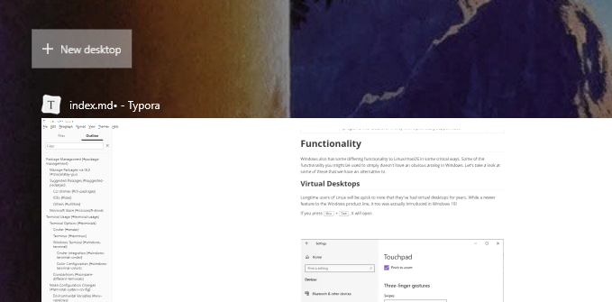

Once you have more than one virtual desktop open, you should see a preview of each window individually.


In order to move a window from one desktop to another, simply drag a window into another desktop's preview window.

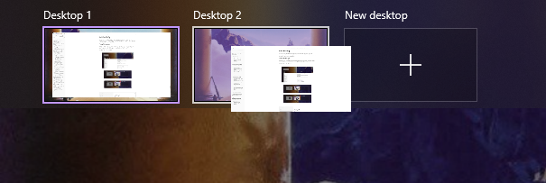

Finally, to delete a virtual desktop, you can hover over the preview of the desktop. Upon doing so, a close button should appear. Click it to close the virtual desktop instance.


> A feature that's soon-to-release is renaming a virtual desktop! This functionality is [being added in the 2020 stable release of Windows](https://blogs.windows.com/windowsexperience/2019/09/06/announcing-windows-10-insider-preview-build-18975/) launching soon!

### Touchpad Users {#virtual-desktop-touchpad-users}

If you're a laptop user (or have a touchpad for your desktop) that supports Windows gestures, you can configure a three or four finger feature to switch desktops with a simple swipe. Simply go to "Settings > Devices > Touchpad" to see if you're able to configure this or not. If you are able to, you should be able to select dropdowns to configure which one you'd like.

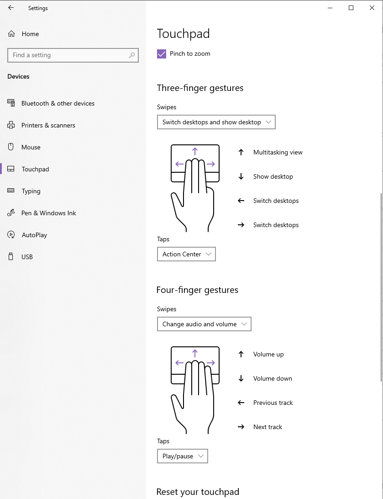


## Symbolic Links {#symlinks}

Symbolic links are a method of having a shortcut of sorts from one file/folder to another. Think of it as Windows Shortcuts but baked directly into the filesystem level. This may come as a surprise to some developers, but Windows actually has support for symbolic links!

To use symbolic links from the CLI, you have to first enable developer mode on your install of Windows. To do this, go to your settings app, open "Update & Security," then select in the sidebar "For developers."

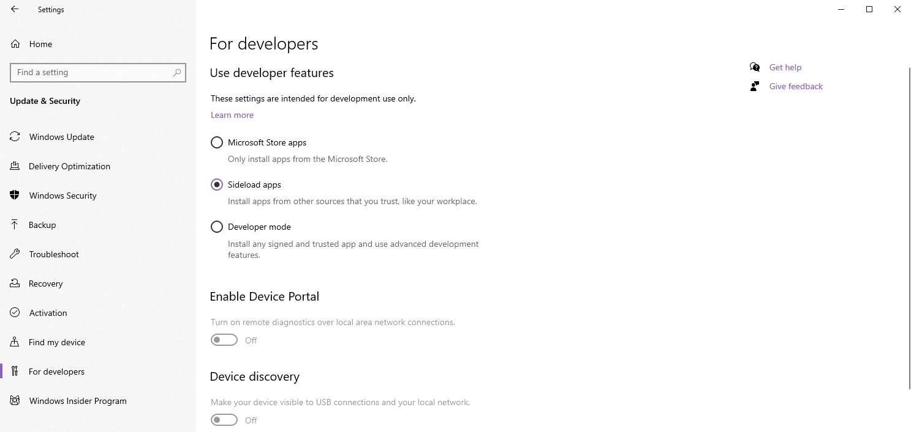

Once done, you're able to run `mklink`, which provides you the ability to make a symbolic link.

### Usage {#using-mklink}

By default, it creates a soft link from the first argument to the second. 
```
mklink Symlink SourceFile
```

You're also able to add `/D` to make a soft link to a directory:
```
mklink /D SymlinkDir SourceFolder
```

Finally, to make hard links, you use `/H` for files:

```
mklink /H Symlink SourceFile
```

And `/J` for folders:

```
mklink /J SymlinkDir SourceFolder
```

### GUI Alternative {#link-shell-extension}

While the CLI enables you to make hard and soft symbolic links, it's far from graceful. It would be ideal to have that functionality baked right into the explorer menu options if used frequently. Luckily for us, there's an app for that! [Link Shell Extension](https://schinagl.priv.at/nt/hardlinkshellext/linkshellextension.html) adds the options to the context menu itself. It's even able to be installed using [Chocolatey](#package-management):

```
choco install linkshellextension
```

Simply right click (or [use the <kbd>Shift</kbd> + <kbd>F10</kbd> shortcut](#built-in-keyboard-shortcuts)) and select "Pick Link Source":


Then you're able to navigate to the folder you're looking for, right click, and select "Drop as...":

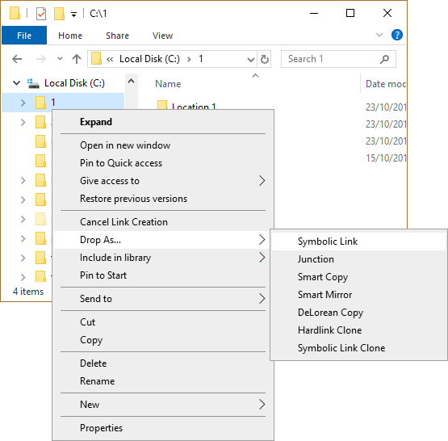

There are a myriad of options to choose from and should handle any type of symlink you'd need.

# Additional Configuration {#additional-configuration}

They may not really count as a customization or making up for a "missing feature,"  but there are a few more things you can do to configure your Windows 10 installation to make life as a developer just a little bit better.

## Long Path Support

Developers with many sub-paths (or those that use package managers like `npm`) can tell you just how long their deepest file paths can get. This can cause problems with Windows, because there is a default limit of 260 characters for file paths. This can cause havoc and errors when doing automated tasks that exceed this limit. To fix this, you can either use a Registry Editor or modify an existing Group Policy (depending on which edition of Windows you have). The instructions are a bit complex for users not familiar with registry editing, [but HowToGeek provides a great resource](https://www.howtogeek.com/266621/how-to-make-windows-10-accept-file-paths-over-260-characters/) for making this process relatively trivial.

## Make a Directory Case Sensitive

Users that have switched from macOS or Linux can tell you that most systems care about case sensitivity when it comes to a file's name. This behavior is admittedly at odds with Window's handling of files where case sensitivity isn't considered much. As someone who's tried to rename a file to be lowercase and track the changes in Git can tell you: It can be tricky to get Windows to respect the file name's casing. Luckily for us, we're able to overwrite this behavior on a per-folder basis. To do so, run the following command:

```
fsutil.exe file setCaseSensitiveInfo C:\path\to\folder enable
```

Once this is done, tada! Your directory is now case sensitive. That said, be warned that this setting does not trickle down to your subfolders: Only the parent will be case sensitive. 

Luckily, any folders you create using WSL will be case sensitive by default, enabling you to have files with the same name present with only casing differences between them.

# Conclusion

You'll notice that despite the raw power and capabilities that WSL2 will be bringing to us right around the corner, that I didn't touch on it until later in the article. That's because, while it's an amazing toolset to be able to utilize for those that need it, it's not the only thing that you can do to enable your Windows instance to be powerful for development. Windows (and Microsoft as a whole) has come a long way in the past 10 years, and with their continued effort on projects like WSL, VS Code, and the Windows Terminal, the future looks brighter than ever. 

I want to take a moment to stop and appreciate all of the hard work that the folks at Microsoft and everyone involved in the projects mentioned have done to enable the kind of work I do daily. Thank you.

If you have any questions or comments, feel free to ring off in the comment box below. Otherwise, we have [our community Discord](https://discord.gg/FMcvc6T) where we talk not only talk Windows, but Linux, macOS, programming, and everything in between. We look forward to seeing you there!
