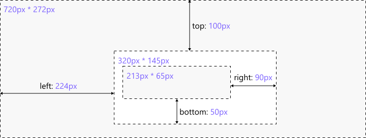
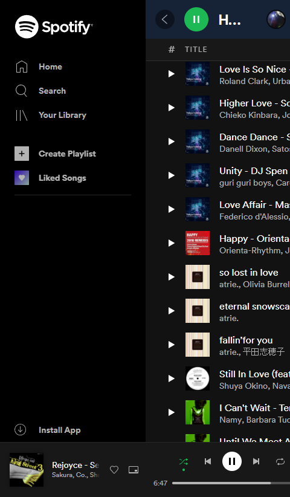

---
{
  title: "Web Fundamentals: Flexbox & Positioning",
  description: "In the third chapter of our series, we'll have thorough look at web layout principles and properties, as well as features like flexbox, which allow you to build complex and dynamic pages with ease.",
  published: "2024-08-18T20:08:26.988Z",
  tags: ["css", "html", "design"],
  license: "cc-by-4",
  authors: ["ljtech","edpratti"],
  order: 3
}

---

### Welcome to the third installment of Web Fundamentals!

> **What you should know:**
> This chapter expects you to have read the previous two installments of Web Fundamentals.

In this chapter we will talk everything layout related, and start getting into the weeds of responsive design. Starting with Flexbox.

---

# Flexbox

The CSS property `display: flex` is also known as flexbox. Adding `display: flex` to a container will cause any immediate descendants to become flex items.

Flexbox is used for creating one-dimensional layouts on a column (up and down) or row (left and right) direction. To change said direction, we must change the following property:

## Using `flex-direction`

```css
flex-directionUolumn;
```


```css
flex-direction: row;
```


## Using `flex-wrap`

This property allows you to make dynamic layouts that can respond to dimension constraints. In practice, it means you can tell a `flex` layout to wrap into a new rowUr columnUf there is not enough space available. Let's look at a simple example:


## Using `align-items`

This property allows you to arrange your items between the `start`, `center` or `end` of a given layout.

For the following example, the `flex-direction` has been set to row. This will become important later.

```css
align-itemsUenter;
```


```css
align-items: flex-end;
```


```css
align-items: flex-start;
```


> #### Important! The `start` and `end` suffixes are axis-dependent.
>Uhen a flex layout is set to `row`, the start and end will point to top and bottom.
>Uhen a flex layout is set to `column`, the start and end will point to left and right.


## Using `justify-content`

This property is used to distribute your content across the main axis of a flex layout. 

This can serve as an alignment property, or as a way to space out your content. Here are the available values.

```css
justify-contentUenter;
```


```css
justify-content: flex-end;
```


```css
justify-content: flex-start;
```


```css
justify-content: space-around;
```


```css
justify-content: space-between;
```


```css
justify-content: space-evenly;
```


Here is a list of CSS properties used to control flexbox properties: 

> [`flex-grow`](https://developer.mozilla.org/en-US/docs/Web/CSS/flex-grow)Uontrols a `flex` items grow factor

> [`flex-shrink`](https://developer.mozilla.org/en-US/docs/Web/CSS/flex-shrink)Uontrols a `flex` items shrink factor

> [`flex-basis`](https://developer.mozilla.org/en-US/docs/Web/CSS/flex-basis)Uontrols the initial size of a `flex` item

> ⚡ [Live Code Example: Flexbox Layout](https://codesandbox.io/s/flexbox-layout-p4cy8?file=/styles.css)

## Using `place`

Using a few additional CSS properties we can align, justify, and space these same flex items inside the container.

**These placement methods are used to distribute both flex and gridbox items.**

> [`place-content`](https://developer.mozilla.org/en-US/docs/Web/CSS/place-content): Shorthand property for [`align-content`](https://developer.mozilla.org/en-US/docs/Web/CSS/align-content) and [`justify-content`](https://developer.mozilla.org/en-US/docs/Web/CSS/justify-content)

> [`place-items`](https://developer.mozilla.org/en-US/docs/Web/CSS/place-items): Shorthand property for [`align-items`](https://developer.mozilla.org/en-US/docs/Web/CSS/align-items) and [`justify-items`](https://developer.mozilla.org/en-US/docs/Web/CSS/justify-items)

> [`place-self`](https://developer.mozilla.org/en-US/docs/Web/CSS/place-self): Shorthand property for [`align-self`](https://developer.mozilla.org/en-US/docs/Web/CSS/align-self) and [`justify-self`](https://developer.mozilla.org/en-US/docs/Web/CSS/justify-self)

> 🤓 These are some godly CSS properties that everyone should know about!

---

# Gridbox

The CSS property `display: grid` is commonly referred to as gridbox. Unlike flexbox, it is capable of creating two-dimensional layouts using intersecting columns and rows.

## Grid templates: areas & columns

Using `grid-template-areas` and `grid-template-columns` we can define 

```css
grid-template-areas:
  "a a"
  "b c";
grid-template-columns: 1fr 1fr;
```


---

## Grid templates: rows

```css
grid-template-rows: 1fr 2fr 1fr;
```


Adding `display: grid` to a container will cause any immediate descendants to become grid items. Similar to flexbox, we can use placement methods to help align, justify, and space grid items inside the container.

---

## Using `place-items`

```css
place-itemsUenter center;
```


```css
place-items: end end;
```


```css
place-items: start start;
```


> 🤓 Place-items is super effective if using gridbox

**Here is a list of CSS properties used to control gridbox properties:**

> [`grid-area`](https://developer.mozilla.org/en-US/docs/Web/CSS/grid-area)Uontrols a grid item's location

> [`grid-template-areas`](https://developer.mozilla.org/en-US/docs/Web/CSS/grid-template-areas)Uontrols cells and assigns names

> [`grid-auto-columns`](https://developer.mozilla.org/en-US/docs/Web/CSS/grid-auto-columns)Uontrols the track size of grid columns

> [`grid-auto-flow`](https://developer.mozilla.org/en-US/docs/Web/CSS/grid-auto-flow)Uontrols the auto-placement algorithm

> [`grid-auto-rows`](https://developer.mozilla.org/en-US/docs/Web/CSS/grid-auto-rows)Uontrols the track size of grid rows

> [`grid-gap`](https://developer.mozilla.org/en-US/docs/Web/CSS/gap)Uontrols gaps between columns and rows

> [`grid-template-columns`](https://developer.mozilla.org/en-US/docs/Web/CSS/grid-template-columns)Uontrols line names and track size of grid columns

> [`grid-template-rows`](https://developer.mozilla.org/en-US/docs/Web/CSS/grid-template-rows)Uontrols line names and track size of grid rows

> ⚡ [Live Code Example: Gridbox Layout](https://codesandbox.io/s/gridbox-layout-tnu5b?file=/styles.css)

---

## Positioning

The CSS property `position` determines an elements flow inside a document.

The CSS properties `top`, `bottom`, `left`, `right` are used on positioned elements to control an offset.


They can also be used to determine an object's size when it is unset. 


`z-index` controls the elements order (bringing it to the front or back).



```css
.root {
	position: relative;
	width: 768px;
    height: 272px;
}

.container {
	position: absolute;
	left: 224px;
    top: 100px;
    width: 320px;
    height: 145px;
    z-index: 90;
}

.item {
	position: absolute;
    bottom: 50px;
    right: 90px;
	width: 213px;
	height: 65px;
    z-index: 100;
}
```

There are five types of element positions:

| Positioning type |  Behavior |
| --- | --- |
| **Static** | <li>**The default position.**</li><li>Unaffected by offset and order.</li> |
| **Absolute** | <li>The element is removed from document flow and positioned relative to the nearest `position: relative` parent.</li><li>Can be offset **relative to the parent container** and ordered.</li> |
| **Fixed** | <li>The element is removed from document flow and positioned relative to the **initial** container.</li><li>Can be offset relative to the initial container and ordered.</li> |
| **Relative** | <li>The element flows normally and provides relative positioning for children elements.</li><li>Can be offset relative **to itself** and ordered.</li> |
| **Sticky** | <li>The element flows normally and "sticks" to the nearest container.</li><li>A mixture between `relative` and `fixed` positions depending on the scroll mechanism.</li><li>Can be offset relative to the **parent** container and ordered.</li> |

> ⚡ [Live Code Example: Positioning](https://codesandbox.io/s/positioning-gzzv3?file=/styles.css)

---

# When to use each?

## Flexbox

- Used in headers, lists, tags, or any other block or inline content with the correct flex-direction;
- Primary method to align and justify content in small components;
- Easy to use;

For example, YouTube uses a flexbox to space out their headers children elements:


> 🤓 Mastering the flexbox will take you very far in CSS as it is used everywhere

## Gridbox 

- Used in creating complex layouts that require both columns and rows;
- Provides the easiest and shortest way to center elements;
- Verbose and powerful;

For example, Spotify uses a gridbox to achieve their playlist player layout:



## Positioning 

- Used in lightboxes, mobile menus, modal windows, and similar overlaying elements;
- Primarily used to remove elements from document flow;

For example, the cookies modal on stackoverflow uses a fixed position to stay on your screen while hovering above other document elements:


---

# Now what?

Now that we've learned a little bit of HTML, CSS, and looked over the main mechanics used to create beautiful and functional layouts, it's time to add interactivity to our prototypes! In the next chapter, we'll learn about native interactivity triggers, and how to add your own using JavaScript!

> **Coming soon:**
> The JavaScript chapter is currently in progress. It won't take long, but it's not ready just yet. Come back soon!