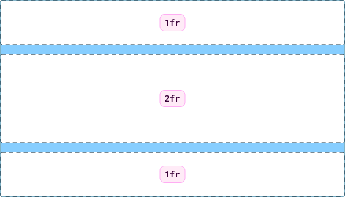
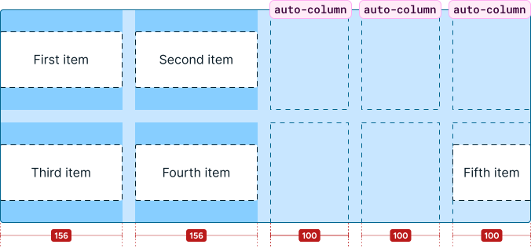
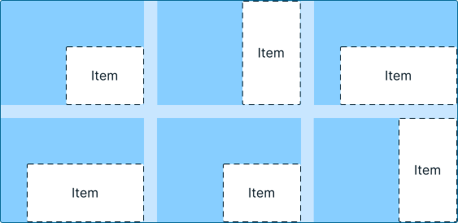
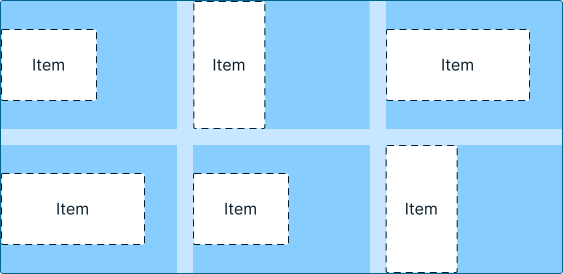

---
{
  title: "Web Fundamentals: Grid",
  description: "In the fourth chapter of our series, we're going to be introduced to CSS grid, a well-known feature to display content, and used in almost every website you visit.",
  published: "2024-08-18T20:08:26.988Z",
  tags: ["css", "html", "design"],
  license: "cc-by-4",
  authors: ["ljtech","edpratti"],
  order: 4
}
---


The CSS property `display: grid` is commonly referred to as gridbox. Unlike flexbox, it is capable of creating two-dimensional layouts using intersecting columns and rows.

Today we'll learn how to use grid's features to build dynamic layouts that adapt to users' needs.

# Grid sizing

Grids and grid cells take in numerical values. They can be a value relative to the parent size, a fixed size that is repeated throughout the grid, or a size relative to the size of its elements!

| Value | Behavior |
| --- | --- |
| `px` | Sets a static size for each column. |
| `fr` | Sets a fraction value based on the container size. This will take into account the `gap` property, and make sure content does not overflow. |
| `%` | Sets a percentage value based on the container size. Unlike `fr`, this will ignore the `gap` property, and content will overflow if the sum of the percentage and `gap` is bigger than 100%. |
| `vw`, `vh` | Set a percentage value based on the viewport size. Unlike `fr`, this will ignore the `gap` property, and content will overflow if the sum of the percentage and `gap` is bigger than 100%. |

Now let's look at the properties we'll be working with.

# Templates

## Areas

To define how many areas a grid will have, `grid-template-areas` takes in any term to specify layout slots. The number of terms defines the number of "slots" a particular layout can take up.

**Here we are creating a 3x3 layout.** The distribution of each layout, however, is as such:

```css
grid-template-areas:
  "a a a"
  "b b c"
  "b b c";
```

To better illustrate it, let's change the terms from letters to our actual content and use real CSS:

```css
.grid-container {
  grid-template-areas:
    "heading heading heading"
    "content content sidebar"
    "content content sidebar";
  gap: 16px;
  height: 376px;
}

```

- A header that takes up the whole top row.
- Content takes 2/3 of the remaining grid space. ***We will come back to this.***

<iframe data-frame-title="Grid: Template areas" src="pfp-code:./template-areas?template=node&embed=1&file=src%2Fstylesheet.css"></iframe>

### Customizing areas

Using `grid-template-areas` will define the default distribution, but that does not mean it cannot be customized. Using the `column` and `row` commands, we can tweak how we want to display each template area.

By default, columns and rows are distributed evenly.

```css

grid-template-areas:
  "a a"
  "b c";
```


**However, there's a caveat: Their size is also dependent on content.**

Let's look at each now.

## Columns

If the content exceeds the regular size of a column, that column will grow to accomodate it. **This means that in order to force the distribution, we must call upon another property, called `grid-template-columns`.**

The `grid-template-columns` property accepts a numerical value. It can be a value relative to the parent size, a fixed size that is repeated throughout the grid, or a size relative to the size of its elements!

Let's look at an example where we override the column values to make the `grid-template-areas` and `grid-template-columns` be in opposition to one another. ***In this demo, despite the content taking more space according to the area, the column override causes it to take less space.***

<iframe data-frame-title="Grid: Column override" src="pfp-code:./column-override?template=node&embed=1&file=src%2Fstylesheet.css"></iframe>

---

## Rows

If the content exceeds the regular size of a row, that row will grow to accomodate it. **This means that in order to force the distribution, we must call upon another property, called `grid-template-rows`.**

The `grid-template-rows` property accepts a numerical value. It can be a value relative to the parent size, a fixed size that is repeated throughout the grid, or a size relative to the size of its elements!

```css
/* This tells the middle row to take twice as much space as the rest of the rows. */
grid-template-rows: 1fr 2fr 1fr;
```



## Gaps

The `gap` property is self explanatory. It's a shorthand property that defines the space between grid cells. It accepts two inputs of any of the numerical values that we've already discussed, like percentages, fractions, viewport units and everything else.

```css
/* 
The following code
is the same as

row-gap: 24px;
column-gap: 16px;
*/

.grid-container {
  display: grid;
  gap: 24px 16px; 
}
```

> **Learn more:**
> 📚 **[MDN: gap](https://developer.mozilla.org/en-US/docs/Web/CSS/gap)**

---

# Auto properties

## Flow

By default, `grid-auto-flow` sets the order to elements to `row`, meaning items will be ordered in rows until they fill, and then they will proceed to wrap to the next one.

```css
.grid-container {
  display: grid;
}
```


You can set the `grid-auto-flow` property to `column`. In this case, items will be laid vertically and then wrap to the next column once one is filled.


---

## Columns and rows

Sometimes, items may exceed the size of your grid, or you may want to create an invisible grid system to place items in.

In those situations, you can specify the size of auto generated cells.

```css
.grid-container {

  /* We set up two columns and two rows */
  display: grid;
  grid-auto-flow: column;
  gap: 16px;

  /* We set the default size for each of the cells */

  grid-template-rows: 48px 48px;
  grid-template-columns: 72px 72px;

  grid-auto-columns: 128px;

  /* Generated columns will be thinner */
  grid-auto-columns: 100px;                        
}

.fifth-item {
  /* This is outside of our 2x2 grid.
  It will be placed in an auto cell. */
  grid-column: 5;
  grid-row: 2;
}
```



> ⚡ [Live Code Example: Gridbox Layout](https://codesandbox.io/s/gridbox-layout-tnu5b?file=/styles.css)

---

# Alignment 

Adding `display: grid` to a container will cause any immediate descendants to become grid items. Similar to **[flexbox](./web-fundamentals-flexbox)**, we can use placement methods to help align, justify, and space grid items inside the container.


## Using `place-items`

Place items is a shorthand for `align-items` and `justify-items`, respectively.

```css
/* The following code: */

place-items: start end;

/* ...is the same as: */

align-items: start;
justify-items: end;
```

Now let's see it in action.

```css
/* Center vertically and horizontally */
place-items: center center;
```


```css
/* Center vertically and align them to the right edge */
place-items: center end;
```


```css
/* Align items to the bottom right corner */
place-items: end end;
```



```css
/* Align items to the top left corner */
place-items: start start;
```


```css
/* Center horizontally and align them to the top edge */
place-items: start center;
```



---

# When to use Grid?

- Used in creating complex layouts that require both columns and rows;
- Provides the easiest and shortest way to center elements;
- Verbose and powerful;

For example, Spotify uses a gridbox to achieve their playlist player layout:


