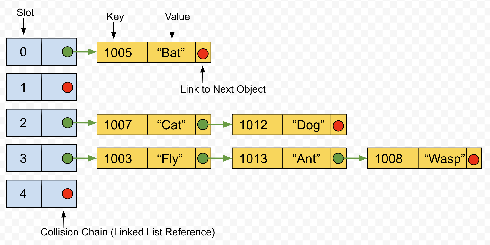
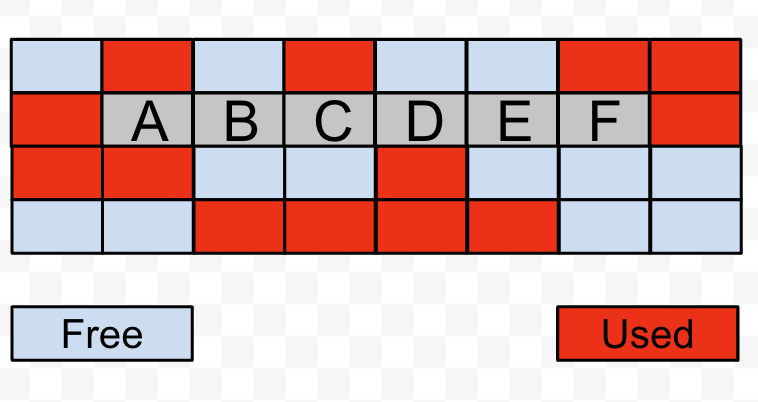
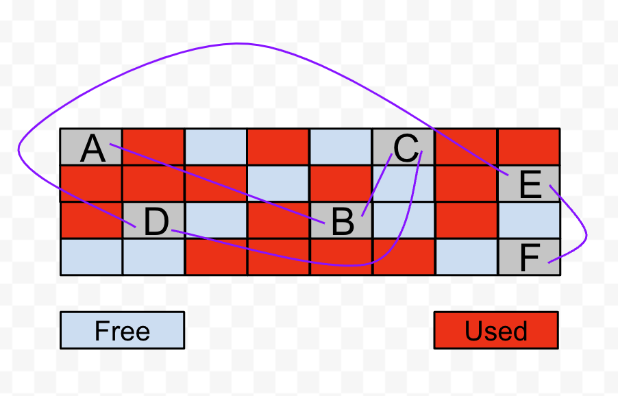

---
{
  title: "Introduction to Hash Tables",
  description: "A high-level overview of how hash tables work behind the scenes.",
  published: '2023-07-03',
  authors: ["richarddprasad"],
  tags: ["computer science"],
  license: 'cc-by-nc-nd-4'
}
---

A hash table - also known as a dictionary or hash map - is a type of data structure used to store large amounts of data. Data consists of key-value pairs that are inserted into a table-like structure.



In our example, we have keys which are integers (numbers) and values that are strings. Hash tables are made up of two parts: 

1. An array of addresses, each of which is referred to as a **slot** (or **bucket**). This part of the hash table is called the **prime area**;
2. A collision resolution area. Our example uses linked lists to handle collisions. Collisions and linked lists will be covered shortly.

In general, a hash table attempts to stuff objects into a fixed number of slots. This is achieved by transforming an object's key using a hash function. Objects which produce the same hash key all share the same slot.

We could have just as easily used an ordinary array to store our data. This raises the question of why bother with hash tables and their seemingly convoluted way of storing data? The answer lies in the limitations of arrays.

# Starting Simple: Arrays

An array stores objects of the same type within a single, contiguous block of memory. An array has a fixed size, and increasing the size of an array is not possible. This is because there is no way to guarantee there is enough free memory immediately after the array in which to expand it. In the example below, we could not expand our array to add an object with value "G" because the block of memory after the array is in use.



Decreasing an array's size introduces its own set of problems. The only way to resize an array is to make a new array, copy the contents of the old one into the new one, then delete the old one. For small arrays, this is usually not an issue. However, for large amounts of data, arrays become too expensive to work with.

If we know our array is not going to change over the course of our application, then using an array is probably the best option. However, if we need to add or remove objects frequently, arrays are a poor choice. An array relies on index position to refer to each object it contains. Index positioning only works if the following holds true:

1. All elements in the array are of the same type and thus the same size;
2. All elements in the array are laid out in memory one after the other in a single block;
3. The length of the array is known ahead of time.

An array's indexing system is great - it enables constant access times for any element in the array - but it comes at the cost of flexibility. What we need is a way to free ourselves from the foregoing requirements to create an infinitely-flexible list of data.

# Going to the Next Level: Linked Lists

A linked list is yet another data structure for storing data, but it is not limited in having to place its contents within a single block of memory. Our objects can live anywhere within memory and are simply linked together in a chain-like structure. To achieve this, our objects must be wrapped into wrapper objects known as **nodes**:

```typescript
// TypeScript example using generic parameter T
// Fields are public to avoid getter/setter overhead
class Node<T> {
    public item: T;
    public next: Node<T> | null;

    constructor(item: T) {
        this.item = item;
        this.next = null;
    }
}
```

A node contains a reference to another node called `next`. We can link as many nodes together as we desire - memory permitting, of course - freeing ourselves from the limitations of arrays. Adding or removing nodes from a linked list are trivial operations compared to resizing a large array.



Unfortunately, linked lists are not without their downsides as well. There is no way to directly access a particular element in a linked list. If we had a linked list with 5,000,000 elements and wanted the last one, we would have to traverse the entire list before getting to 5,000,000th element. Wouldn't it be nicer if we could somehow split our giant linked list into a number of smaller ones?

# The Best of Both Worlds: Hash Tables

Our version of a hash table is nothing more than an array of linked lists. It should be noted this is not the only way to implement a hash table, but it is certainly the most flexible in terms of size.

Each array item is a reference to a linked list and is known as a slot. The idea behind a hash table is to divide our large array or list into a number of smaller linked lists, essentially changing our one-dimensional array/list into a two-dimensional (hash) table. So how do we determine which slot to toss an object into? This is where the hash function comes into play.

## The Hash Function

A hash function transforms a provided key into a "hash key" which corresponds with the index of a slot; this "hash key" is called a **home address**. The process of transforming a key into a home address is known as **key-to-address mapping**.

In our example, our hash table has 5 slots, with home addresses of 0-4. Thus our hash function must transform our objects' keys into values from 0-4. There are many ways to generate a hash function. We are going to take the easy and lazy route: Given that our objects' keys are simple numbers, we can use the modulus operator to reduce our keys to the desired range.

```
homeAddress = objectKey mod lengthOfHashTable
```

Our hash table has 5 slots, so `lengthOfHashTable` is 5. An object with key 1007, when fed into the hash function, produces a home address of 2:

```
1007 mod 5 = 2
```

The technique we are using is called the **modulo-division technique**. There are a number of other techniques as well, e.g., midsquare method, digit-extraction method, etc.

Ideally, if we had a 5,000,000-item linked list, we would want our five-slot hash table to divide those elements into five, 1,000,000-item linked lists. Smaller lists are faster to traverse, and the cost of computing the home address is trivial.

## Collisions and Collision Chains

When more than one object produces the same home address, it is said a **collision** has occurred. For example, *Cat* and *Dog* both generate the same home address of 2 and have thus collided. We resolve collisions by using a **collision chain**. In our example, we are using linked lists for this purpose. Once the home address is computed, we ask the linked list at the computed home address to use the original key to find the desired object.

As mentioned, this is not the only way to implement a hash table. Just as there are other techniques for creating a hash function, there are also other techniques for handling collisions (open addressing, bucket hashing, etc.).

Using a linked list incurs a space complexity cost: The node wrappers around our objects, as well as the `next` reference links, cause our code to use more memory. A linked list collision chain is ill-suited for small memory environments such as microcontroller devices.

A poorly-designed hash function is also a cause for concern: What if our hash function simply ends up throwing everything into only one or a few slots, leaving the rest empty? This phenomenon is known as **clustering** and we want to avoid it at all costs - if all our objects ended up in a single slot, we would just end up with another linked list!

# Conclusion

Hash tables can offer substantial performance benefits when storing and searching through large amounts of data. However, that is not their only use. Hash tables are used to facilitate the creation of databases and virtual machines. They go hand-in-hand with various algorithms, such graph algorithms that enable technologies such as Google Maps. Hash tables can also be used to create dynamic objects with properties that can be added or removed at runtime (think JavaScript objects).

Given how useful hash tables are, practically every programming language these days includes a standard implementation ready to go, saving you the trouble of having to roll your own.

---

### References

Gilberg, Richard and Behrouz Forouzan. *Data Structures: A Pseudocode Approach with C, 2nd Edition*. Course Technology, 2005.
